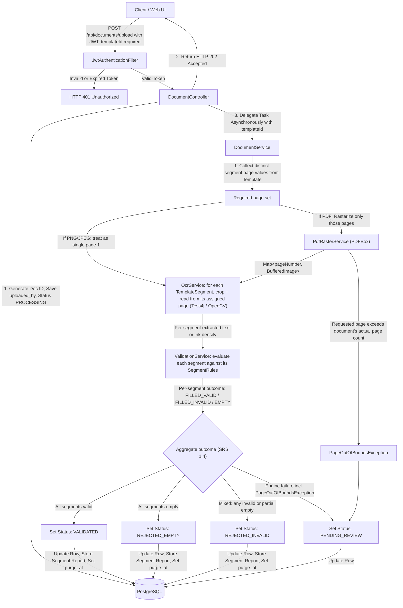
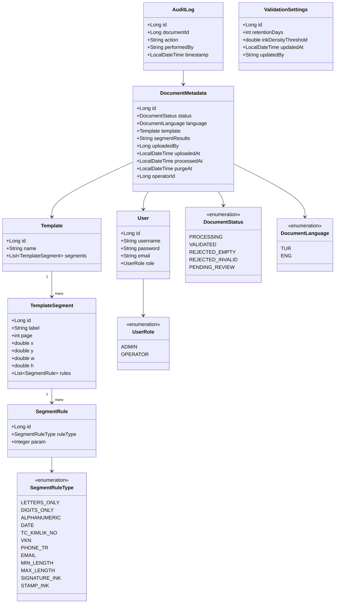
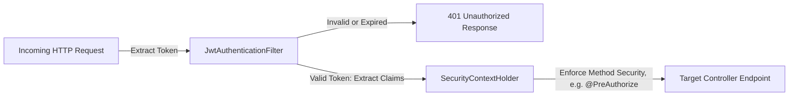

# Software Design Document (SDD) - validdoc

## 1. System Architecture

The system follows a classic **Layered Monolithic Architecture** implemented via Spring Boot 4.x, packaged as a stateless container image (see `Dockerfile`, §1.1) so it can scale horizontally by running additional replicas. Communication between layers is strictly unidirectional and decoupled using Data Transfer Objects (DTOs) to isolate database entities from the presentation layer.

- **Presentation Layer (`@RestController`):** exposes stateless REST endpoints. Responsible for HTTP request validation, parsing `MultipartFile` payloads, and returning unified JSON structures.
- **Business Logic Layer (`@Service`):** contains the core orchestration logic. It encapsulates the asynchronous lifecycle execution, PDF rasterization, per-segment OCR extraction, rule evaluation against a template's registered `SegmentRule`s, and OpenCV pixel-density analysis for ink-based segments.
- **Data Access Layer (`@Repository`):** built upon Spring Data JPA. It abstracts SQL operations into safe Java interfaces, leveraging Hibernate as the underlying Object-Relational Mapping (ORM) framework. The `segment_results` column on `document_metadata` (the encrypted, masked per-segment report — see §4.2) is encrypted at rest, application-side, via a JPA `AttributeConverter` (`MaskedDataEncryptionConverter`, AES-256-GCM) rather than a database-native encryption function — this keeps the encryption key out of any checked-in SQL and out of the database engine entirely, sourced only from the externalized `encryption.secret-key` property at runtime.

### 1.1 Container Readiness

The application holds no local session or file state (per §5.1, all documents are processed strictly in-memory). A single-stage `Dockerfile` (project root) builds from `eclipse-temurin:21-jre-jammy` — a glibc-based image, deliberately not Alpine/musl, because the `org.openpnp:opencv` native bindings are prebuilt against glibc and fail to load under musl — installs `tesseract-ocr`/`tesseract-ocr-tur` from the standard Ubuntu apt repository (jammy ships Tesseract **4.1.1**, no third-party PPA dependency; `tesseract-ocr-eng` is pulled in transitively since the base `tesseract-ocr` package depends on it, so English data is present without an explicit install step), copies the pre-built fat JAR, and runs it as a non-root `validdoc` user; horizontal scaling is achieved by running multiple container replicas behind a load balancer, with PostgreSQL as the sole shared state. `tesseract.datapath` (`application.properties`) is the single source of truth for the tessdata location and is set to `/usr/share/tesseract-ocr/4.00/tessdata` — the actual path Debian/Ubuntu packaging uses for Tesseract 4.x (the `.../5/tessdata` convention only applies on Ubuntu 24.04+, which ships Tesseract 5; using it against a jammy-based image silently points at a non-existent directory). There is deliberately no separate `TESSERACT_DATAPATH` env var in the `Dockerfile` — a single property read via `TesseractConfig` avoids two values that can drift out of sync. `spring.datasource.*` and all secrets (`jwt.secret`, `encryption.secret-key`) must be supplied via environment variables at container run time; the checked-in `application.properties` values are local-development defaults only. A `docker-compose.yml` (project root) runs the app alongside a `postgres:16-alpine` container for local integration testing; it reads required secrets from a `.env` file (see `.env.example`) rather than hardcoding or defaulting them, so a missing `.env` fails loudly instead of silently running with an insecure value.

---

## 2. System Architecture & Data Flow Diagram

To comply with KVKK/GDPR and prevent local storage bottlenecks, files are processed strictly in-memory (RAM) via Java standard input streams. Uploaded documents are instantly processed and destroyed from RAM, leaving only metadata (and the masked/encrypted per-segment report, subject to retention purge — see §4.2 and §5.3).



`DocumentService.processDocument()` — not `ValidationService`, which is a stateless, DB-free matching engine — is marked `@Transactional` (alongside `@Async`) to ensure that a document's metadata update and its `audit_logs` write succeed or fail as a single atomic unit.

---

## 3. Class Design & Package Structure

The application uses strict domain-driven sub-packages under the root `com.validdoc` package to prevent circular dependencies.



### 3.1 Directory Tree

```
com.validdoc
│
├── config
│   ├── SecurityConfig.java (BCrypt PasswordEncoder, AuthenticationManager, stateless SecurityFilterChain with JwtAuthenticationFilter; @EnableMethodSecurity for @PreAuthorize. `/api/auth/login` and `/actuator/health` are the only `permitAll` routes — everything else requires a valid Bearer token. CORS is not yet configured — pending a decided frontend origin.)
│   ├── AsyncConfig.java (Configures ThreadPoolTaskExecutor limits for < 3s response)
│   ├── TesseractConfig.java (Reads tesseract.datapath; exposes a TesseractFactory bean — no longer owns a shared Tesseract instance, see §5.4)
│   ├── TesseractFactory.java (Stateless factory producing a fresh Tesseract instance per call; consumed by OcrService to build its per-thread cache — see §5.4)
│   ├── ValidationProperties.java (Binds validation.* defaults from application.properties; used only as a one-time seed source for ValidationSettingsService on first boot — see §5.3. Now backs only retentionDays and inkDensityThreshold.)
│   └── AdminBootstrapRunner.java (ApplicationRunner; seeds one default ADMIN account on first startup if the users table is empty — see §7.1)
│
├── controller
│   ├── AuthController.java (Handles authentication and JWT issue; no self-service registration — accounts are created via UserController, per SRS 1.1)
│   ├── UserController.java (Admin-only account creation for both ADMIN and OPERATOR roles — see §7.1)
│   ├── DocumentController.java (Handles binary streams, upload with mandatory templateId, single-document lookup by id, and manual operator reviews)
│   ├── TemplateController.java (Admin-only template registration with nested segments/rules, and a read-only list for OPERATOR/ADMIN selection at upload time; no update/delete endpoints exist — templates are immutable, see §5.4. Also exposes the ephemeral, non-persisting preview endpoint — see §5.5)
│   └── ValidationSettingsController.java (Admin-only GET/PUT of the runtime-editable retention window and ink-density threshold — see §5.3)
│
├── dto
│   ├── request
│   │   ├── LoginRequest.java
│   │   ├── VerificationRequest.java
│   │   ├── TemplateRequest.java (name + nested list of segment definitions, each carrying its own list of rule selections — see §5.4)
│   │   ├── TemplatePreviewRequest.java (draft segment coordinates only, no rules — used solely by the preview endpoint, see §5.5)
│   │   ├── CreateUserRequest.java
│   │   └── ValidationSettingsUpdateRequest.java (retentionDays, inkDensityThreshold)
│   └── response
│       ├── AuthResponse.java
│       ├── DocumentSummaryResponse.java (includes language and the full segment-result list, see §5.4)
│       ├── TemplateSummaryResponse.java
│       ├── TemplatePreviewResponse.java (per-segment raw reading, no persistence)
│       ├── UserSummaryResponse.java
│       └── ValidationSettingsResponse.java
│
├── exception
│   ├── OpenCVException.java
│   ├── PdfRasterizationException.java
│   ├── PageOutOfBoundsException.java (Thrown when a template segment's assigned page number exceeds the uploaded document's actual page count — see §5.1, §5.4)
│   ├── TemplateDefinitionException.java
│   ├── ErrorCode.java (Enum mapping each business error to an HttpStatus + a MessageSource key — see §5.4, §8)
│   ├── ApiException.java (RuntimeException carrying an ErrorCode plus MessageFormat args; the standard way to raise a user-facing business error, see §8)
│   ├── ApiErrorResponse.java (Record — the {code, message} JSON body returned for every handled error, see §8)
│   └── GlobalExceptionHandler.java (@RestControllerAdvice — see §8; also handles MethodArgumentNotValidException, translating jakarta bean-validation failures into the same localized {code, message} shape)
│
├── model
│   ├── enums
│   │   ├── UserRole.java
│   │   ├── DocumentStatus.java
│   │   ├── SegmentRuleType.java (the fixed, system-defined rule catalog — see SRS 1.3, §5.4)
│   │   └── DocumentLanguage.java (TUR/ENG, each carrying its Tesseract language code; fromParam(String) resolves an upload's lang query param, defaulting unknown/blank/absent values to TUR — see §5.4)
│   ├── User.java
│   ├── DocumentMetadata.java (@Convert(MaskedDataEncryptionConverter) on segmentResults; language defaults to TUR at the Java level; template is now a required, non-null relation)
│   ├── Template.java (id, name; owns segments via @OneToMany, cascade ALL, orphanRemoval true — see §5.4)
│   ├── TemplateSegment.java (id, label, page (1-indexed, positive), x, y, w, h; owns rules via @OneToMany, cascade ALL, orphanRemoval true)
│   ├── SegmentRule.java (id, ruleType, nullable param — populated only for MIN_LENGTH/MAX_LENGTH)
│   ├── AuditLog.java (documentId nullable — set for document-related actions, null for account-level actions)
│   └── ValidationSettings.java (Single-row table, id fixed to 1 — no @GeneratedValue — enforcing the singleton invariant at the schema level; see §4.5)
│
├── repository
│   ├── UserRepository.java
│   ├── DocumentRepository.java (findByPurgeAtLessThanEqualAndSegmentResultsIsNotNull excludes rows already purged, or that never had maskable data, from repeat retention sweeps — see §5.3)
│   ├── TemplateRepository.java
│   ├── AuditLogRepository.java (Immutable repository configuration)
│   └── ValidationSettingsRepository.java
│
├── scheduler
│   └── RetentionCleanupJob.java (Periodically purges/anonymizes rows past purgeAt)
│
├── security
│   ├── CustomUserDetailsService.java (Adapts User entity to Spring Security's UserDetails, ROLE_-prefixed authorities)
│   ├── JwtService.java (HMAC token generation/parsing via jjwt; secret and expiration externalized via jwt.secret/jwt.expiration-ms, the latter set to 600000 — 10 minutes, see SRS 1.1)
│   ├── JwtAuthenticationFilter.java (OncePerRequestFilter populating SecurityContextHolder from a valid Bearer token)
│   ├── LoginRateLimiter.java (In-memory fixed-window counter, keyed by remote address — 5 attempts per 60s; see §7.2)
│   └── MaskedDataEncryptionConverter.java (JPA AttributeConverter, AES-256-GCM; key externalized via encryption.secret-key)
│
└── service
    ├── PdfRasterService.java (Renders a caller-supplied set of 1-indexed page numbers to BufferedImages via Apache PDFBox — only the pages a template actually needs, not the whole document; throws PageOutOfBoundsException if a requested page exceeds the PDF's actual page count, see §5.1)
    ├── OcrService.java (BufferedImage conversion, Tess4j bindings, and OpenCV cropping; for each TemplateSegment, looks up its assigned page's image and crops/reads from it — no anchor-keyword search — see §5.4. Holds a ThreadLocal<Tesseract> — one instance per async worker thread, built via TesseractFactory — and calls setLanguage(...) per document before each doOCR, see §5.4)
    ├── ValidationService.java (Evaluates each extracted segment against its assigned SegmentRules, produces a FILLED_VALID/FILLED_INVALID/EMPTY outcome per segment, and derives the aggregate DocumentStatus — see §5.4. Reads inkDensityThreshold from ValidationSettingsService)
    ├── ValidationSettingsService.java (Loads/seeds the singleton ValidationSettings row on startup, caches it in a volatile field, and applies admin updates — see §5.3)
    ├── DocumentService.java (State tracking, asynchronous orchestration, and persistence; collects the distinct page numbers required by the selected Template before rasterizing, reads retentionDays from ValidationSettingsService and the document's resolved language from the DocumentMetadata row itself, see §5.1, §5.4)
    └── TemplatePreviewService.java (Stateless: rasterizes only the pages referenced by the submitted draft segment coordinates — same selective strategy as §5.1 — crops and reads them, and returns the raw reading without touching the database — see §5.5)
```

---

## 4. Database Schema (ERD Model)

The PostgreSQL schema uses specialized native types, automatic key generators (`GenerationType.IDENTITY`), and application-level column encryption for sensitive extracted personal data to satisfy KVKK/GDPR requirements.

### 4.1 `users`

| Column | Type | Constraints |
|---|---|---|
| id | BigInt | Primary Key, Auto-Increment |
| username | VarChar(50) | Unique, Indexed, Not Null (plaintext login identifier — not extracted document data, not subject to §4.2 masking rules) |
| password | VarChar(255) | BCrypt Hashed (60-char), Not Null |
| email | VarChar(255) | Not Null; retained from the previous revision, currently unused now that automated notifications have been removed (see SRS 1.1) |
| role | VarChar(20) | Enum Mapped as String (ADMIN, OPERATOR), Not Null |

### 4.2 `document_metadata`

| Column | Type | Constraints |
|---|---|---|
| id | BigInt | Primary Key, Auto-Increment |
| file_name | VarChar(255) | Not Null; original uploaded filename. This is upload metadata, not "personal data extracted from document contents" (SRS §3.1.1's masking rule is scoped to the latter), so it is intentionally stored in plaintext. |
| status | VarChar(30) | Enum Mapped as String (Default: PROCESSING) |
| language | VarChar(10) | Enum Mapped as String (TUR, ENG); selected at upload time via the `lang` query param (§5.4), defaults to TUR |
| template_id | BigInt | Foreign Key -> templates(id), Not Null — every document is validated against exactly one template |
| segment_results | Text | Column-level encrypted JSON array of per-segment outcomes: `[{"label": "...", "outcome": "FILLED_VALID"|"FILLED_INVALID"|"EMPTY", "failedRules": [...], "maskedValue": "..."}]`; Nullable until analysis concludes |
| uploaded_by | BigInt | Foreign Key -> users(id), Not Null |
| uploaded_at | Timestamp | UTC Metrics, Not Null |
| processed_at | Timestamp | Nullable (Set after validation concludes) |
| purge_at | Timestamp | Nullable; set to `processed_at` + retention window once processing concludes; consumed by `RetentionCleanupJob` |
| operator_id | BigInt | Foreign Key -> users(id), Nullable (Set only if manually reviewed) |

### 4.3 `templates`

Holds the named, immutable definition that every upload is validated against. Managed by admins via `TemplateController`; listable by any authenticated user for selection at upload time.

| Column | Type | Constraints |
|---|---|---|
| id | BigInt | Primary Key, Auto-Increment |
| name | VarChar(100) | Unique, Not Null (e.g. "Standard Application Form v1") |

### 4.4 `template_segments`

| Column | Type | Constraints |
|---|---|---|
| id | BigInt | Primary Key, Auto-Increment |
| template_id | BigInt | Foreign Key -> templates(id), Not Null |
| label | VarChar(100) | Not Null; admin-chosen, human-readable (e.g. "İmza") |
| page | Integer | Not Null, >= 1; the 1-indexed page of the document layout this segment appears on (SRS 1.2, 1.3) |
| x | Double | Not Null |
| y | Double | Not Null |
| w | Double | Not Null |
| h | Double | Not Null |

### 4.5 `segment_rules`

| Column | Type | Constraints |
|---|---|---|
| id | BigInt | Primary Key, Auto-Increment |
| segment_id | BigInt | Foreign Key -> template_segments(id), Not Null |
| rule_type | VarChar(30) | Enum Mapped as String (`SegmentRuleType`, e.g. `LETTERS_ONLY`, `DIGITS_ONLY`, `DATE`, `TC_KIMLIK_NO`, `SIGNATURE_INK`, ...), Not Null |
| param | Integer | Nullable; populated only for `MIN_LENGTH`/`MAX_LENGTH`, otherwise null |

### 4.6 `audit_logs`

> **Note:** this table is strictly append-only. Delete and Update queries are restricted at the repository configuration layer to preserve corporate auditing trail integrity. It is exempt from the `purge_at` retention mechanism above because it stores only action metadata (who/what/when/which-document), never personal document content.

| Column | Type | Constraints |
|---|---|---|
| id | BigInt | Primary Key, Auto-Increment |
| document_id | BigInt | Foreign Key -> document_metadata(id), Nullable (populated for document-related actions such as DOCUMENT_UPLOADED, MANUAL_VALIDATED, RETENTION_PURGE; null for account-level actions) |
| action | VarChar(100) | E.g. "DOCUMENT_UPLOADED", `"AUTO_" + status` written by `DocumentService` on every automated outcome, `"MANUAL_" + status` written by `DocumentController.verify()` on every operator override, "ENGINE_ERROR_PENDING_REVIEW" (any engine failure, see §8), "RETENTION_PURGE" |
| performed_by | VarChar(50) | String capture of context (Username or "SYSTEM") |
| timestamp | Timestamp | UTC Metrics, Not Null |

### 4.7 `validation_settings`

Single-row table (`id` fixed to `1`, no auto-increment) holding the current, admin-editable tuning parameters. Seeded once from `ValidationProperties`/`application.properties` on first application boot if empty; every subsequent read/write goes through `ValidationSettingsService` (see §5.3), never back to the static config.

| Column | Type | Constraints |
|---|---|---|
| id | BigInt | Primary Key, fixed value `1` (no `@GeneratedValue` — schema itself enforces the single-row invariant) |
| retention_days | Integer | Not Null (SRS 2.3 / 3.1.1) |
| ink_density_threshold | Double | Not Null (SRS 1.3, signature/stamp ink detection) |
| updated_at | Timestamp | Not Null; refreshed on every write |
| updated_by | VarChar(50) | Not Null; `"SYSTEM_SEED"` for the initial seed row, otherwise the admin username that made the change |

---

## 5. Core Algorithmic Decisions

### 5.1 In-Memory Document Processing & Leak Prevention

`DocumentController` reads the multipart upload into a `byte[]` synchronously (the underlying request-scoped stream would already be closed by the time an `@Async` method runs on a worker thread, so a raw `InputStream` cannot safely cross that boundary) and hands it off to `DocumentService.processDocument`. Before rasterizing anything, the method first determines which pages the selected template actually needs:

```java
@Async
@Transactional
public void processDocument(Long documentId, byte[] fileBytes, String contentType, Long templateId) {
    Template template = templateRepository.findById(templateId)
        .orElseThrow(() -> new EntityNotFoundException(...));

    Set<Integer> requiredPages = template.getSegments().stream()
        .map(TemplateSegment::getPage)
        .collect(Collectors.toSet());

    Map<Integer, BufferedImage> pages = PDF_CONTENT_TYPE.equals(contentType)
        ? pdfRasterService.renderPages(new ByteArrayInputStream(fileBytes), requiredPages)  // Apache PDFBox, in-memory only, throws PageOutOfBoundsException if a requested page doesn't exist
        : Map.of(1, requireSinglePage(ImageIO.read(new ByteArrayInputStream(fileBytes)), requiredPages)); // PNG/JPEG: a single page numbered 1; throws PageOutOfBoundsException if requiredPages contains anything else

    // OcrService looks up each segment's assigned page from the map, crops and reads it
    // (text extraction via Tesseract, ink density via OpenCV for ink-based segments)
    OcrDocumentResult ocrResult = ocrService.process(pages, template, language);
    ValidationResult result = validationService.validate(ocrResult, template);
    // ... apply result, persist, no notification step
}
```

Rasterizing only the pages a template's segments actually reference — rather than every page of the source document — keeps memory and processing cost proportional to what the template needs, not to how long the uploaded PDF happens to be; a 40-page contract validated against a 2-segment, 1-page template never rasterizes pages 2 through 40. Converting each needed page to a `BufferedImage` forces the JVM to manage its pixel data entirely within heap allocation structures; once a page's reference scope closes, its graphic buffer becomes eligible for immediate Garbage Collection (GC) sweeps. A strict file size limit (e.g. maximum 5MB) is enforced via application configuration to protect system memory, and applies equally to PDF and image uploads, independent of how many pages are ultimately rasterized.

### 5.2 Thread Pool Allocation Strategy for Async OCR

To satisfy the under-three-second response time requirement and prevent a sudden influx of uploads from freezing Tomcat's main execution threads, processing runs via an isolated `ThreadPoolTaskExecutor`:

- **Core Pool Size:** 4 threads (optimized for multi-core CPUs scaling text parsing tasks).
- **Max Pool Size:** 8 threads (upper safety bound during peak corporate processing hours).
- **Queue Capacity:** 500 tasks. If the queue saturates, subsequent requests receive an immediate HTTP 429 Too Many Requests status, protecting the application from memory crash failures.

### 5.3 Admin-Configurable Parameters (Runtime, No Restart)

The two remaining tuning values (`retentionDays`, `inkDensityThreshold`) live in the `validation_settings` table (§4.7), not directly in `application.properties`. `ValidationProperties` still exists and still binds `validation.*` from `application.properties`, but plays a narrower role than before: a one-time default source, read only by `ValidationSettingsService` the very first time the application starts against an empty `validation_settings` table.

```
@PostConstruct on ValidationSettingsService:
  row = validationSettingsRepository.findById(1)
  if row absent:
      row = seed a new row from ValidationProperties defaults, updatedBy = "SYSTEM_SEED"
  cache row in a volatile field ("current")
```

`ValidationService` and `DocumentService` both depend on `ValidationSettingsService`, never on `ValidationProperties` directly, so a value change is visible to every in-flight and future validation immediately, without a restart. The cached reference is `volatile` (not merely synchronized) because validation runs on `@Async` worker threads and the retention job runs on the scheduler thread; a `volatile` read is sufficient for safe cross-thread visibility of an immutable snapshot object, without contending on a lock during the hot validation path.

Admins change these values via `ValidationSettingsController` (`GET`/`PUT /api/admin/validation-settings`, `hasRole('ADMIN')` — see §6). A `PUT` persists the new row, refreshes the cache, and writes a `"VALIDATION_SETTINGS_UPDATED"` entry to `audit_logs` (via the `AuditLog(action, performedBy)` constructor — `document_id` stays null, since this isn't a per-document action).

`RetentionCleanupJob` runs on a daily schedule (`@Scheduled(cron = "0 0 3 * * *")`), reading the current `retentionDays` indirectly — `purge_at` is precomputed and stored per-document at the moment processing (or manual verification) concludes, not read live off `ValidationSettingsService` at purge time, so a later change to `retentionDays` only affects documents processed after the change. It selects `document_metadata` rows via `findByPurgeAtLessThanEqualAndSegmentResultsIsNotNull(now())` — the `segmentResults IS NOT NULL` condition is deliberate: without it, a row past its `purge_at` would be re-selected and re-logged on every single run for as long as it remains in the table, since nothing else marks it as "already purged." Matching rows have `segment_results` nulled and a single `"RETENTION_PURGE"` entry (with the corresponding `document_id`) written to `audit_logs` — preserving the audit trail while satisfying the erasure requirement.

### 5.4 Template-Based Segmentation, Rule Evaluation & Status Derivation

This replaces the previous templated/template-free dual-mode design in full; there is now exactly one analysis path.

**Template structure.** A `Template` owns a list of `TemplateSegment`s (`@OneToMany(cascade = CascadeType.ALL, orphanRemoval = true)`), each of which owns a list of `SegmentRule`s under the same cascade settings. `TemplateController.create()` validates the incoming `TemplateRequest` before persisting: every segment must specify coordinates within a fixed A4 pixel bound, every rule must be a recognized `SegmentRuleType`, `MIN_LENGTH`/`MAX_LENGTH` must carry a positive integer `param` and no other rule type may carry one, and a segment must not combine `SIGNATURE_INK`/`STAMP_INK` with any non-ink rule (rejected as `ApiException(ErrorCode.INVALID_SEGMENT_RULE_COMBINATION)` → 400). Once persisted, a `Template` and its segments/rules are never mutated — there is no update endpoint. Fixing a mistake means registering a new `Template` under a new name; existing `document_metadata` rows keep pointing at the original template's original definition, so past results remain interpretable exactly as they were produced.

**Extraction.** `OcrService.process(pages, template, language)` receives a `Map<Integer, BufferedImage>` already narrowed down by `DocumentService` to exactly the pages the template's segments reference (§5.1), and iterates the selected template's segments in order. For each segment it looks up `pages.get(segment.getPage())`, crops the corresponding region within that page's image (`safeCrop`, clamped to image bounds — the same defensive bounds-check the old templated path used, now the only path) and, depending on whether the segment carries an ink rule, either runs `tesseract.doOCR(region)` for text or computes ink pixel density via the existing OpenCV threshold/Otsu logic. The result is a per-segment raw reading (text or density), not yet a verdict. A missing key in `pages` at this stage would indicate a page that `PdfRasterService` failed to rasterize without throwing — this should not occur given the upstream `PageOutOfBoundsException` check, and is treated as a defensive `IllegalStateException` if it ever does.

**Evaluation.** `ValidationService.validate(ocrResult, template)` evaluates each segment's raw reading against its assigned `SegmentRule`s:

- A text segment with no extracted content (after trimming) is `EMPTY`.
- An ink segment whose measured density falls below `ValidationSettingsService.getInkDensityThreshold()` is `EMPTY`.
- A non-empty text segment is checked against every assigned rule (`LETTERS_ONLY`, `DIGITS_ONLY`, `ALPHANUMERIC`, `DATE`, `TC_KIMLIK_NO`, `VKN`, `PHONE_TR`, `EMAIL`, `MIN_LENGTH`, `MAX_LENGTH`) — reusing the same deterministic regex/checksum/date-parsing logic from the previous revision (11-digit ID check, checksum-validated VKN, phone-format regex, future-date rejection). If every assigned rule passes, the segment is `FILLED_VALID`; otherwise it is `FILLED_INVALID`, and the list of specifically failed `SegmentRuleType` values is recorded.
- A non-empty ink segment whose density meets the threshold is `FILLED_VALID`; ink segments have no additional text-format rules to fail, per the compatibility constraint in §5.4's template-structure paragraph.

**Aggregation.** The document's `DocumentStatus` is derived purely from the collection of segment outcomes, per SRS 1.4:

| Segment outcomes | DocumentStatus |
|---|---|
| All `EMPTY` | `REJECTED_EMPTY` |
| All `FILLED_VALID` | `VALIDATED` |
| Any other mix | `REJECTED_INVALID` |

`PENDING_REVIEW` is not reachable from this table — it is set only when `DocumentService.processDocument` catches an engine-level failure (`PdfRasterizationException`, `TesseractException`, `OpenCVException`, `TemplateDefinitionException`, or an unreadable image), exactly as in the previous revision, and routed to the operator queue via `"ENGINE_ERROR_PENDING_REVIEW"` in `audit_logs` (see §8). Because rule evaluation is now fully deterministic, there is no equivalent of the previous confidence-threshold/margin band; a given input always produces the same aggregate outcome.

**Masking and storage.** Every text segment's raw value that participates in a `FILLED_VALID`/`FILLED_INVALID` outcome is masked using the same label-aware masking used previously (`TC_KIMLIK_NO`/`VKN`/`PHONE_TR` keep the last two characters, `LETTERS_ONLY`-style name fields keep only initials, other rule types are fully masked) before being written into the `segment_results` JSON array, which is encrypted at rest exactly as `extracted_masked_data` was in the previous revision (§4.2).

### 5.5 Document & API Language Selection (TR/EN)

Turkish/English language support spans two independent concerns that are deliberately **not** driven by the same signal, because they answer different questions:

- **"What language should this API response be written in?"** — a per-request presentation concern, resolved via the standard `Accept-Language` HTTP header through Spring's built-in `AcceptHeaderLocaleResolver` (`spring.web.locale-resolver=accept-header`, `spring.web.locale=tr` as the fallback when the header is absent). Every business error raised as an `ApiException(ErrorCode, args...)` is caught by `GlobalExceptionHandler` and resolved against `messages_tr.properties` / `messages_en.properties` at the moment the response is built. The response shape is `{"code": "<ERROR_CODE>", "message": "<localized text>"}`. Numeric `MessageFormat` placeholders are pre-formatted to a fixed-locale string before being passed as args, to avoid locale-specific number grouping being silently applied to opaque identifiers.

- **"What language is this specific document written in, for OCR purposes?"** — a per-document, per-upload concern, resolved via an explicit `lang` query param on `POST /api/documents/upload` (`tur` or `eng`; anything else, including absent/blank/whitespace-only, defaults to `tur` — `DocumentLanguage.fromParam(String)`). This is intentionally independent of `Accept-Language`: an operator with a Turkish-language UI may still upload an English-language document. The resolved `DocumentLanguage` is persisted on the `DocumentMetadata` row at upload time, before the async pipeline starts, since `@Async` execution happens on a worker-pool thread after the original HTTP request (and any request-scoped context) has already completed.

**Tesseract instance lifecycle:** a `tess4j` `Tesseract` instance is not safe for concurrent use from multiple threads. `TesseractConfig` exposes a stateless `TesseractFactory` bean rather than a shared `Tesseract` singleton; `OcrService` holds a `ThreadLocal<Tesseract> tesseractHolder = ThreadLocal.withInitial(tesseractFactory::create)`. Each async worker thread lazily builds and keeps exactly one `Tesseract` instance for its lifetime, and only ever mutates its own instance's language, eliminating any cross-thread race without adding per-call instantiation cost. Since `AsyncConfig`'s pool is small and bounded (max 8 threads, §5.2), this results in at most 8 long-lived `Tesseract` instances, not a leak.

**Admin preview endpoint.** `TemplatePreviewService` reuses `OcrService`'s per-segment cropping and reading logic against a caller-supplied document and a caller-supplied, not-yet-persisted list of segment coordinates, each pinned to a page number exactly like a real `TemplateSegment`. For a multi-page PDF, it rasterizes only the distinct pages referenced by the draft segments, the same selective strategy used for a real upload (§5.1). It performs no rule evaluation and writes nothing to the database; it exists solely so an admin can confirm, before registering a template, that a hand-drawn segment box on a given page actually captures the intended region of a real sample document.

> **Historical note (engineering record):** an earlier revision of this system supported a second, template-free analysis mode that located fields via a fixed anchor-keyword search over OCR'd text. As part of evaluating how to make that mode more general, a self-hosted vision-language model (`qwen2.5vl:7b` via Ollama) was trialed and rejected — it hallucinated a signature that was not present and misjudged a correctly-formatted ID number and phone number as invalid, both checks the existing deterministic regex logic already handled correctly. That evaluation is preserved here for context only; template-free validation itself has since been removed from the system's scope entirely (see SRS 1.3), so the anchor-keyword engine and all Ollama/model artifacts no longer exist in this codebase.

---

## 6. API Endpoints (Contract Design)

| Method | Endpoint | Auth Role | Description | Request Body / Param | Response (Success) |
|---|---|---|---|---|---|
| GET | `/actuator/health` | Public | Unauthenticated liveness check for load balancers/orchestrators; `management.endpoint.health.show-details=never` so no internal state leaks to an unauthenticated caller — see §7 | None | `200 OK {status: "UP"}` |
| POST | `/api/auth/login` | Public | Generates a JWT Bearer Token, valid for 10 minutes; rate-limited to 5 attempts per 60s per source address (§7.2) | JSON `{username, password}` | `200 OK {token, role}` |
| POST | `/api/users` | ADMIN | Creates a new user account (ADMIN or OPERATOR); password is BCrypt-hashed before persistence | JSON `{username, password, email, role}` | `201 Created {id, username, email, role}` |
| GET | `/api/templates` | OPERATOR, ADMIN | Lists registered templates, for selection at upload time | None | `200 OK [{templateId, name}]` |
| POST | `/api/templates` | ADMIN | Registers a named, immutable template with its segments (each pinned to a page) and per-segment rules (§5.4) | JSON `{name, segments: [{label, page, x, y, w, h, rules: [{type, param?}]}]}` | `201 Created {templateId}` |
| POST | `/api/templates/preview` | ADMIN | Ephemeral, non-persisting check of draft segment coordinates (each pinned to a page) against a sample document — supports multi-page PDFs (§5.5) | form-data `{file: MultipartFile, segments: JSON [{label, page, x, y, w, h}]}` | `200 OK {segments: [{label, rawText?, inkDensity?}]}` |
| POST | `/api/documents/upload` | OPERATOR, ADMIN | Accepts a file (PDF/PNG/JPEG) and a required `templateId`, triggers async rasterization (if PDF), per-segment OCR/ink reading, and rule evaluation. `lang` selects the OCR language for this document (§5.5); unset/unrecognized defaults to `tur`. | form-data `{file: MultipartFile, templateId: Long, lang?: "tur"|"eng"}` | `202 Accepted {documentId, status: "PROCESSING", language: "TUR"|"ENG"}` |
| GET | `/api/documents/{id}` | OPERATOR, ADMIN | Fetches a single document's current state by id, including its full per-segment result list once available | None | `200 OK DocumentSummaryResponse` |
| GET | `/api/documents/queue` | OPERATOR, ADMIN | Fetches `PENDING_REVIEW` documents | None | `200 OK [DocumentSummaryResponse]` |
| POST | `/api/documents/{id}/verify` | OPERATOR | Manual status override | JSON `{status: VALIDATED/REJECTED_EMPTY/REJECTED_INVALID}` | `200 OK {message}` — localized per `Accept-Language` (§5.5) |
| GET | `/api/admin/validation-settings` | ADMIN | Reads the current runtime-editable retention window and ink-density threshold (§5.3) | None | `200 OK {ValidationSettingsResponse}` |
| PUT | `/api/admin/validation-settings` | ADMIN | Updates the retention window and ink-density threshold immediately, no restart | JSON `{retentionDays, inkDensityThreshold}` | `200 OK {ValidationSettingsResponse}` |

---

## 7. Security Architecture (JWT Middleware)

Spring Security treats the application as a stateless system. The integration topology follows this sequential validation filter chain:



### 7.1 Account Provisioning

There is no public registration endpoint — this is an internal corporate tool, not a consumer-facing product, so opening account creation to anyone would let an unauthenticated caller grant themselves `OPERATOR` access to the document review queue. Instead:

- **`UserController` (`POST /api/users`, `@PreAuthorize("hasRole('ADMIN')")`):** the only way to create a user account, for either role. Hashes the incoming password with the same `PasswordEncoder` bean `SecurityConfig` already exposes, and relies on the existing global `DataIntegrityViolationException` → 409 handler (§8) if the requested `username` already exists.
- **`AdminBootstrapRunner` (`ApplicationRunner`):** solves the bootstrap problem — an admin-only endpoint is unreachable if zero admins exist yet. On every application startup it checks `userRepository.count() > 0`; if the table is empty, it creates exactly one `ADMIN` account from `app.bootstrap-admin.username` / `app.bootstrap-admin.password` / `app.bootstrap-admin.email` (each overridable via environment variable). It is a no-op on every subsequent restart once at least one user exists. The default password is a placeholder and **must** be overridden via `BOOTSTRAP_ADMIN_PASSWORD` outside local development.

### 7.2 Login Rate Limiting

`AuthController.login` consults `LoginRateLimiter` before attempting authentication: a `ConcurrentHashMap<String, Window>` keyed by `HttpServletRequest.getRemoteAddr()`, each `Window` a fixed 60-second counter capped at 5 attempts (`ApiException(ErrorCode.TOO_MANY_LOGIN_ATTEMPTS)` → 429 once exceeded). This is an in-process, in-memory counter, a deliberate scope decision: a distributed store (e.g. Redis) would be needed only once the application runs as more than one replica behind a load balancer, since each instance would otherwise track attempts independently. Revisit if/when horizontal scaling is actually deployed. A request that fails bean validation (e.g. blank `username`/`password`, §8) is rejected by `@Valid` before `LoginRateLimiter` is ever consulted.

---

## 8. Global Exception & Failure Handling Strategy

To avoid generic internal server errors (HTTP 500) and handle runtime anomalies safely, the application implements a centralized `@RestControllerAdvice` (`GlobalExceptionHandler`) mapping specific exceptions to a single structured, **localized** response shape: `ApiErrorResponse(String code, String message)` — see §5.5 for how `message` is resolved. Business-logic errors are raised as `ApiException(ErrorCode, args...)` from the throw site rather than as raw JDK/framework exceptions carrying hardcoded text, so the same exception object works for every supported language:

- **`ApiException`:** the general-purpose path — `GlobalExceptionHandler` reads its `ErrorCode` (which fixes the `HttpStatus`) and resolves the corresponding `messages_*.properties` key against the request's locale. Current `ErrorCode` values: `USER_NOT_FOUND`, `TEMPLATE_NOT_FOUND`, `DOCUMENT_NOT_FOUND` (all → 404), `INVALID_DOCUMENT_STATUS`, `INVALID_FIELD_DEFINITIONS`, `INVALID_SEGMENT_RULE_COMBINATION`, `TEMPLATE_ID_REQUIRED` (all → 400), `BAD_CREDENTIALS` (401), `ACCESS_DENIED` (403), `DUPLICATE_RECORD` (409), `FILE_TOO_LARGE` (413), `SERVER_BUSY`, `TOO_MANY_LOGIN_ATTEMPTS` (both → 429), `INTERNAL_UNEXPECTED` (500).
- **`MethodArgumentNotValidException` → 400 `VALIDATION_FAILED`:** jakarta bean-validation failures are localized without annotating every field individually, via Spring Boot's auto-wired `MessageSource` in the default `Validator`. `GlobalExceptionHandler` collects every failed field into one `field: message; field: message` string, keeping the response consistent with every other error type's `{code, message}` contract.
- **`MaxUploadSizeExceededException` → `FILE_TOO_LARGE` (413).**
- **`TaskRejectedException` → `SERVER_BUSY` (429):** thrown synchronously by the `@Async` proxy when `AsyncConfig`'s `ThreadPoolTaskExecutor` queue (500 tasks) is saturated, fulfilling the behavior already promised in §5.2.
- **`AuthenticationException` → `BAD_CREDENTIALS` (401)** on a failed `/api/auth/login` attempt.
- **`AccessDeniedException` → `ACCESS_DENIED` (403)** when `@PreAuthorize` rejects a request due to insufficient role.
- **`DataIntegrityViolationException` → `DUPLICATE_RECORD` (409)** when a database uniqueness constraint is violated, e.g. registering a template with a name that already exists.
- **Any other unexpected exception → `INTERNAL_UNEXPECTED` (500):** a final generic handler logs the exception server-side and returns a safe, localized, non-leaking message.
- **`PdfRasterizationException`, `PageOutOfBoundsException`, `TesseractException` / `OpenCVException`, `TemplateDefinitionException`, and unreadable image input (`IOException`):** these never reach `GlobalExceptionHandler` — they occur inside the `@Async` pipeline, after the HTTP response has already been sent. All are caught by `DocumentService.processDocument`, which sets the target document's status to `PENDING_REVIEW`, logs the exception, and writes an `"ENGINE_ERROR_PENDING_REVIEW"` entry to `audit_logs`. `PageOutOfBoundsException` specifically covers a document whose actual page count cannot satisfy every page a selected template's segments reference (including a single-page image upload validated against a template that references any page other than 1) — a template/document mismatch, not a scoring outcome, so it is routed to a human rather than auto-classified as empty or invalid.