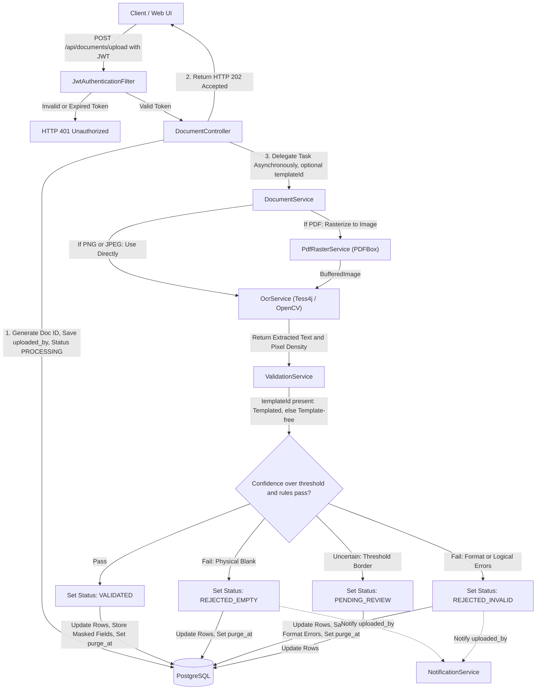
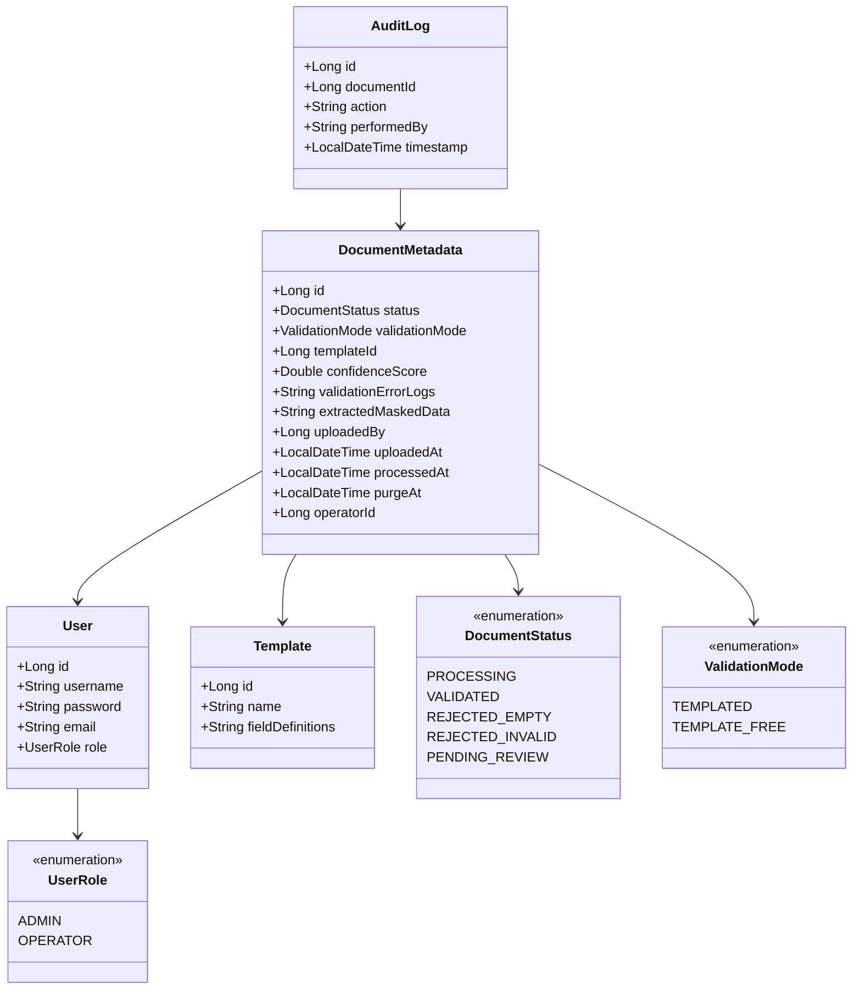
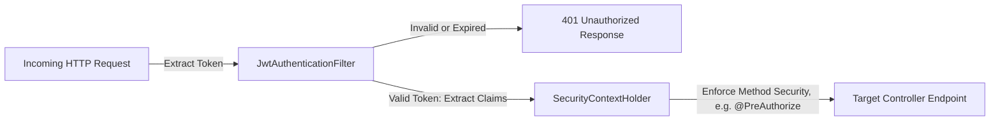

# Software Design Document (SDD) - validdoc (MVP)

## 1. System Architecture

The system follows a classic **Layered Monolithic Architecture** implemented via Spring Boot 4.x, packaged as a stateless container image (see `Dockerfile`, §1.1) so it can scale horizontally by running additional replicas. Communication between layers is strictly unidirectional and decoupled using Data Transfer Objects (DTOs) to isolate database entities from the presentation layer.

- **Presentation Layer (`@RestController`):** Exposes stateless REST endpoints. Responsible for HTTP request validation, parsing `MultipartFile` payloads, and returning unified JSON structures.
- **Business Logic Layer (`@Service`):** Contains the core orchestration logic. It encapsulates the asynchronous lifecycle execution, PDF rasterization, regular expression compilation for data scanning, OpenCV coordinate/pixel density analysis for signature/stamp detection, the Tesseract execution framework, and rejection notifications.
- **Data Access Layer (`@Repository`):** Built upon Spring Data JPA. It abstracts SQL operations into safe Java interfaces, leveraging Hibernate as the underlying Object-Relational Mapping (ORM) framework with database-level encryption for sensitive extracted-data fields.
### 1.1 Container Readiness

The application holds no local session or file state (per §5.1, all documents are processed strictly in-memory). A single-stage `Dockerfile` builds the Spring Boot fat JAR and runs it as a non-root user; horizontal scaling is achieved by running multiple container replicas behind a load balancer, with PostgreSQL as the sole shared state.

> **Known MVP limitation:** PDF rasterization (§5.1) covers only the first page. Multi-page support is out of scope for this version.
 
---

## 2. System Architecture & Data Flow Diagram

To comply with KVKK/GDPR and prevent local storage bottlenecks, files are processed strictly in-memory (RAM) via Java standard input streams. Uploaded documents are instantly processed and destroyed from RAM, leaving only metadata (and masked/encrypted extracted fields, subject to retention purge — see §4.2 and §5.3).



`DocumentService.processDocument()` — not `ValidationService`, which is a stateless, DB-free matching engine — is marked `@Transactional` (alongside `@Async`) to ensure that a document's metadata update and its `audit_logs` write succeed or fail as a single atomic unit. `NotificationService.notifyRejection()` is itself `@Async`, so its call is dispatched to a separate thread and its execution is decoupled from `processDocument`'s transaction — a downstream notification failure never rolls back a validation result.
 
---

## 3. Class Design & Package Structure

The application uses strict domain-driven sub-packages under the root `com.validdoc` package to prevent circular dependencies.



### 3.1 Directory Tree

```
com.validdoc
│
├── config
│   ├── SecurityConfig.java (Configures BCrypt, CORS, and stateless Filter Chain)
│   ├── AsyncConfig.java (Configures ThreadPoolTaskExecutor limits for < 3s response)
│   ├── TesseractConfig.java (Bean instantiation of Tesseract instances)
│   └── ValidationProperties.java (Binds validation.confidence-threshold & retention window from application.yml)
│
├── controller
│   ├── AuthController.java (Handles registration, authentication, and JWT issue)
│   ├── DocumentController.java (Handles binary streams, upload, and manual operator reviews)
│   └── TemplateController.java (Admin CRUD for named field-coordinate templates; read access for OPERATOR/ADMIN)
│
├── dto
│   ├── request
│   │   ├── LoginRequest.java
│   │   └── VerificationRequest.java
│   └── response
│       ├── AuthResponse.java
│       ├── DocumentSummaryResponse.java
│       └── TemplateSummaryResponse.java
│
├── model
│   ├── enums
│   │   ├── UserRole.java
│   │   ├── DocumentStatus.java
│   │   └── ValidationMode.java
│   ├── User.java
│   ├── DocumentMetadata.java (@ColumnTransformer encryption on extractedMaskedData only)
│   ├── Template.java
│   └── AuditLog.java (documentId nullable — set for document-related actions, null for account-level actions)
│
├── repository
│   ├── UserRepository.java
│   ├── DocumentRepository.java
│   ├── TemplateRepository.java
│   └── AuditLogRepository.java (Immutable repository configuration)
│
├── scheduler
│   └── RetentionCleanupJob.java (Periodically purges/anonymizes rows past purgeAt)
│
└── service
    ├── PdfRasterService.java (Renders first PDF page to BufferedImage via Apache PDFBox)
    ├── OcrService.java (BufferedImage conversion, Tess4j bindings, and OpenCV cropping)
    ├── ValidationService.java (Templated & template-free matching engine, regex, pixel density checks)
    ├── DocumentService.java (State tracking, asynchronous orchestration, and persistence)
    └── NotificationService.java (Async hook fired on REJECTED_* transitions; stubbed/logged for MVP)
```
 
---

## 4. Database Schema (ERD Model)

The PostgreSQL schema uses specialized native types, automatic key generators (`GenerationType.IDENTITY`), and database-level column encryption for sensitive extracted personal data to satisfy KVKK/GDPR requirements.

### 4.1 `users`

| Column | Type | Constraints |
|---|---|---|
| id | BigInt | Primary Key, Auto-Increment |
| username | VarChar(50) | Unique, Indexed, Not Null (plaintext login identifier — not extracted document data, not subject to §4.2 masking rules) |
| password | VarChar(255) | BCrypt Hashed (60-char), Not Null |
| email | VarChar(255) | Not Null (notification delivery target only, see §4.2 `uploaded_by`) |
| role | VarChar(20) | Enum Mapped as String (ADMIN, OPERATOR), Not Null |

### 4.2 `document_metadata`

| Column | Type | Constraints |
|---|---|---|
| id | BigInt | Primary Key, Auto-Increment |
| status | VarChar(30) | Enum Mapped as String (Default: PROCESSING) |
| validation_mode | VarChar(20) | Enum Mapped as String (TEMPLATED, TEMPLATE_FREE), Nullable until analysis starts |
| template_id | BigInt | Foreign Key -> templates(id), Nullable (set only when validation_mode = TEMPLATED) |
| confidence_score | Double | Nullable until OCR/CV validation concludes |
| validation_error_logs | Text | Stores logical/format verification error details, Nullable |
| extracted_masked_data | Text | Column-level encrypted JSON blob of masked personal fields (name, phone, etc.); Nullable |
| uploaded_by | BigInt | Foreign Key -> users(id), Not Null (also the `NotificationService` recipient) |
| uploaded_at | Timestamp | UTC Metrics, Not Null |
| processed_at | Timestamp | Nullable (Set after validation concludes) |
| purge_at | Timestamp | Nullable; set to `processed_at` + retention window once processing concludes; consumed by `RetentionCleanupJob` |
| operator_id | BigInt | Foreign Key -> users(id), Nullable (Set only if manually reviewed) |

### 4.3 `templates`

Draft-level definition — holds the named field boxes that `TEMPLATED` mode matches a document against. Managed by admins via `TemplateController`; listable by any authenticated user for selection at upload time.

| Column | Type | Constraints |
|---|---|---|
| id | BigInt | Primary Key, Auto-Increment |
| name | VarChar(100) | Unique, Not Null (e.g. "Standard Application Form v1") |
| field_definitions | Text (JSON) | Not Null; list of named field boxes (label + coordinates), e.g. `[{"label":"signature","x":..,"y":..,"w":..,"h":..}]` |

### 4.4 `audit_logs`

> **Note:** This table is strictly append-only. Delete and Update queries are restricted at the repository configuration layer to preserve corporate auditing trail integrity. It is exempt from the `purge_at` retention mechanism above because it stores only action metadata (who/what/when/which-document), never personal document content.

| Column | Type | Constraints |
|---|---|---|
| id | BigInt | Primary Key, Auto-Increment |
| document_id | BigInt | Foreign Key -> document_metadata(id), Nullable (populated for document-related actions such as DOCUMENT_UPLOADED, MANUAL_APPROVE, RETENTION_PURGE; null for account-level actions, if any) |
| action | VarChar(100) | E.g., "DOCUMENT_UPLOADED", "MANUAL_APPROVE", `"AUTO_" + status` written by `DocumentService` on every automated outcome (e.g. "AUTO_VALIDATED", "AUTO_REJECTED_EMPTY", "AUTO_REJECTED_INVALID", "AUTO_PENDING_REVIEW"), "ENGINE_ERROR_PENDING_REVIEW" (any engine failure, see §8), "RETENTION_PURGE" |
| performed_by | VarChar(50) | String capture of context (Username or "SYSTEM") |
| timestamp | Timestamp | UTC Metrics, Not Null |
 
---

## 5. Core Algorithmic Decisions

### 5.1 In-Memory Document Processing & Leak Prevention

`DocumentController` reads the multipart upload into a `byte[]` synchronously (the underlying request-scoped stream would already be closed by the time an `@Async` method runs on a worker thread, so a raw `InputStream` cannot safely cross that boundary) and hands it off to `DocumentService.processDocument`, which rasterizes PDFs first so every downstream step operates on a uniform `BufferedImage`:

```java
@Async
@Transactional
public void processDocument(Long documentId, byte[] fileBytes, String contentType, Long templateId) {
    BufferedImage image = PDF_CONTENT_TYPE.equals(contentType)
        ? pdfRasterService.renderFirstPage(new ByteArrayInputStream(fileBytes))   // Apache PDFBox, in-memory only
        : ImageIO.read(new ByteArrayInputStream(fileBytes));                     // PNG / JPEG path
 
    // OcrService checks pixel density at specific coordinates for signatures/stamps (OpenCV)
    // and extracts raw text for logical & format regex verification (Tesseract)
    OcrDocumentResult ocrResult = ocrService.process(image, template);
    ValidationResult result = validationService.validate(ocrResult, template);
    // ... apply result, persist, notify on rejection
}
```

Converting to `BufferedImage` forces the JVM to manage pixel data entirely within heap allocation structures. Once the reference scope closes, the graphic buffer becomes eligible for immediate Garbage Collection (GC) sweeps. A strict file size limit (e.g., maximum 5MB) is enforced via application configuration to protect system memory, and applies equally to PDF and image uploads.

### 5.2 Thread Pool Allocation Strategy for Async OCR

To satisfy the under-three-second response time requirement and prevent a sudden influx of uploads from freezing Tomcat's main execution threads, processing runs via an isolated `ThreadPoolTaskExecutor`:

- **Core Pool Size:** 4 threads (Optimized for multi-core CPUs scaling text parsing tasks).
- **Max Pool Size:** 8 threads (Upper safety bound during peak corporate processing hours).
- **Queue Capacity:** 500 tasks. If the queue saturates, subsequent requests receive an immediate HTTP 429 Too Many Requests status, protecting the application from memory crash failures.
### 5.3 Configurable Confidence Threshold & Retention Window

Both values are externalized to `application.yml` and bound via `ValidationProperties`, so they can be tuned per environment without a code change:

```yaml
validation:
  confidence-threshold: 0.80   # SRS 1.4 — documents below this go to PENDING_REVIEW
  retention-days: 90           # SRS 2.3 / 3.1.1 — window before extracted_masked_data is purged
```

`RetentionCleanupJob` runs on a daily schedule (`@Scheduled(cron = "...")`), selecting all `document_metadata` rows where `purge_at IS NOT NULL AND purge_at <= now()`, nulling `extracted_masked_data`, and writing a single `"RETENTION_PURGE"` entry (with the corresponding `document_id`) per row to `audit_logs` — preserving the audit trail while satisfying the erasure requirement.

### 5.4 Validation Logic Overview (Draft Level)

This is intentionally a high-level summary, not a full specification — exact weights and margins are tuning parameters set in `ValidationProperties`, not fixed contracts:

- **Confidence score:** a weighted combination of (a) required-field completeness, (b) format/logical correctness of extracted text, and (c) signature/stamp ink presence.
- **`REJECTED_EMPTY`:** little to no extracted text **and** no ink detected in signature/stamp regions — treated as a physically blank document regardless of score.
- **`REJECTED_INVALID`:** content is present, but one or more required fields fail format/logical checks (§1.3 of the SRS).
- **`PENDING_REVIEW`:** score falls within a small configurable margin around `validation.confidence-threshold`, or an engine error occurred (§8) — routed to a human rather than auto-decided.
- **`VALIDATED`:** score at or above the threshold, outside the review margin, with all logical checks passed.
  Field-level checks under `TEMPLATED` mode are evaluated against the selected `Template`'s `field_definitions`, after `OcrService` first validates that each field's coordinates actually fall within the rasterized image bounds (malformed template geometry raises `TemplateDefinitionException`, routed to `PENDING_REVIEW` per §8, rather than attempting an out-of-bounds crop). Under `TEMPLATE_FREE` mode, fields are located via OCR-anchor heuristics (e.g. a line labeled "İmza"/"Signature", "Tarih"/"Date") using a locale-safe text normalizer so matching works uniformly whether the document is in Turkish or English. The detailed matching logic is an implementation detail left to `ValidationService`/`OcrService`, not specified further here — concrete examples include an 11-digit TC Kimlik No check, a checksum-validated 10-digit VKN, a phone-format regex, rejection of dates parsed as being in the future, and a consonant-run/vowel-ratio heuristic for keyboard-mashed gibberish. Format/logical checking and masking apply to every text field OCR actually finds, not only the required-label subset used for the completeness score.

---

## 6. API Endpoints (Contract Design)

| Method | Endpoint | Auth Role | Description | Request Body / Param | Response (Success) |
|---|---|---|---|---|---|
| POST | `/api/auth/login` | Public | Generates JWT Bearer Token | JSON `{username, password}` | `200 OK {token, role}` |
| POST | `/api/documents/upload` | OPERATOR, ADMIN | Accepts file (PDF/PNG/JPEG), triggers async rasterization (if PDF), OCR & CV validation. Presence of `templateId` selects TEMPLATED mode; its absence selects TEMPLATE_FREE. | form-data `{file: MultipartFile, templateId?: Long}` | `202 Accepted {documentId, status: "PROCESSING"}` |
| GET | `/api/documents/queue` | OPERATOR, ADMIN | Fetches PENDING_REVIEW docs | None | `200 OK [DocumentMetadata]` |
| POST | `/api/documents/{id}/verify` | OPERATOR | Manual status override | JSON `{status: VALIDATED/REJECTED_EMPTY/REJECTED_INVALID}` | `200 OK {message: "Updated"}` |
| GET | `/api/templates` | OPERATOR, ADMIN | Lists registered templates, for selection at upload time | None | `200 OK [{templateId, name}]` |
| POST | `/api/templates` | ADMIN | Registers a named template for TEMPLATED validation | JSON `{name, fieldDefinitions}` | `201 Created {templateId}` |
 
---

## 7. Security Architecture (JWT Middleware)

Spring Security treats the application as a stateless system. The integration topology follows this sequential validation filter chain:


 
---

## 8. Global Exception & Failure Handling Strategy

To avoid generic internal server errors (HTTP 500) and handle runtime anomalies safely, the application implements a centralized `@ControllerAdvice` handler mapping specific exceptions to structured error responses:

- **`MaxUploadSizeExceededException`:** Returns HTTP 413 Payload Too Large with JSON: `{"error": "File size exceeds the maximum limit of 5MB"}`.
- **`PdfRasterizationException` (corrupted/unreadable PDF), `TesseractException` / `OpenCVException` (OCR/CV engine failures), `TemplateDefinitionException` (unparseable or out-of-bounds template `field_definitions`), and unreadable image input (`IOException`):** All caught by `DocumentService.processDocument`, which sets the target document's status to `PENDING_REVIEW` with a 0.0 confidence score, logs the exception, and writes an `"ENGINE_ERROR_PENDING_REVIEW"` entry to `audit_logs` — routing it straight to the human operator queue.
- **Any other unexpected exception:** Caught by a final generic safety net in `processDocument` (same `PENDING_REVIEW` / 0.0-score / `"ENGINE_ERROR_PENDING_REVIEW"` handling as above), so a single document's failure can never leave its row stuck in `PROCESSING` or crash the async worker thread.
- **`EntityNotFoundException`:** Returns HTTP 404 Not Found when an operator attempts to verify a non-existent document ID.