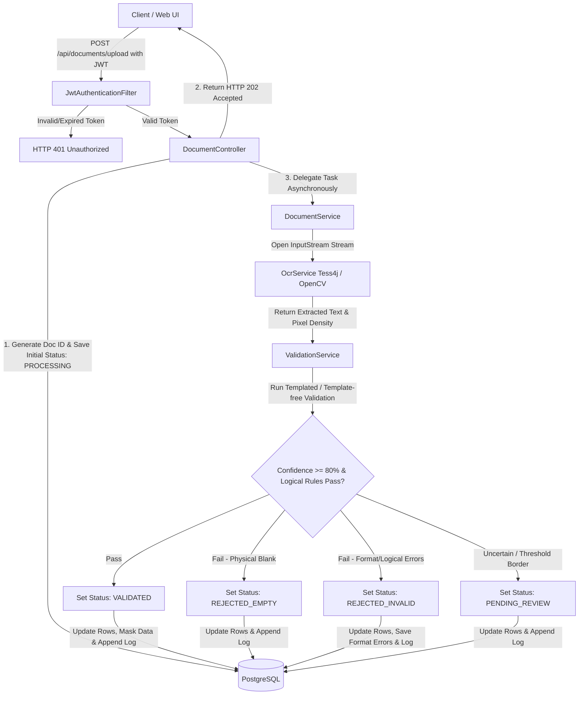
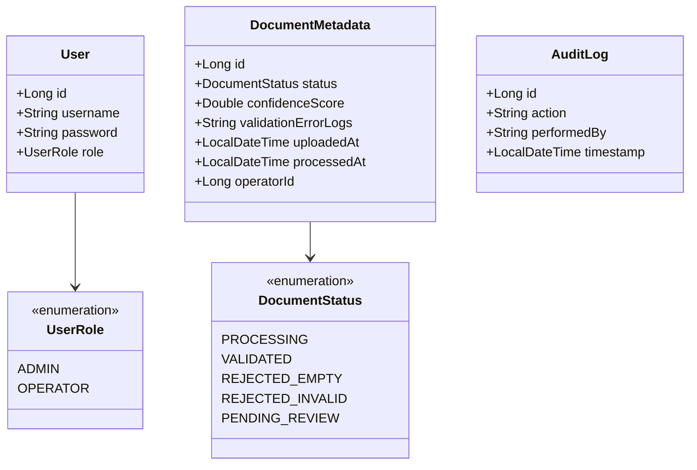
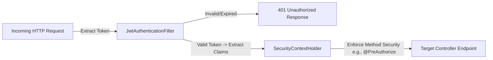

# Software Design Document (SDD) - validdoc (MVP)

## 1. System Architecture

The system follows a classic **Layered Monolithic Architecture** implemented via Spring Boot 4.x. Communication between layers is strictly unidirectional and decoupled using Data Transfer Objects (DTOs) to isolate database entities from the presentation layer.

- **Presentation Layer (`@RestController`):** Exposes stateless REST endpoints. Responsible for HTTP request validation, parsing `MultipartFile` payloads, and returning unified JSON structures.
- **Business Logic Layer (`@Service`):** Contains the core orchestration logic. It encapsulates the asynchronous lifecycle execution, regular expression compilation for data scanning, OpenCV coordinate/pixel density analysis for signature/stamp detection, and the Tesseract execution framework.
- **Data Access Layer (`@Repository`):** Built upon Spring Data JPA. It abstracts SQL operations into safe Java interfaces, leveraging Hibernate as the underlying Object-Relational Mapping (ORM) framework with database-level encryption for sensitive fields.

---

## 2. System Architecture & Data Flow Diagram

To comply with KVKK/GDPR and prevent local storage bottlenecks, files are processed strictly in-memory (RAM) via Java standard input streams. Uploaded documents are instantly processed and destroyed from RAM, leaving only metadata.



The transactional execution inside `ValidationService` is marked with `@Transactional` to ensure that database metadata updates and immutable audit log writes succeed or fail as a single atomic unit.

---

## 3. Class Design & Package Structure

The application uses strict domain-driven sub-packages under the root `com.validdoc` package to prevent circular dependencies.



### 3.1 Directory Tree

```
com.validdoc
│
├── config
│   ├── SecurityConfig.java (Configures BCrypt, CORS, and stateless Filter Chain)
│   ├── AsyncConfig.java (Configures ThreadPoolTaskExecutor limits for < 3s response)
│   └── TesseractConfig.java (Bean instantiation of Tesseract instances)
│
├── controller
│   ├── AuthController.java (Handles registration, authentication, and JWT issue)
│   └── DocumentController.java (Handles binary streams, upload, and manual operator reviews)
│
├── dto
│   ├── request
│   │   ├── LoginRequest.java
│   │   └── VerificationRequest.java
│   └── response
│       ├── AuthResponse.java
│       └── DocumentSummaryResponse.java
│
├── model
│   ├── enums
│   │   ├── UserRole.java
│   │   └── DocumentStatus.java
│   ├── User.java (Hassas alanlar için @ColumnTransformer şifreleme/maskeleme barındırır)
│   ├── DocumentMetadata.java
│   └── AuditLog.java
│
├── repository
│   ├── UserRepository.java
│   ├── DocumentRepository.java
│   └── AuditLogRepository.java (Immutable repository configuration)
│
└── service
    ├── OcrService.java (BufferedImage conversion, Tess4j bindings, and OpenCV cropping)
    ├── ValidationService.java (Templated & template-free matching engine, regex, pixel density checks)
    └── DocumentService.java (State tracking, asynchronous orchestration, and persistence)
```

---

## 4. Database Schema (ERD Model)

The PostgreSQL schema uses specialized native types, automatic key generators (`GenerationType.IDENTITY`), and database-level column encryption for sensitive personal data to satisfy KVKK/GDPR requirements.

### 4.1 `users`

| Column | Type | Constraints |
|---|---|---|
| id | BigInt | Primary Key, Auto-Increment |
| username | VarChar(50) | Unique, Indexed, Not Null (Masked/Encrypted if containing personal details) |
| password | VarChar(255) | BCrypt Hashed (60-char), Not Null |
| role | VarChar(20) | Enum Mapped as String (ADMIN, OPERATOR), Not Null |

### 4.2 `document_metadata`

| Column | Type | Constraints |
|---|---|---|
| id | BigInt | Primary Key, Auto-Increment |
| status | VarChar(30) | Enum Mapped as String (Default: PROCESSING) |
| confidence_score | Double | Nullable until OCR/CV validation concludes |
| validation_error_logs | Text | Stores logical/format verification error details, Nullable |
| uploaded_at | Timestamp | UTC Metrics, Not Null |
| processed_at | Timestamp | Nullable (Set after validation concludes) |
| operator_id | BigInt | Foreign Key -> users(id), Nullable (Set only if manually reviewed) |

### 4.3 `audit_logs`

> **Note:** This table is strictly append-only. Delete and Update queries are restricted at the repository configuration layer to preserve corporate auditing trail integrity.

| Column | Type | Constraints |
|---|---|---|
| id | BigInt | Primary Key, Auto-Increment |
| action | VarChar(100) | E.g., "DOCUMENT_SIZE_REJECTED", "MANUAL_APPROVE", "DOCUMENT_UPLOADED" |
| performed_by | VarChar(50) | String capture of context (Username or "SYSTEM") |
| timestamp | Timestamp | UTC Metrics, Not Null |

---

## 5. Core Algorithmic Decisions

### 5.1 In-Memory Document Processing & Leak Prevention

When a binary stream reaches `DocumentController`, it is processed inside a try-with-resources block to ensure the underlying stream closes automatically:

```java
try (InputStream is = file.getInputStream()) {
    BufferedImage image = ImageIO.read(is);
    // OpenCV methods check pixel density at specific coordinates for signatures
    // Tesseract extracts raw text for logical & format regex verification
    String extractedText = ocrService.doOcr(image);
    // ... validation steps
}
```

Converting to `BufferedImage` forces the JVM to manage pixel data entirely within heap allocation structures. Once the reference scope closes, the graphic buffer becomes eligible for immediate Garbage Collection (GC) sweeps. A strict file size limit (e.g., maximum 5MB) is enforced via application configuration to protect system memory.

### 5.2 Thread Pool Allocation Strategy for Async OCR

To satisfy the under 3-second response time requirement and prevent a sudden influx of uploads from freezing Tomcat's main execution threads, processing runs via an isolated `ThreadPoolTaskExecutor`:

- **Core Pool Size:** 4 threads (Optimized for multi-core CPUs scaling text parsing tasks).
- **Max Pool Size:** 8 threads (Upper safety bound during peak corporate processing hours).
- **Queue Capacity:** 500 tasks. If the queue saturates, subsequent requests receive an immediate HTTP 429 Too Many Requests status, protecting the application from memory crash failures.

---

## 6. API Endpoints (Contract Design)

| Method | Endpoint | Auth Role | Description | Request Body / Param | Response (Success) |
|---|---|---|---|---|---|
| POST | `/api/auth/login` | Public | Generates JWT Bearer Token | JSON `{username, password}` | `200 OK {token, role}` |
| POST | `/api/documents/upload` | OPERATOR, ADMIN | Accepts file, triggers async OCR & CV validation | form-data `{file: MultipartFile}` | `202 Accepted {documentId, status: "PROCESSING"}` |
| GET | `/api/documents/queue` | OPERATOR, ADMIN | Fetches PENDING_REVIEW docs | None | `200 OK [DocumentMetadata]` |
| POST | `/api/documents/{id}/verify` | OPERATOR | Manual status override | JSON `{status: VALIDATED/REJECTED_EMPTY/REJECTED_INVALID}` | `200 OK {message: "Updated"}` |

---

## 7. Security Architecture (JWT Middleware)

Spring Security treats the application as a stateless system. The integration topology follows this sequential validation filter chain:



---

## 8. Global Exception & Failure Handling Strategy

To avoid generic internal server errors (HTTP 500) and handle runtime anomalies safely, the application implements a centralized `@ControllerAdvice` handler mapping specific exceptions to structured error responses:

- **`MaxUploadSizeExceededException`:** Returns HTTP 413 Payload Too Large with JSON: `{"error": "File size exceeds the maximum limit of 5MB"}`.
- **`TesseractException` / `OpenCVException` (Engine Failures):** Caught gracefully. Automatically sets the target document's status to `PENDING_REVIEW` with a 0.0 confidence score and logs the exception, routing it straight to the human operator queue.
- **`EntityNotFoundException`:** Returns HTTP 404 Not Found when an operator attempts to verify a non-existent document ID.
