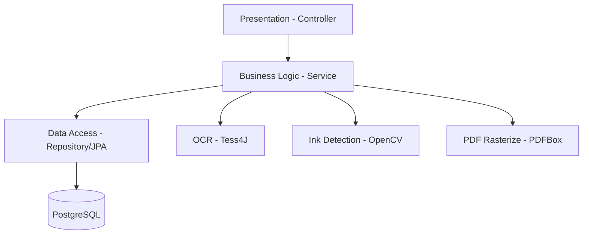
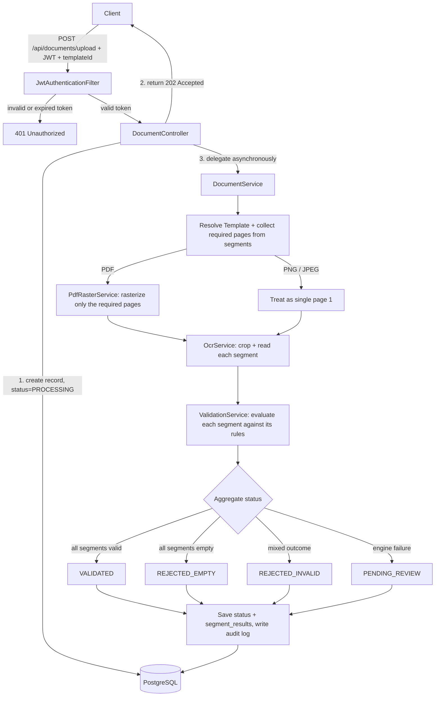
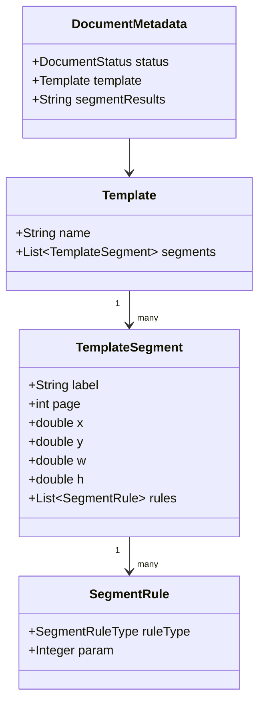
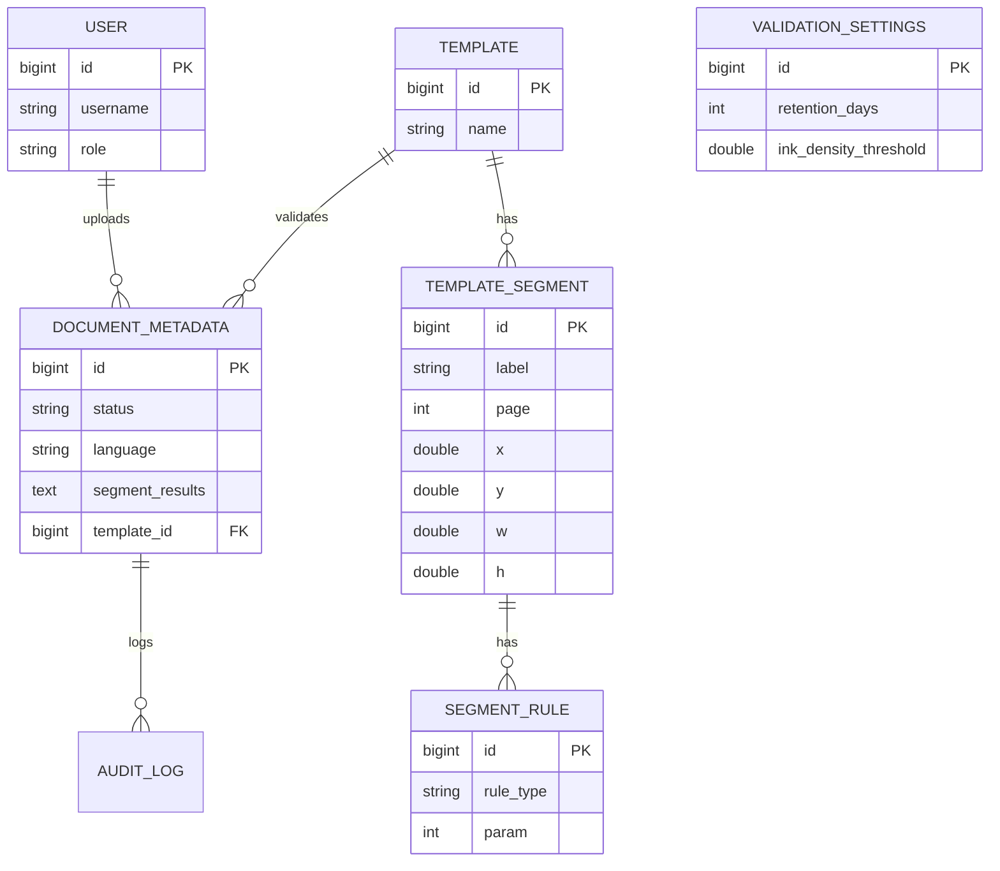

# Software Design Document (SDD) - validdoc

## 1. System Architecture
The application follows a layered monolithic architecture (**Controller → Service → Repository**), built on Spring Boot 4.x, and is packaged as a stateless container.

Sensitive fields (`segment_results`) are encrypted at the JPA `AttributeConverter` level with **AES-256-GCM**; the key is supplied only via an environment variable.

### 1.1 Container Readiness
The Dockerfile is based on `eclipse-temurin:21-jre-jammy`; Tesseract 4.1.1 is installed via apt, and the `tessdata` path is fixed accordingly. Secrets (DB, JWT, encryption key) are supplied only via environment variables.

---

## 2. Data Flow Diagram
Every request first passes through JWT authentication. The upload endpoint persists an initial record and returns `202 Accepted` immediately; the rest of the pipeline (page rasterization, OCR, rule evaluation, status derivation) runs asynchronously in the background. Only the pages a template's segments actually reference are rasterized — not the whole document — and every outcome, automatic or manual, is written to the audit log alongside the final status.

---

## 3. Class Design & Package Structure

**Main packages:** `controller` (REST endpoints), `service` (OCR/validation/document orchestration), `model` (JPA entities), `dto` (request/response/internal carriers), `security` (JWT and encryption), `exception` (centralized error handling), `repository` (Spring Data JPA), `config` (Tesseract/async/settings infrastructure).

---

## 4. Database Schema (ERD)

**Note:** `templates` cannot be modified once saved; a correction is made by registering a new template. `audit_logs` is append-only and is exempt from the retention purge process.

---

## 5. Core Algorithmic Decisions

- **5.1 In-Memory Processing:** Files are never written to disk; once processing completes, the `BufferedImage` is released for GC. A maximum file size of 5MB is enforced.
- **5.2 Async Processing:** OCR and validation run in the background via an `@Async` thread pool (4-8 threads); the upload request returns `202 Accepted` immediately.
- **5.3 Admin-Configurable Settings:** Only `retentionDays` and `inkDensityThreshold` can be changed at runtime (no restart required); they are stored in the `validation_settings` table.
- **5.4 Segment Evaluation:** Each segment is evaluated against its own rules as `FILLED_VALID` / `FILLED_INVALID` / `EMPTY`; the result is masked and written as JSON into `segment_results`. Document status is derived deterministically from these results (see §2).
- **5.5 Multi-Language (TR/EN):** The `Accept-Language` header determines the API message language, while a separate `lang` parameter determines the OCR scanning language — two independent signals. Since `Tesseract` is not thread-safe, each worker thread keeps its own instance (`ThreadLocal`).

---

## 6. API Endpoints

| Method | Endpoint | Role | Description |
|---|---|---|---|
| GET | `/actuator/health` | Public | Provides an authentication-free liveness check |
| POST | `/api/auth/login` | Public | Issues a JWT (valid for 10 min) |
| POST | `/api/users` | ADMIN | Creates a new user |
| GET/POST | `/api/templates` | ADMIN | Lists templates / saves one with segments and rules (immutable) |
| POST | `/api/templates/preview` | ADMIN | Provides a segment preview without saving |
| POST | `/api/documents/upload` | OPERATOR/ADMIN | Uploads a document, processes it asynchronously |
| GET | `/api/documents/{id}` | OPERATOR/ADMIN | Returns a document and its segment report |
| GET | `/api/documents/queue` | OPERATOR/ADMIN | Returns the `PENDING_REVIEW` queue |
| POST | `/api/documents/{id}/verify` | OPERATOR | Applies a manual status |
| GET/PUT | `/api/admin/validation-settings` | ADMIN | Manages retention and ink threshold |

---

## 7. Security Architecture
- Every request passes through `JwtAuthenticationFilter`; an invalid or expired token results in `401`.
- Login attempts are rate-limited to **5 per minute per IP** (in-memory).
- Account creation is restricted to admins; a single admin account is seeded automatically on first startup.

---

## 8. Global Exception & Failure Handling
- Business logic errors are thrown as `ApiException` with an `ErrorCode`; `@RestControllerAdvice` returns them as a localized `{code, message}` payload (based on `Accept-Language`).
- Engine failures (OCR/PDF/OpenCV/template mismatch) never surface as HTTP errors — they are caught inside the `@Async` pipeline, the document is moved to `PENDING_REVIEW`, and the outcome is written to `audit_logs`.