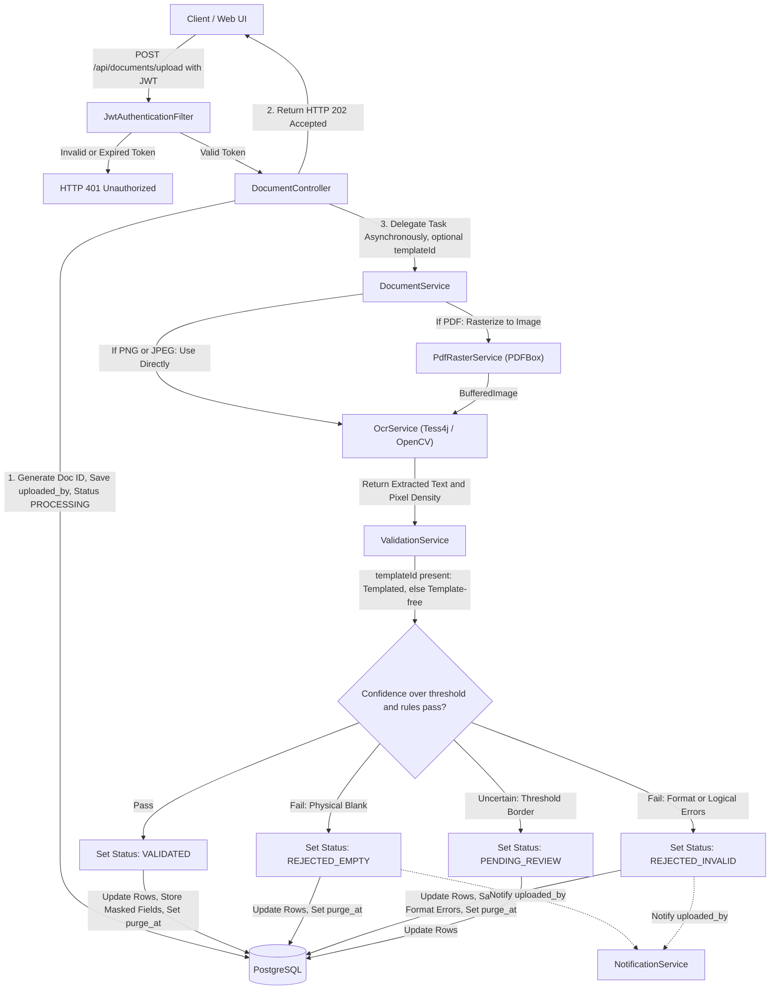
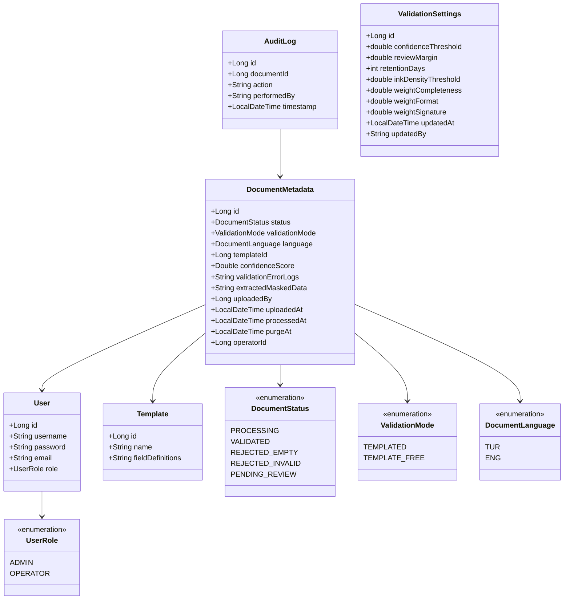
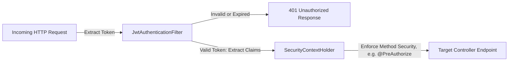

# Software Design Document (SDD) - validdoc (MVP)

## 1. System Architecture

The system follows a classic **Layered Monolithic Architecture** implemented via Spring Boot 4.x, packaged as a stateless container image (see `Dockerfile`, §1.1) so it can scale horizontally by running additional replicas. Communication between layers is strictly unidirectional and decoupled using Data Transfer Objects (DTOs) to isolate database entities from the presentation layer.

- **Presentation Layer (`@RestController`):** Exposes stateless REST endpoints. Responsible for HTTP request validation, parsing `MultipartFile` payloads, and returning unified JSON structures.
- **Business Logic Layer (`@Service`):** Contains the core orchestration logic. It encapsulates the asynchronous lifecycle execution, PDF rasterization, regular expression compilation for data scanning, OpenCV coordinate/pixel density analysis for signature/stamp detection, the Tesseract execution framework, and rejection notifications.
- **Data Access Layer (`@Repository`):** Built upon Spring Data JPA. It abstracts SQL operations into safe Java interfaces, leveraging Hibernate as the underlying Object-Relational Mapping (ORM) framework. Sensitive extracted-data fields are encrypted at rest, application-side, via a JPA `AttributeConverter` (`MaskedDataEncryptionConverter`, AES-256-GCM) rather than a database-native encryption function — this keeps the encryption key out of any checked-in SQL and out of the database engine entirely, sourced only from the externalized `encryption.secret-key` property at runtime.
### 1.1 Container Readiness

The application holds no local session or file state (per §5.1, all documents are processed strictly in-memory). A single-stage `Dockerfile` (project root) builds from `eclipse-temurin:21-jre-jammy` — a glibc-based image, deliberately not Alpine/musl, because the `org.openpnp:opencv` native bindings are prebuilt against glibc and fail to load under musl — installs `tesseract-ocr`/`tesseract-ocr-tur` from the standard Ubuntu apt repository (jammy ships Tesseract **4.1.1**, no third-party PPA dependency; `tesseract-ocr-eng` is pulled in transitively since the base `tesseract-ocr` package depends on it, so English data is present without an explicit install step), copies the pre-built fat JAR, and runs it as a non-root `validdoc` user; horizontal scaling is achieved by running multiple container replicas behind a load balancer, with PostgreSQL as the sole shared state. `tesseract.datapath` (`application.properties`) is the single source of truth for the tessdata location and is set to `/usr/share/tesseract-ocr/4.00/tessdata` — the actual path Debian/Ubuntu packaging uses for Tesseract 4.x (the `.../5/tessdata` convention only applies on Ubuntu 24.04+, which ships Tesseract 5; using it against a jammy-based image silently points at a non-existent directory). There is deliberately no separate `TESSERACT_DATAPATH` env var in the `Dockerfile` — a single property read via `TesseractConfig` avoids two values that can drift out of sync. `spring.datasource.*` and all secrets (`jwt.secret`, `encryption.secret-key`) must be supplied via environment variables at container run time; the checked-in `application.properties` values are local-development defaults only. A `docker-compose.yml` (project root) runs the app alongside a `postgres:16-alpine` container for local integration testing; it reads required secrets from a `.env` file (see `.env.example`) rather than hardcoding or defaulting them, so a missing `.env` fails loudly instead of silently running with an insecure value.

> **Known MVP limitation:** PDF rasterization (§5.1) covers only the first page. Multi-page support is out of scope for this version.
 
---

## 2. System Architecture & Data Flow Diagram

To comply with KVKK/GDPR and prevent local storage bottlenecks, files are processed strictly in-memory (RAM) via Java standard input streams. Uploaded documents are instantly processed and destroyed from RAM, leaving only metadata (and masked/encrypted extracted fields, subject to retention purge — see §4.2 and §5.3).



`DocumentService.processDocument()` — not `ValidationService`, which is a stateless, DB-free matching engine — is marked `@Transactional` (alongside `@Async`) to ensure that a document's metadata update and its `audit_logs` write succeed or fail as a single atomic unit. `NotificationService.notifyRejection()` is itself `@Async`, so its call is dispatched to a separate thread and its execution is decoupled from `processDocument`'s transaction — a downstream notification failure never rolls back a validation result.
 
---

## 3. Class Design & Package Structure

The application uses strict domain-driven sub-packages under the root `com.validdoc` package to prevent circular dependencies.



### 3.1 Directory Tree

```
com.validdoc
│
├── config
│   ├── SecurityConfig.java (BCrypt PasswordEncoder, AuthenticationManager, stateless SecurityFilterChain with JwtAuthenticationFilter; @EnableMethodSecurity for @PreAuthorize. CORS is not yet configured — pending a decided frontend origin.)
│   ├── AsyncConfig.java (Configures ThreadPoolTaskExecutor limits for < 3s response)
│   ├── TesseractConfig.java (Reads tesseract.datapath; exposes a TesseractFactory bean — no longer owns a shared Tesseract instance, see §5.5)
│   ├── TesseractFactory.java (Stateless factory producing a fresh Tesseract instance per call; consumed by OcrService to build its per-thread cache — see §5.5)
│   ├── ValidationProperties.java (Binds validation.* defaults from application.properties; used only as a one-time seed source for ValidationSettingsService on first boot — see §5.3. Not read directly by ValidationService/DocumentService anymore.)
│   └── AdminBootstrapRunner.java (ApplicationRunner; seeds one default ADMIN account on first startup if the users table is empty — see §7.1)
│
├── controller
│   ├── AuthController.java (Handles authentication and JWT issue; no self-service registration — accounts are created via UserController, per SRS 1.1)
│   ├── UserController.java (Admin-only account creation for both ADMIN and OPERATOR roles — see §7.1)
│   ├── DocumentController.java (Handles binary streams, upload, and manual operator reviews)
│   ├── TemplateController.java (Admin Create + read-only list of named field-coordinate templates for OPERATOR/ADMIN; no update/delete endpoints exist)
│   └── ValidationSettingsController.java (Admin-only GET/PUT of the runtime-editable confidence threshold, review margin, retention window, and scoring weights — see §5.3)
│
├── dto
│   ├── request
│   │   ├── LoginRequest.java
│   │   ├── VerificationRequest.java
│   │   ├── TemplateRequest.java
│   │   ├── CreateUserRequest.java
│   │   └── ValidationSettingsUpdateRequest.java (all seven tuning fields required; bounded 0.0–1.0 for scores/weights, positive for retentionDays)
│   └── response
│       ├── AuthResponse.java
│       ├── DocumentSummaryResponse.java (includes language, see §5.5)
│       ├── TemplateSummaryResponse.java
│       ├── UserSummaryResponse.java
│       └── ValidationSettingsResponse.java
│
├── exception
│   ├── OpenCVException.java
│   ├── PdfRasterizationException.java
│   ├── TemplateDefinitionException.java
│   ├── ErrorCode.java (Enum mapping each business error to an HttpStatus + a MessageSource key — see §5.5, §8)
│   ├── ApiException.java (RuntimeException carrying an ErrorCode plus MessageFormat args; the standard way to raise a user-facing business error, see §8)
│   ├── ApiErrorResponse.java (Record — the {code, message} JSON body returned for every handled error, see §8)
│   └── GlobalExceptionHandler.java (@RestControllerAdvice — see §8)
│
├── model
│   ├── enums
│   │   ├── UserRole.java
│   │   ├── DocumentStatus.java
│   │   ├── ValidationMode.java
│   │   └── DocumentLanguage.java (TUR/ENG, each carrying its Tesseract language code; fromParam(String) resolves an upload's lang query param, defaulting unknown/blank/absent values to TUR — see §5.5)
│   ├── User.java
│   ├── DocumentMetadata.java (@Convert(MaskedDataEncryptionConverter) on extractedMaskedData only; language defaults to TUR at the Java level — rows created before this field existed read back as null, treated as TUR by DocumentService, see §5.5)
│   ├── Template.java
│   ├── AuditLog.java (documentId nullable — set for document-related actions, null for account-level actions)
│   └── ValidationSettings.java (Single-row table, id fixed to 1 — no @GeneratedValue — enforcing the singleton invariant at the schema level; see §4.5)
│
├── repository
│   ├── UserRepository.java
│   ├── DocumentRepository.java (findByPurgeAtLessThanEqualAndExtractedMaskedDataIsNotNull excludes rows already purged, or that never had maskable data, from repeat retention sweeps — see §5.3)
│   ├── TemplateRepository.java
│   ├── AuditLogRepository.java (Immutable repository configuration)
│   └── ValidationSettingsRepository.java
│
├── scheduler
│   └── RetentionCleanupJob.java (Periodically purges/anonymizes rows past purgeAt)
│
├── security
│   ├── CustomUserDetailsService.java (Adapts User entity to Spring Security's UserDetails, ROLE_-prefixed authorities)
│   ├── JwtService.java (HMAC token generation/parsing via jjwt; secret and expiration externalized via jwt.secret/jwt.expiration-ms)
│   ├── JwtAuthenticationFilter.java (OncePerRequestFilter populating SecurityContextHolder from a valid Bearer token)
│   └── MaskedDataEncryptionConverter.java (JPA AttributeConverter, AES-256-GCM; key externalized via encryption.secret-key)
│
└── service
    ├── PdfRasterService.java (Renders first PDF page to BufferedImage via Apache PDFBox)
    ├── OcrService.java (BufferedImage conversion, Tess4j bindings, and OpenCV cropping; holds a ThreadLocal<Tesseract> — one instance per async worker thread, built via TesseractFactory — and calls setLanguage(...) per document before each doOCR, see §5.5)
    ├── ValidationService.java (Templated & template-free matching engine, regex, pixel density checks; reads all tuning values from ValidationSettingsService, not ValidationProperties — see §5.3)
    ├── ValidationSettingsService.java (Loads/seeds the singleton ValidationSettings row on startup, caches it in a volatile field, and applies admin updates — see §5.3)
    ├── DocumentService.java (State tracking, asynchronous orchestration, and persistence; reads retentionDays from ValidationSettingsService and the document's resolved language from the DocumentMetadata row itself, see §5.5)
    └── NotificationService.java (Async hook fired on REJECTED_* transitions; stubbed/logged for MVP)
```
 
---

## 4. Database Schema (ERD Model)

The PostgreSQL schema uses specialized native types, automatic key generators (`GenerationType.IDENTITY`), and database-level column encryption for sensitive extracted personal data to satisfy KVKK/GDPR requirements.

### 4.1 `users`

| Column | Type | Constraints |
|---|---|---|
| id | BigInt | Primary Key, Auto-Increment |
| username | VarChar(50) | Unique, Indexed, Not Null (plaintext login identifier — not extracted document data, not subject to §4.2 masking rules) |
| password | VarChar(255) | BCrypt Hashed (60-char), Not Null |
| email | VarChar(255) | Not Null (notification delivery target only, see §4.2 `uploaded_by`) |
| role | VarChar(20) | Enum Mapped as String (ADMIN, OPERATOR), Not Null |

### 4.2 `document_metadata`

| Column | Type | Constraints |
|---|---|---|
| id | BigInt | Primary Key, Auto-Increment |
| file_name | VarChar(255) | Not Null; original uploaded filename (e.g. `application.pdf`). This is upload metadata, not "personal data extracted from document contents" (SRS §3.1.1's masking rule is scoped to the latter), so it is intentionally stored in plaintext — operators need it to identify/cross-reference an upload. Uploaders should be advised not to name files after the data subject. |
| status | VarChar(30) | Enum Mapped as String (Default: PROCESSING) |
| validation_mode | VarChar(20) | Enum Mapped as String (TEMPLATED, TEMPLATE_FREE), Nullable until analysis starts |
| language | VarChar(10) | Enum Mapped as String (TUR, ENG); selected at upload time via the `lang` query param (§5.5), defaults to TUR. Nullable at the DB level only for rows created before this column existed (added via `ddl-auto=update` against a non-empty table, so no `NOT NULL` was applied); `DocumentService` treats a null read as TUR |
| template_id | BigInt | Foreign Key -> templates(id), Nullable (set only when validation_mode = TEMPLATED) |
| confidence_score | Double | Nullable until OCR/CV validation concludes |
| validation_error_logs | Text | Stores logical/format verification error details, Nullable |
| extracted_masked_data | Text | Column-level encrypted JSON blob of masked personal fields (name, phone, etc.); Nullable |
| uploaded_by | BigInt | Foreign Key -> users(id), Not Null (also the `NotificationService` recipient) |
| uploaded_at | Timestamp | UTC Metrics, Not Null |
| processed_at | Timestamp | Nullable (Set after validation concludes) |
| purge_at | Timestamp | Nullable; set to `processed_at` + retention window once processing concludes; consumed by `RetentionCleanupJob` |
| operator_id | BigInt | Foreign Key -> users(id), Nullable (Set only if manually reviewed) |

### 4.3 `templates`

Draft-level definition — holds the named field boxes that `TEMPLATED` mode matches a document against. Managed by admins via `TemplateController`; listable by any authenticated user for selection at upload time.

| Column | Type | Constraints |
|---|---|---|
| id | BigInt | Primary Key, Auto-Increment |
| name | VarChar(100) | Unique, Not Null (e.g. "Standard Application Form v1") |
| field_definitions | Text (JSON) | Not Null; list of named field boxes (label + coordinates), e.g. `[{"label":"signature","x":..,"y":..,"w":..,"h":..}]` |

### 4.4 `audit_logs`

> **Note:** This table is strictly append-only. Delete and Update queries are restricted at the repository configuration layer to preserve corporate auditing trail integrity. It is exempt from the `purge_at` retention mechanism above because it stores only action metadata (who/what/when/which-document), never personal document content.

| Column | Type | Constraints |
|---|---|---|
| id | BigInt | Primary Key, Auto-Increment |
| document_id | BigInt | Foreign Key -> document_metadata(id), Nullable (populated for document-related actions such as DOCUMENT_UPLOADED, MANUAL_APPROVE, RETENTION_PURGE; null for account-level actions, if any) |
| action | VarChar(100) | E.g., "DOCUMENT_UPLOADED", `"AUTO_" + status` written by `DocumentService` on every automated outcome (e.g. "AUTO_VALIDATED", "AUTO_REJECTED_EMPTY", "AUTO_REJECTED_INVALID", "AUTO_PENDING_REVIEW"), `"MANUAL_" + status` written by `DocumentController.verify()` on every operator override (e.g. "MANUAL_VALIDATED", "MANUAL_REJECTED_EMPTY", "MANUAL_REJECTED_INVALID"), "ENGINE_ERROR_PENDING_REVIEW" (any engine failure, see §8), "RETENTION_PURGE" |
| performed_by | VarChar(50) | String capture of context (Username or "SYSTEM") |
| timestamp | Timestamp | UTC Metrics, Not Null |

### 4.5 `validation_settings`

Single-row table (`id` fixed to `1`, no auto-increment) holding the current, admin-editable validation tuning parameters. Seeded once from `ValidationProperties`/`application.properties` on first application boot if empty; every subsequent read/write goes through `ValidationSettingsService` (see §5.3), never back to the static config. This is what makes threshold/weight/retention tuning a runtime operation instead of a code change + redeploy.

| Column | Type | Constraints |
|---|---|---|
| id | BigInt | Primary Key, fixed value `1` (no `@GeneratedValue` — schema itself enforces the single-row invariant) |
| confidence_threshold | Double | Not Null (SRS 1.4) |
| review_margin | Double | Not Null (SRS 1.3, §5.4) |
| retention_days | Integer | Not Null (SRS 2.3 / 3.1.1) |
| ink_density_threshold | Double | Not Null (SRS 1.3, signature/stamp ink detection) |
| weight_completeness | Double | Not Null; with weight_format and weight_signature, must sum to 1.0 — enforced on every write |
| weight_format | Double | Not Null |
| weight_signature | Double | Not Null |
| updated_at | Timestamp | Not Null; refreshed on every write |
| updated_by | VarChar(50) | Not Null; `"SYSTEM_SEED"` for the initial seed row, otherwise the admin username that made the change |
 
---

## 5. Core Algorithmic Decisions

### 5.1 In-Memory Document Processing & Leak Prevention

`DocumentController` reads the multipart upload into a `byte[]` synchronously (the underlying request-scoped stream would already be closed by the time an `@Async` method runs on a worker thread, so a raw `InputStream` cannot safely cross that boundary) and hands it off to `DocumentService.processDocument`, which rasterizes PDFs first so every downstream step operates on a uniform `BufferedImage`:

```java
@Async
@Transactional
public void processDocument(Long documentId, byte[] fileBytes, String contentType, Long templateId) {
    BufferedImage image = PDF_CONTENT_TYPE.equals(contentType)
        ? pdfRasterService.renderFirstPage(new ByteArrayInputStream(fileBytes))   // Apache PDFBox, in-memory only
        : ImageIO.read(new ByteArrayInputStream(fileBytes));                     // PNG / JPEG path
 
    // OcrService checks pixel density at specific coordinates for signatures/stamps (OpenCV)
    // and extracts raw text for logical & format regex verification (Tesseract)
    OcrDocumentResult ocrResult = ocrService.process(image, template);
    ValidationResult result = validationService.validate(ocrResult, template);
    // ... apply result, persist, notify on rejection
}
```

Converting to `BufferedImage` forces the JVM to manage pixel data entirely within heap allocation structures. Once the reference scope closes, the graphic buffer becomes eligible for immediate Garbage Collection (GC) sweeps. A strict file size limit (e.g., maximum 5MB) is enforced via application configuration to protect system memory, and applies equally to PDF and image uploads.

### 5.2 Thread Pool Allocation Strategy for Async OCR

To satisfy the under-three-second response time requirement and prevent a sudden influx of uploads from freezing Tomcat's main execution threads, processing runs via an isolated `ThreadPoolTaskExecutor`:

- **Core Pool Size:** 4 threads (Optimized for multi-core CPUs scaling text parsing tasks).
- **Max Pool Size:** 8 threads (Upper safety bound during peak corporate processing hours).
- **Queue Capacity:** 500 tasks. If the queue saturates, subsequent requests receive an immediate HTTP 429 Too Many Requests status, protecting the application from memory crash failures.
### 5.3 Admin-Configurable Validation Parameters (Runtime, No Restart)

All seven tuning values (`confidenceThreshold`, `reviewMargin`, `retentionDays`, `inkDensityThreshold`, `weightCompleteness`, `weightFormat`, `weightSignature`) live in the `validation_settings` table (§4.5), not directly in `application.properties`. `ValidationProperties` still exists and still binds `validation.*` from `application.properties`, but it now plays a narrower role: a one-time default source, read only by `ValidationSettingsService` the very first time the application starts against an empty `validation_settings` table.

```
@PostConstruct on ValidationSettingsService:
  row = validationSettingsRepository.findById(1)
  if row absent:
      row = seed a new row from ValidationProperties defaults, updatedBy = "SYSTEM_SEED"
  cache row in a volatile field ("current")
```

`ValidationService` and `DocumentService` both depend on `ValidationSettingsService`, never on `ValidationProperties` directly — so a value change is visible to every in-flight and future validation immediately, without a restart. The cached reference is `volatile` (not merely synchronized) because validation runs on `@Async` worker threads and the retention job runs on the scheduler thread; a `volatile` read is sufficient for safe cross-thread visibility of an immutable snapshot object, without contending on a lock during the hot validation path.

Admins change these values via `ValidationSettingsController` (`GET`/`PUT /api/admin/validation-settings`, `hasRole('ADMIN')` — see §6). A `PUT` re-validates that `weightCompleteness + weightFormat + weightSignature` sums to 1.0 (the same invariant `ValidationProperties` used to check once at startup via `@PostConstruct`, now re-checked on every write), rejecting with `IllegalArgumentException` → 400 (§8) otherwise; on success it persists the new row, refreshes the cache, and writes a `"VALIDATION_SETTINGS_UPDATED"` entry to `audit_logs` (via the `AuditLog(action, performedBy)` constructor — `document_id` stays null, since this isn't a per-document action).

`RetentionCleanupJob` runs on a daily schedule (`@Scheduled(cron = "0 0 3 * * *")`), reading the current `retentionDays` indirectly — `purge_at` is precomputed and stored per-document at the moment processing (or manual verification) concludes, not read live off `ValidationSettingsService` at purge time, so a later change to `retentionDays` only affects documents processed after the change. It selects `document_metadata` rows via `findByPurgeAtLessThanEqualAndExtractedMaskedDataIsNotNull(now())` — the `extractedMaskedData IS NOT NULL` condition is deliberate: without it, a row past its `purge_at` would be re-selected and re-logged on every single run for as long as it remains in the table, since nothing else marks it as "already purged." Requiring non-null masked data means a row is only ever picked up once (nulling the column removes it from future sweeps), and a document that never had maskable personal data extracted in the first place is never selected at all, since there is nothing to purge. Matching rows have `extracted_masked_data` nulled and a single `"RETENTION_PURGE"` entry (with the corresponding `document_id`) written to `audit_logs` — preserving the audit trail while satisfying the erasure requirement.

### 5.4 Validation Logic Overview (Draft Level)

This is intentionally a high-level summary, not a full specification — exact weights and margins are admin-configurable tuning parameters (§5.3), not fixed contracts:

- **Confidence score:** a weighted combination of (a) required-field completeness, (b) format/logical correctness of extracted text, and (c) signature/stamp ink presence.
- **`REJECTED_EMPTY`:** little to no extracted text **and** no ink detected in signature/stamp regions — treated as a physically blank document regardless of score.
- **`REJECTED_INVALID`:** content is present, but one or more required fields fail format/logical checks (§1.3 of the SRS).
- **`PENDING_REVIEW`:** score falls within a small margin around the current `confidenceThreshold` (§5.3), **in either direction** (`threshold - margin` to `threshold + margin`), or an engine error occurred (§8) — routed to a human rather than auto-decided. This is intentionally a narrow band; most low-scoring documents are confidently auto-rejected rather than deferred (see `REJECTED_INVALID` below).
- **`VALIDATED`:** score at or above `threshold + margin`, with all logical checks passed.
- **`REJECTED_INVALID` (score path):** in addition to the explicit format/logical failures described above, a score at or below `threshold - margin` — with no format errors, but too little of the expected content actually found (e.g. most required fields missing) — is also confidently classified as `REJECTED_INVALID` rather than `PENDING_REVIEW`, logged with an `"insufficient_completeness"` marker in `validation_error_logs`.
  Field-level checks under `TEMPLATED` mode are evaluated against the selected `Template`'s `field_definitions`, after `OcrService` first validates that each field's coordinates actually fall within the rasterized image bounds (malformed template geometry raises `TemplateDefinitionException`, routed to `PENDING_REVIEW` per §8, rather than attempting an out-of-bounds crop). Under `TEMPLATE_FREE` mode, fields are located via OCR-anchor heuristics (e.g. a line labeled "İmza"/"Signature", "Tarih"/"Date") using a locale-safe text normalizer so matching works uniformly whether the document is in Turkish or English. The detailed matching logic is an implementation detail left to `ValidationService`/`OcrService`, not specified further here — concrete examples include an 11-digit TC Kimlik No check, a checksum-validated 10-digit VKN, a phone-format regex, rejection of dates parsed as being in the future, and a consonant-run/vowel-ratio heuristic for keyboard-mashed gibberish. Format/logical checking and masking apply to every text field OCR actually finds, not only the required-label subset used for the completeness score.

### 5.5 Document & API Language Selection (TR/EN)

Turkish/English language support spans two independent concerns that are deliberately **not** driven by the same signal, because they answer different questions:

- **"What language should this API response be written in?"** — a per-request presentation concern, resolved via the standard `Accept-Language` HTTP header through Spring's built-in `AcceptHeaderLocaleResolver` (`spring.web.locale-resolver=accept-header`, `spring.web.locale=tr` as the fallback when the header is absent — configured, not custom code). Every business error raised as an `ApiException(ErrorCode, args...)` is caught by `GlobalExceptionHandler` and resolved against `messages_tr.properties` / `messages_en.properties` (`ResourceBundleMessageSource`, `spring.messages.basename=messages`, `spring.messages.encoding=UTF-8`, `spring.messages.fallback-to-system-locale=false` so container OS locale never leaks in) at the moment the response is built. The response shape is `{"code": "<ERROR_CODE>", "message": "<localized text>"}` — `code` is a stable, language-independent identifier for programmatic handling (logging, frontend `switch` statements); `message` is what a human reads. Numeric `MessageFormat` placeholders (e.g. `{0}` in `error.user.not_found`) are pre-formatted to a fixed-locale string (`String.format(Locale.ROOT, ...)`) or wrapped in `String.valueOf(...)` before being passed as args — `MessageFormat` otherwise silently applies locale-specific number grouping/decimal separators to raw numeric arguments (an `en` response would render a document id like `999999` as `999,999`), which is never the intent for an opaque identifier.

- **"What language is this specific document written in, for OCR purposes?"** — a per-document, per-upload concern, resolved via an explicit `lang` query param on `POST /api/documents/upload` (`tur` or `eng`; anything else, including absent/blank/whitespace-only, defaults to `tur` — `DocumentLanguage.fromParam(String)`). This is intentionally independent of `Accept-Language`: an operator with a Turkish-language UI may still upload an English-language document, and conflating the two would silently mis-select the OCR language. The resolved `DocumentLanguage` is persisted on the `DocumentMetadata` row (`language` column) at upload time, before the async pipeline starts — not passed as a method parameter down the call chain — because `@Async` execution happens on a worker-pool thread after the original HTTP request (and any request-scoped context, e.g. `LocaleContextHolder`) has already completed; persisting it on the entity is the only reliable way for `DocumentService.processDocument` to recover it later. `OcrService.process(image, template, language)` calls `tesseract.setLanguage(language.getTesseractCode())` immediately before OCR on each document.

**Tesseract instance lifecycle:** a `tess4j` `Tesseract` instance is not safe for concurrent use from multiple threads. Before this feature, `TesseractConfig` exposed a single shared `@Bean Tesseract` — safe only because the language never changed after construction. Making the language a per-document, runtime-mutable property on a shared singleton would let two documents processing concurrently on `AsyncConfig`'s pool (core 4 / max 8 threads, §5.2) race on each other's `setLanguage()` call, silently corrupting OCR output. The fix: `TesseractConfig` now exposes a stateless `TesseractFactory` bean instead of a `Tesseract` singleton; `OcrService` holds a `ThreadLocal<Tesseract> tesseractHolder = ThreadLocal.withInitial(tesseractFactory::create)`. Each async worker thread lazily builds and keeps exactly one `Tesseract` instance for its lifetime (avoiding repeated `setDatapath()` I/O on every document), and only ever mutates its own instance's language — eliminating the race without adding per-call instantiation cost. Since `AsyncConfig`'s pool is small and bounded (max 8 threads), this results in at most 8 long-lived `Tesseract` instances, not a leak.

> **Known limitation, out of scope for this feature:** template-free validation's required-field detection (§5.4) is a fixed anchor-keyword list (`name`, `date`, `id_number`, `signature`) matched against raw OCR text — it is not a general-purpose "is this form correctly filled out" detector, does not attempt handwriting recognition (Tesseract's `tur`/`eng` trained data targets printed text), and scores a legitimately-filled document poorly if that document's field labels don't match the anchor list. Robust, form-agnostic completeness detection is a separate, larger design problem than language selection and is deliberately not addressed here.

---

## 6. API Endpoints (Contract Design)

| Method | Endpoint | Auth Role | Description | Request Body / Param | Response (Success) |
|---|---|---|---|---|---|
| POST | `/api/auth/login` | Public | Generates JWT Bearer Token | JSON `{username, password}` | `200 OK {token, role}` |
| POST | `/api/users` | ADMIN | Creates a new user account (ADMIN or OPERATOR); password is BCrypt-hashed before persistence | JSON `{username, password, email, role}` | `201 Created {id, username, email, role}` |
| POST | `/api/documents/upload` | OPERATOR, ADMIN | Accepts file (PDF/PNG/JPEG), triggers async rasterization (if PDF), OCR & CV validation. Presence of `templateId` selects TEMPLATED mode; its absence selects TEMPLATE_FREE. `lang` selects the OCR language for this document (§5.5); unset/unrecognized defaults to `tur`. | form-data `{file: MultipartFile, templateId?: Long, lang?: "tur"|"eng"}` | `202 Accepted {documentId, status: "PROCESSING", language: "TUR"|"ENG"}` |
| GET | `/api/documents/queue` | OPERATOR, ADMIN | Fetches PENDING_REVIEW docs | None | `200 OK [DocumentSummaryResponse]` (a safe projection of `DocumentMetadata`, not the raw entity; includes `language`) |
| POST | `/api/documents/{id}/verify` | OPERATOR | Manual status override | JSON `{status: VALIDATED/REJECTED_EMPTY/REJECTED_INVALID}` | `200 OK {message}` — localized per `Accept-Language` (§5.5) |
| GET | `/api/templates` | OPERATOR, ADMIN | Lists registered templates, for selection at upload time | None | `200 OK [{templateId, name}]` |
| POST | `/api/templates` | ADMIN | Registers a named template for TEMPLATED validation | JSON `{name, fieldDefinitions}` | `201 Created {templateId}` |
| GET | `/api/admin/validation-settings` | ADMIN | Reads the current runtime-editable validation tuning parameters (§5.3) | None | `200 OK {ValidationSettingsResponse}` |
| PUT | `/api/admin/validation-settings` | ADMIN | Updates validation tuning parameters immediately, no restart; rejects if the three weights don't sum to 1.0 | JSON `{confidenceThreshold, reviewMargin, retentionDays, inkDensityThreshold, weightCompleteness, weightFormat, weightSignature}` | `200 OK {ValidationSettingsResponse}` |
 
---

## 7. Security Architecture (JWT Middleware)

Spring Security treats the application as a stateless system. The integration topology follows this sequential validation filter chain:



### 7.1 Account Provisioning

There is no public registration endpoint — this is an internal corporate tool, not a consumer-facing product, so opening account creation to anyone would let an unauthenticated caller grant themselves `OPERATOR` access to the document review queue. Instead:

- **`UserController` (`POST /api/users`, `@PreAuthorize("hasRole('ADMIN')")`):** the only way to create a user account, for either role. Hashes the incoming password with the same `PasswordEncoder` bean `SecurityConfig` already exposes, and relies on the existing global `DataIntegrityViolationException` → 409 handler (§8) if the requested `username` already exists — no bespoke duplicate-check code needed.
- **`AdminBootstrapRunner` (`ApplicationRunner`):** solves the bootstrap problem — an admin-only endpoint is unreachable if zero admins exist yet. On every application startup it checks `userRepository.count() > 0`; if the table is empty, it creates exactly one `ADMIN` account from `app.bootstrap-admin.username` / `app.bootstrap-admin.password` / `app.bootstrap-admin.email` (each overridable via environment variable, same `${ENV_VAR:default}` pattern as `jwt.secret`). It is a no-op on every subsequent restart once at least one user exists. The default password is a placeholder and **must** be overridden via `BOOTSTRAP_ADMIN_PASSWORD` outside local development; operators are expected to change it immediately after first login.

---

## 8. Global Exception & Failure Handling Strategy

To avoid generic internal server errors (HTTP 500) and handle runtime anomalies safely, the application implements a centralized `@RestControllerAdvice` (`GlobalExceptionHandler`) mapping specific exceptions to a single structured, **localized** response shape: `ApiErrorResponse(String code, String message)` — see §5.5 for how `message` is resolved. Business-logic errors are raised as `ApiException(ErrorCode, args...)` from the throw site (controllers/services) rather than as raw JDK/framework exceptions carrying hardcoded text, so the same exception object works for every supported language:

- **`ApiException`:** The general-purpose path — `GlobalExceptionHandler` reads its `ErrorCode` (which fixes the `HttpStatus`) and resolves the corresponding `messages_*.properties` key against the request's locale. Current `ErrorCode` values: `USER_NOT_FOUND`, `TEMPLATE_NOT_FOUND`, `DOCUMENT_NOT_FOUND` (all → 404), `INVALID_DOCUMENT_STATUS`, `INVALID_FIELD_DEFINITIONS`, `INVALID_WEIGHTS_SUM` (all → 400), `BAD_CREDENTIALS` (401), `ACCESS_DENIED` (403), `DUPLICATE_RECORD` (409), `FILE_TOO_LARGE` (413), `SERVER_BUSY` (429), `INTERNAL_UNEXPECTED` (500).
- **`MaxUploadSizeExceededException` → `FILE_TOO_LARGE` (413).**
- **`TaskRejectedException` → `SERVER_BUSY` (429):** thrown synchronously by the `@Async` proxy when `AsyncConfig`'s `ThreadPoolTaskExecutor` queue (500 tasks) is saturated, fulfilling the behavior already promised in §5.2.
- **`AuthenticationException` → `BAD_CREDENTIALS` (401)** on a failed `/api/auth/login` attempt.
- **`AccessDeniedException` → `ACCESS_DENIED` (403)** when `@PreAuthorize` rejects a request due to insufficient role.
- **`DataIntegrityViolationException` → `DUPLICATE_RECORD` (409)** when a database uniqueness constraint is violated, e.g. registering a template with a name that already exists.
- **Any other unexpected exception → `INTERNAL_UNEXPECTED` (500):** a final generic handler logs the exception server-side and returns a safe, localized, non-leaking message — nothing reaches Spring's default whitelabel error page.
- **`PdfRasterizationException` (corrupted/unreadable PDF), `TesseractException` / `OpenCVException` (OCR/CV engine failures), `TemplateDefinitionException` (unparseable or out-of-bounds template `field_definitions`), and unreadable image input (`IOException`):** These never reach `GlobalExceptionHandler` at all — they occur inside the `@Async` pipeline, after the HTTP response has already been sent. All are caught by `DocumentService.processDocument`, which sets the target document's status to `PENDING_REVIEW` with a 0.0 confidence score, logs the exception, and writes an `"ENGINE_ERROR_PENDING_REVIEW"` entry to `audit_logs` — routing it straight to the human operator queue instead of surfacing as an API error.

> **Implementation note:** every throw site that used to raise a raw `jakarta.persistence.EntityNotFoundException` or `IllegalArgumentException` with a hardcoded Turkish message (in `AuthController`, `DocumentController`, `TemplateController`, `ValidationSettingsService`) has been migrated to `ApiException`. `DocumentService` and `OcrService` still use `EntityNotFoundException`/`IllegalArgumentException` internally for a small number of cases — this is intentional, not an oversight: those specific throws only ever occur inside the `@Async` pipeline described above, are always caught by `DocumentService`'s own handling before reaching an HTTP response, and therefore never need localization.
