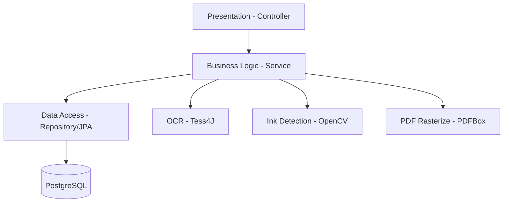
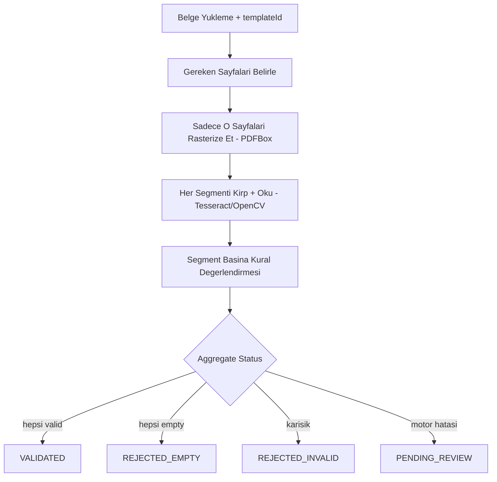
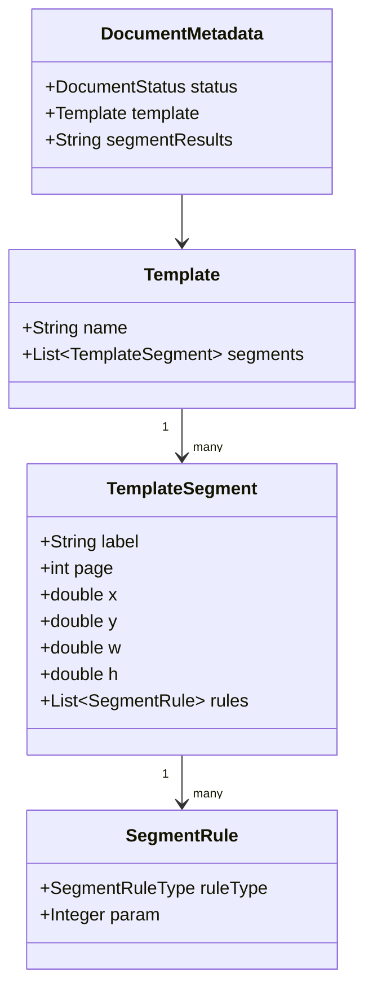
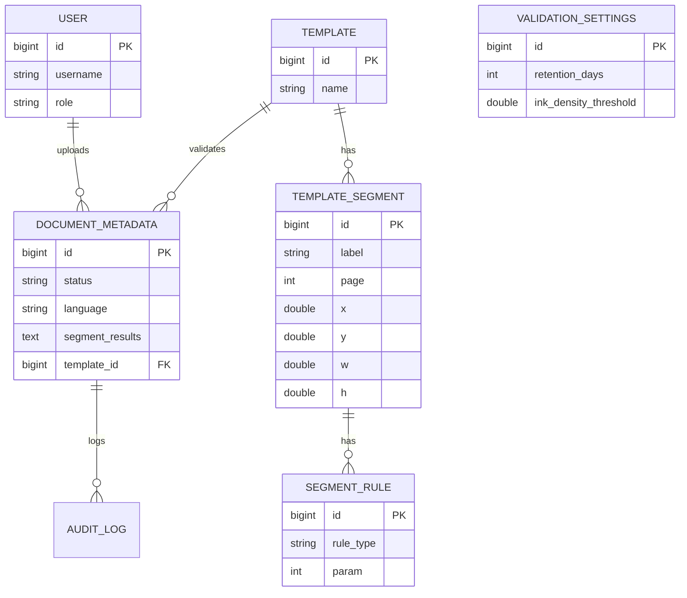

# Software Design Document (SDD) - validdoc

## 1. System Architecture
Uygulama, katmanlı monolitik mimariyle (**Controller → Service → Repository**) Spring Boot 4.x üzerinde geliştirilir ve stateless container olarak paketlenir.

Hassas alanlar (`segment_results`) JPA `AttributeConverter` seviyesinde **AES-256-GCM** ile şifrelenir; anahtar yalnızca env variable üzerinden sağlanır.

### 1.1 Container Readiness
Dockerfile `eclipse-temurin:21-jre-jammy` tabanlıdır; Tesseract 4.1.1 apt üzerinden kurulur ve `tessdata` yolu buna göre sabitlenir. Secret'lar (DB, JWT, encryption key) yalnızca env variable ile sağlanır.

---

## 2. Data Flow Diagram
Template'in ihtiyaç duyduğu sayfalar (tümü değil, yalnızca referans verilenler) rasterize edilir; her segment ilgili sayfadan kırpılıp okunur, kural motoru değerlendirir ve statü türetilir.

---

## 3. Class Design & Package Structure

**Ana paketler:** `controller` (REST uçları), `service` (OCR/validation/document orkestrasyonu), `model` (JPA entity'leri), `dto` (request/response/internal taşıyıcılar), `security` (JWT ve şifreleme), `exception` (merkezi hata yönetimi), `repository` (Spring Data JPA), `config` (Tesseract/async/settings altyapısı).

---

## 4. Database Schema (ERD)

**Not:** `templates` kaydedildikten sonra değiştirilemez; düzeltme yeni template oluşturularak yapılır. `audit_logs` append-only tutulur ve retention purge sürecinden muaftır.

---

## 5. Core Algorithmic Decisions

- **5.1 Bellekte İşleme:** Dosyalar diske hiç yazılmaz; işlem tamamlandığında `BufferedImage` GC'ye bırakılır. Maksimum dosya boyutu 5MB ile sınırlandırılır.
- **5.2 Async İşleme:** OCR ve validation `@Async` thread pool (4-8 thread) üzerinden arka planda yürütülür; upload isteği hemen `202 Accepted` döner.
- **5.3 Admin-Configurable Ayarlar:** Yalnızca `retentionDays` ve `inkDensityThreshold` çalışma zamanında (restart gerektirmeden) değiştirilebilir; `validation_settings` tablosunda tutulur.
- **5.4 Segment Değerlendirme:** Her segment, kendi kurallarına göre `FILLED_VALID` / `FILLED_INVALID` / `EMPTY` olarak değerlendirilir; sonuç maskelenerek `segment_results` alanına JSON olarak yazılır. Belge statüsü bu sonuçlardan deterministik olarak türetilir (bkz. §2).
- **5.5 Çok Dil (TR/EN):** `Accept-Language` header'ı API mesaj dilini, ayrı bir `lang` parametresi ise OCR tarama dilini belirler — birbirinden bağımsız iki ayrı sinyal olarak ele alınır. `Tesseract` thread-safe olmadığından her worker thread kendi instance'ını (`ThreadLocal`) tutar.

---

## 6. API Endpoints

| Method | Endpoint | Rol | Açıklama |
|---|---|---|---|
| GET | `/actuator/health` | Public | Kimlik doğrulamasız liveness check sağlar |
| POST | `/api/auth/login` | Public | JWT üretir (10 dk geçerli) |
| POST | `/api/users` | ADMIN | Yeni kullanıcı oluşturur |
| GET/POST | `/api/templates` | ADMIN | Template listeler / segment ve kurallarla kaydeder (immutable) |
| POST | `/api/templates/preview` | ADMIN | Kaydetmeden segment önizlemesi sağlar |
| POST | `/api/documents/upload` | OPERATOR/ADMIN | Belge yükler, asenkron işler |
| GET | `/api/documents/{id}` | OPERATOR/ADMIN | Belge ve segment raporunu döner |
| GET | `/api/documents/queue` | OPERATOR/ADMIN | `PENDING_REVIEW` kuyruğunu döner |
| POST | `/api/documents/{id}/verify` | OPERATOR | Manuel statü ataması yapar |
| GET/PUT | `/api/admin/validation-settings` | ADMIN | Retention ve ink threshold değerlerini yönetir |

---

## 7. Security Architecture
- Her istek `JwtAuthenticationFilter` üzerinden geçer; geçersiz veya süresi dolmuş token `401` ile sonuçlanır.
- Login denemeleri IP başına dakikada **5** ile sınırlandırılır (in-memory).
- Hesap oluşturma yalnızca admin rolüne açıktır; ilk açılışta tek bir admin hesabı otomatik olarak seed edilir.

---

## 8. Global Exception & Failure Handling
- İş mantığı hataları `ApiException` ve `ErrorCode` ile fırlatılır; `@RestControllerAdvice` bunları `Accept-Language`'a göre lokalize edilmiş `{code, message}` formatında döner.
- Motor hataları (OCR/PDF/OpenCV/template uyumsuzluğu) HTTP katmanına yansımaz; `@Async` pipeline içinde yakalanarak belge `PENDING_REVIEW`'e düşürülür ve `audit_logs`'a kaydedilir.