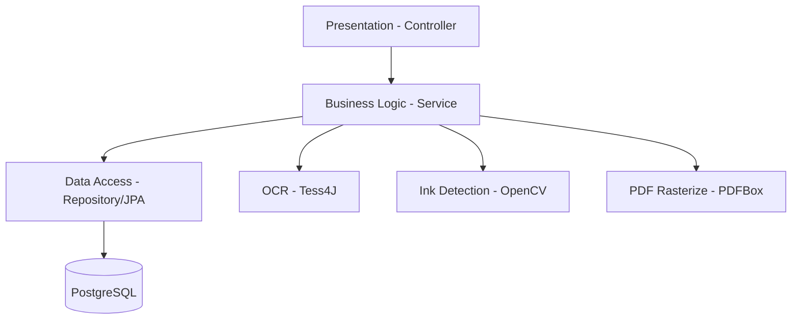
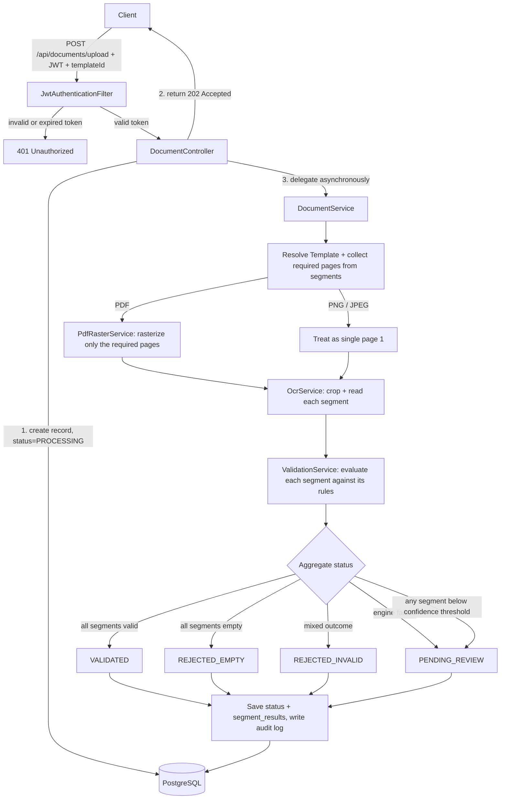
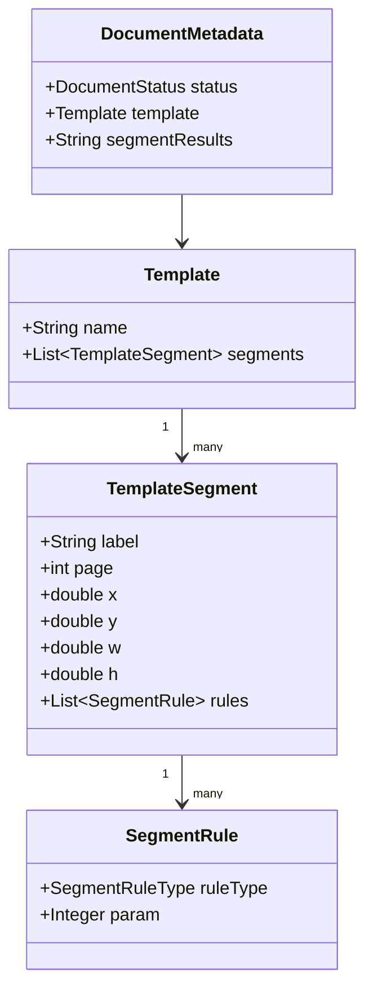
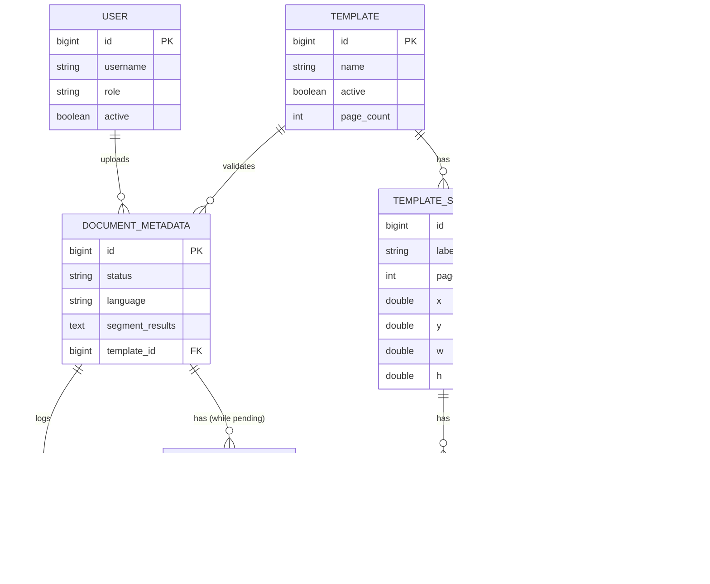

# Software Design Document (SDD) - validdoc

## 1. System Architecture
The application follows a layered monolithic architecture (**Controller → Service → Repository**), built on Spring Boot 4.x, and is packaged as a stateless container.

```mermaid
graph TD
    A[Presentation - Controller] --> B[Business Logic - Service]
    B --> C[Data Access - Repository/JPA]
    C --> D[(PostgreSQL)]
    B --> E[OCR - Tess4J]
    B --> F[Ink Detection - OpenCV]
    B --> G[PDF Rasterize - PDFBox]
```

Sensitive fields (`segment_results`, `segment_images.image_data`) are encrypted at the JPA `AttributeConverter` level with **AES-256-GCM**; the key is supplied only via an environment variable.

### 1.1 Container Readiness
The Dockerfile is based on `eclipse-temurin:21-jre-jammy`; Tesseract 4.1.1 is installed via apt, and the `tessdata` path is fixed accordingly. The image runs as a dedicated non-root `validdoc` user. Secrets (DB, JWT, encryption key) are supplied only via environment variables, and `SecretsValidator` aborts startup if any of them is missing or still holds a placeholder published in `.env.example` (see §7).

`docker-compose.yml` publishes the PostgreSQL port to `127.0.0.1` rather than all interfaces, marks every service `restart: unless-stopped`, and gives the `app` service a health check against `/actuator/health` so orchestration can distinguish "started" from "serving".

---

## 2. Data Flow Diagram
Every request first passes through JWT authentication. The upload endpoint persists an initial record and returns `202 Accepted` immediately; the rest of the pipeline (page rasterization, OCR, rule evaluation, status derivation) runs asynchronously in the background. Only the pages a template's segments actually reference are rasterized — not the whole document — and every outcome, automatic or manual, is written to the audit log alongside the final status.

```mermaid
graph TD
    Client["Client"] -->|"POST /api/documents/upload + JWT + templateId"| Filter["JwtAuthenticationFilter"]
    Filter -->|"invalid or expired token"| Auth401["401 Unauthorized"]
    Filter -->|"valid token"| Controller["DocumentController"]

    Controller -->|"1. create record, status=PROCESSING"| DB[("PostgreSQL")]
    Controller -->|"2. return 202 Accepted"| Client
    Controller -->|"3. delegate asynchronously"| Service["DocumentService"]

    Service --> Resolve["Resolve Template + collect required pages from segments"]
    Resolve -->|"PDF"| Raster["PdfRasterService: rasterize only the required pages"]
    Resolve -->|"PNG / JPEG"| Single["Treat as single page 1"]
    Raster --> OCR["OcrService: crop + read each segment"]
    Single --> OCR
    OCR --> Validate["ValidationService: evaluate each segment against its rules"]

    Validate --> Eval{"Aggregate status"}
    Eval -->|"all segments valid"| Validated["VALIDATED"]
    Eval -->|"all segments empty"| Empty["REJECTED_EMPTY"]
    Eval -->|"mixed outcome"| Invalid["REJECTED_INVALID"]
    Eval -->|"engine failure"| Review["PENDING_REVIEW"]
    Eval -->|"any segment below confidence threshold"| Review

    Validated --> Save["Save status + segment_results, write audit log"]
    Empty --> Save
    Invalid --> Save
    Review --> Save
    Save --> DB
```

---

## 3. Class Design & Package Structure

```mermaid
classDiagram
    class DocumentMetadata {
        +DocumentStatus status
        +Template template
        +String segmentResults
    }
    class Template {
        +String name
        +List~TemplateSegment~ segments
    }
    class TemplateSegment {
        +String label
        +int page
        +double x
        +double y
        +double w
        +double h
        +List~SegmentRule~ rules
    }
    class SegmentRule {
        +SegmentRuleType ruleType
        +Integer param
    }
    Template "1" --> "many" TemplateSegment
    TemplateSegment "1" --> "many" SegmentRule
    DocumentMetadata --> Template
```

**Main packages:** `controller` (REST endpoints), `service` (OCR/validation/document orchestration), `model` (JPA entities), `dto` (request/response/internal carriers), `security` (JWT and encryption), `exception` (centralized error handling), `repository` (Spring Data JPA), `config` (Tesseract/async/settings infrastructure).

---

## 4. Database Schema (ERD)

```mermaid
erDiagram
    USER ||--o{ DOCUMENT_METADATA : uploads
    TEMPLATE ||--o{ TEMPLATE_SEGMENT : has
    TEMPLATE_SEGMENT ||--o{ SEGMENT_RULE : has
    TEMPLATE ||--o{ DOCUMENT_METADATA : validates
    DOCUMENT_METADATA ||--o{ AUDIT_LOG : logs
    DOCUMENT_METADATA ||--o{ SEGMENT_IMAGES : "has (while pending)"

    USER {
        bigint id PK
        string username
        string role
        boolean active
    }
    TEMPLATE {
        bigint id PK
        string name
        boolean active
        int page_count
    }
    TEMPLATE_SEGMENT {
        bigint id PK
        string label
        int page
        double x
        double y
        double w
        double h
    }
    SEGMENT_RULE {
        bigint id PK
        string rule_type
        int param
    }
    DOCUMENT_METADATA {
        bigint id PK
        string status
        string language
        text segment_results
        bigint template_id FK
    }
    SEGMENT_IMAGES {
        bigint id PK
        bigint document_id FK
        bigint segment_id
        text image_data
    }
    VALIDATION_SETTINGS {
        bigint id PK
        int retention_days
        double ink_density_threshold
        double ocr_confidence_threshold
    }
```

**Note:** `templates` cannot be modified once saved; a correction is made by registering a new template. `audit_logs` is append-only and is exempt from the retention purge process. `segment_images` rows are deleted as soon as their segment is resolved, independent of the retention job.

---

## 5. Core Algorithmic Decisions

- **5.1 In-Memory Processing:** Files are never written to disk; once processing completes, the `BufferedImage` is released for GC. A maximum file size of 5MB is enforced.
- **5.2 Async Processing:** OCR and validation run in the background via an `@Async` thread pool (4-8 threads); the upload request returns `202 Accepted` immediately.
- **5.3 Admin-Configurable Settings:** `retentionDays`, `inkDensityThreshold`, and `ocrConfidenceThreshold` can all be changed at runtime (no restart required); they are stored in the `validation_settings` table.
- **5.4 Segment Evaluation:** Each segment is evaluated against its own rules as `FILLED_VALID` / `FILLED_INVALID` / `EMPTY` / `PENDING_REVIEW` (the last triggered by low OCR confidence); the result is masked and written as JSON into `segment_results`. Document status is derived deterministically from these results (see §2), and is recomputed once every `PENDING_REVIEW` segment has been manually resolved.
- **5.5 Multi-Language (TR/EN):** The `Accept-Language` header determines the API message language, while a separate `lang` parameter determines the OCR scanning language — two independent signals. Since `Tesseract` is not thread-safe, each worker thread keeps its own instance (`ThreadLocal`).
- **5.6 Upload Hardening:** the accepted file type is determined from the file's actual signature bytes (`FileSignatureValidator`) rather than the client-supplied `Content-Type` header, since the latter is trivially spoofable. Upload requests are also rate-limited per authenticated user (`UploadRateLimiter`, 20 requests per 60 seconds, in-memory) to protect the async processing pipeline from a single account's burst traffic.
- **5.7 Page Count Enforcement:** the uploaded file's actual page count (PDF: read via PDFBox `Loader.loadPDF(...).getNumberOfPages()`; PNG/JPEG: always treated as 1) must exactly equal `template.pageCount`, checked synchronously in `DocumentController.upload()` before a `DocumentMetadata` row is even created — a mismatch returns `400 PAGE_COUNT_MISMATCH` immediately, matching the frontend's own pre-upload page-count check (`Upload.tsx`) rather than deferring to the async `PENDING_REVIEW` pathway. A PDF that fails to load at this stage (corrupt/encrypted) returns `400 PDF_UNREADABLE`.
- **5.8 Schema Migrations:** the database schema is owned by versioned Flyway migrations under `src/main/resources/db/migration`, not derived from the entity model at runtime. Hibernate runs with `ddl-auto=validate`, so the application refuses to start if the entities and the migrated schema disagree, turning a silent drift into a startup failure. The partial unique indexes that enforce username/template-name uniqueness among active rows only (`users_username_active_unique`, `templates_name_active_unique`) live in `V1__initial_schema.sql`; they previously had to be created by an `ApplicationRunner` at boot because no migration mechanism existed.
- **5.9 Timestamps:** all persisted timestamps are `Instant` (UTC) mapped to `timestamptz` columns, never wall-clock `LocalDateTime`. The earlier `LocalDateTime` mapping recorded whatever the host clock read, so the same document got a different stored value depending on whether the code ran in the UTC application container or on a developer machine — mixing both in one column broke ordering and displayed times off by the UTC offset. Serialized as ISO-8601 with a `Z` suffix, so the browser renders them in the viewer's own zone. The container's `TZ` (default `Europe/Istanbul`, overridable in `.env`) only affects zone-dependent calculations such as the day boundary behind the dashboard's today-uploads counter, not what is stored.
- **5.10 Testing Strategy:** integration tests run against a disposable PostgreSQL container supplied by Testcontainers, not the development database. A single container is created in a static initializer in `AbstractIntegrationTest` and shared by every test class, which extends that base class; `@DynamicPropertySource` rewrites the datasource properties to point at it. Flyway then builds the schema inside that container exactly as it would in production, so the migrations themselves are exercised on every run. Before this, the suite wrote to the same database the running application used, leaving dozens of synthetic users, templates and documents behind and making the application's own screens hard to read. `@DynamicPropertySource` is used in preference to `@ServiceConnection` deliberately: it depends only on the Testcontainers module itself, which keeps it clear of the Spring Boot 4 / Testcontainers 2 integration churn.
- **5.11 API Documentation:** `springdoc-openapi` derives an OpenAPI 3.1 description from the controllers at runtime and serves it with Swagger UI, so the documented surface cannot drift from the implemented one. `OpenApiConfig` registers a bearer/JWT security scheme, which is what makes the UI's Authorize button able to call the protected endpoints. Both the UI and the raw schema are switched off under the `prod` profile, so a deployed instance does not advertise its API surface.

---

## 6. API Endpoints

**Coordinate contract:** every segment coordinate (`x`, `y`, `w`, `h`) is expressed in **pixels at 300 DPI**, the same resolution `PdfRasterService` uses to rasterize PDF pages (see §5.1). An A4 page therefore spans **2480×3508 px** (`DocumentGeometry.A4_WIDTH_PX` / `A4_HEIGHT_PX`); any segment whose bounds fall outside this box is rejected at template-registration time with `INVALID_SEGMENT_COORDINATES`. A frontend capturing coordinates from an on-screen canvas must scale its own pixel space to this 300-DPI/A4 basis before submitting a template — not to the screen's native resolution.

**Pagination:** every list endpoint accepts `page` (0-indexed, default `0`) and `size` (default `20`) query parameters and returns a `PagedResponse` envelope (`content`, `page`, `size`, `totalElements`, `totalPages`) rather than a bare array.

| Method | Endpoint | Role | Description |
|---|---|---|---|
| GET | `/actuator/health` | Public | Provides an authentication-free liveness check, also used by the container health check (§1.1) |
| GET | `/swagger-ui.html`, `/v3/api-docs` | Public | Serve the generated OpenAPI description and its UI; disabled under the `prod` profile (§5.11) |
| POST | `/api/auth/login` | Public | Issues a JWT (valid for 10 min) |
| GET | `/api/users` | ADMIN | Lists users (paginated) |
| POST | `/api/users` | ADMIN | Creates a new user |
| DELETE | `/api/users/{id}` | ADMIN | Deactivates a user (soft delete — sets `active=false`, does not remove the row); blocked only for the last active admin. Past documents remain linked and visible; no longer blocked by having linked documents. |
| PUT | `/api/users/me/password` | ADMIN | Changes the caller's own password. Restricted to admins by design — operators do not self-manage passwords; an admin resets an operator's password by deactivating and recreating the account. |
| GET | `/api/templates` | OPERATOR/ADMIN | Lists templates (paginated) |
| POST | `/api/templates` | ADMIN | Saves a template with segments and rules (immutable) |
| DELETE | `/api/templates/{id}` | ADMIN | Deactivates a template (soft delete — sets `active=false`, does not remove the row); it can no longer be selected for new uploads, and documents already processed with it are unaffected |
| GET | `/api/templates/{id}` | OPERATOR/ADMIN | Returns a template's full segment and rule detail |
| GET | `/api/templates/rule-types` | ADMIN | Returns the fixed rule catalog, flagging which rules take a param and which are ink-based |
| POST | `/api/templates/preview` | ADMIN | Provides a segment preview without saving |
| POST | `/api/documents/upload` | OPERATOR/ADMIN | Uploads a document, processes it asynchronously |
| GET | `/api/documents` | OPERATOR/ADMIN | Lists documents, newest first (paginated); **scope differs by role** — admins see all documents, operators see only documents they uploaded themselves |
| GET | `/api/documents/{id}` | OPERATOR/ADMIN | Returns a document and its segment report |
| GET | `/api/documents/{id}/segments/{segmentId}/image` | OPERATOR/ADMIN | Returns a `PENDING_REVIEW` segment's stored crop image |
| POST | `/api/documents/{id}/segments/{segmentId}/resolve` | OPERATOR/ADMIN | Applies a one-time manual decision to a `PENDING_REVIEW` segment |
| GET | `/api/documents/queue` | OPERATOR/ADMIN | Returns the `PENDING_REVIEW` queue (paginated) |
| GET | `/api/documents/stats` | OPERATOR/ADMIN | Returns dashboard counters (today's uploads, pending review, weekly validation rate); scope differs by role like `GET /api/documents` |
| GET/PUT | `/api/admin/validation-settings` | ADMIN | Manages retention, ink threshold, and OCR confidence threshold |
| GET | `/api/admin/audit-logs` | ADMIN | Lists audit log entries, optionally filtered by `documentId` (paginated) |

---

## 7. Security Architecture
- Every request passes through `JwtAuthenticationFilter`; an invalid or expired token results in `401`.
- Login attempts are rate-limited to **5 per minute per IP** (in-memory).
- Account creation is restricted to admins; a single admin account is seeded automatically on first startup.
- `SecretsValidator` runs at startup and rejects `JWT_SECRET`, `ENCRYPTION_SECRET_KEY` or `BOOTSTRAP_ADMIN_PASSWORD` when blank or equal to a placeholder from the tracked `.env.example`, and rejects a `JWT_SECRET` shorter than the 32 bytes HMAC-SHA256 needs. The placeholders are public in the repository, so a forgotten substitution is a real key-compromise scenario; failing at startup converts it from a silent one into a visible one.

---

## 8. Global Exception & Failure Handling
- Business logic errors are thrown as `ApiException` with an `ErrorCode`; `@RestControllerAdvice` returns them as a localized `{code, message}` payload (based on `Accept-Language`).
- Engine failures (OCR/PDF/OpenCV/template mismatch) never surface as HTTP errors — they are caught inside the `@Async` pipeline, the document is moved to `PENDING_REVIEW`, and the outcome is written to `audit_logs`.

---

## 9. Frontend Architecture

### 9.1 Stack
React 19 + Vite + TypeScript, styled with Tailwind CSS 4 and shadcn/ui (Base UI primitives, Nova preset). State/data: TanStack Query for server state, `axios` for HTTP, React Router for navigation, react-hook-form + zod for forms. `react-konva` renders the template segment-drawing canvas; `pdfjs-dist` rasterizes PDF pages client-side (both for the segment canvas and for reading a PDF's page count before upload). i18next drives full TR/EN UI translation, including a client-side mapping of backend `ErrorCode`s to localized strings.

### 9.2 Directory Structure (`frontend/src`)
`pages/` (one file per route: `Login`, `Dashboard`, `Upload`, `TemplateNew`, `Templates`, `Users`, `Settings`, `AuditLog`, `DocumentsList`, `DocumentDetail`, `ReviewQueue`, `ChangePassword`), `components/ui/` (shadcn primitives), `components/layout/` (`AppLayout`, sidebar, `ProtectedRoute`), `lib/api.ts` (configured axios instance), `locales/` (`tr.json`, `en.json`).

### 9.3 Auth & Session
The JWT is stored in `localStorage` (chosen over in-memory/React state so a page refresh doesn't drop the session, given the backend's 10-minute token lifetime already bounds the exposure window). `ProtectedRoute` guards routes by role (`allowedRoles` prop); admin-only routes are `/users`, `/change-password`, `/templates`, `/templates/new`, `/settings`, `/audit-logs`. A proactive client-side timer warns of token expiry before the backend rejects a request.

### 9.4 PDF/Image Handling on the Client
Both the document-upload screen (`Upload.tsx`) and the template-creation canvas (`TemplateNew.tsx`) accept PNG, JPEG, and PDF. For PDF, `pdfjs-dist` parses the file **entirely in the browser** via a dedicated Web Worker (`pdf.worker.min.mjs`, spawned directly with `new Worker(new URL(..., import.meta.url))` and handed to pdf.js via `GlobalWorkerOptions.workerPort` — chosen over the `?url`-import + `workerSrc` pattern for more reliable behavior across bundler backends) — this is how the upload screen can show a file's page count and reject a page-count mismatch before ever calling the backend, and how the template canvas rasterizes a page for segment drawing. This client-side PDF parsing has no relation to the backend's own PDF rasterization (`PdfRasterService`, §1/§2), which independently re-rasterizes the file server-side from the raw bytes at processing time — the frontend's PDF handling exists purely for UI preview/validation, not as a data source for the backend pipeline.

### 9.5 Deployment (Docker/nginx)
The frontend is built as a static production bundle (multi-stage `Dockerfile`: `node:22-alpine` build stage → `nginx:1.27-alpine` serve stage) and served by its own nginx container, separate from the Spring Boot container (see §1.1). The backend's base URL is baked in at **build time** via the `VITE_API_BASE_URL` build arg (default `http://localhost:8080`, set in `docker-compose.yml`) — the browser talks to the backend directly over this URL, not through nginx as a reverse proxy, and not via the Docker-internal service hostname (`app`), which is unreachable from the host browser. nginx's static-file serving relies on the container's default `mime.types` table; the one addition on top of it is a `.mjs` extension mapping (via a targeted `location ~* \.mjs$` block, not a blanket `types {}` override) needed because pdf.js's worker script (§9.4) ships as `.mjs`, an extension the default table doesn't include. `index.html` is served with `Cache-Control: no-cache, no-store, must-revalidate` — routes are code-split (`React.lazy`) into content-hashed chunk files that change on every build, and an `index.html` cached by the browser across deploys would keep referencing chunk filenames that no longer exist on the server, surfacing as "Failed to fetch dynamically imported module" errors. `/assets/` (the hashed chunks themselves) remain cached for a year, since their filename changes whenever their content does.