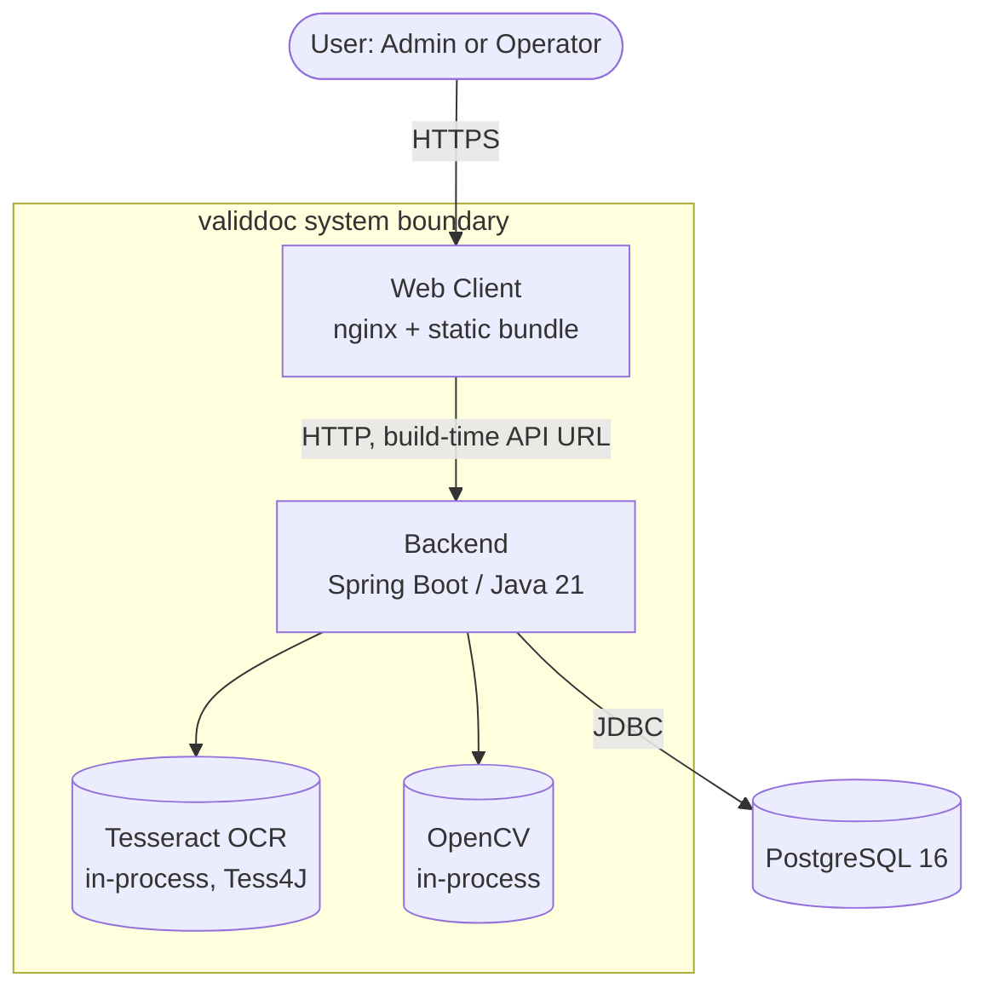
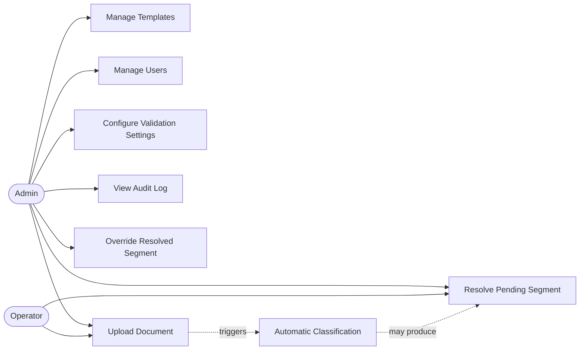
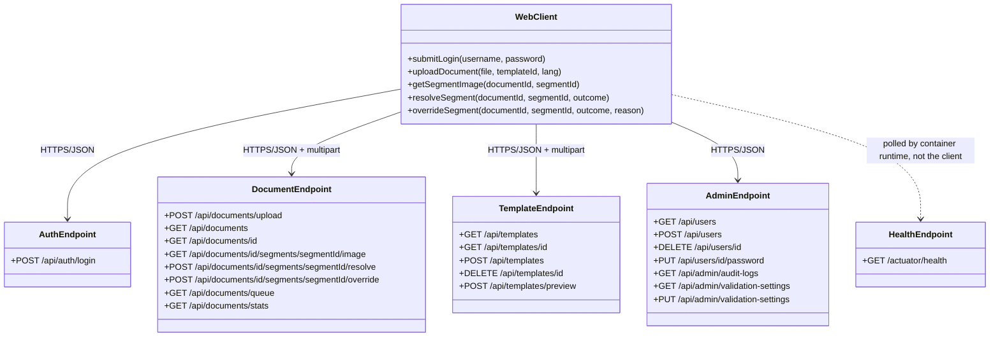
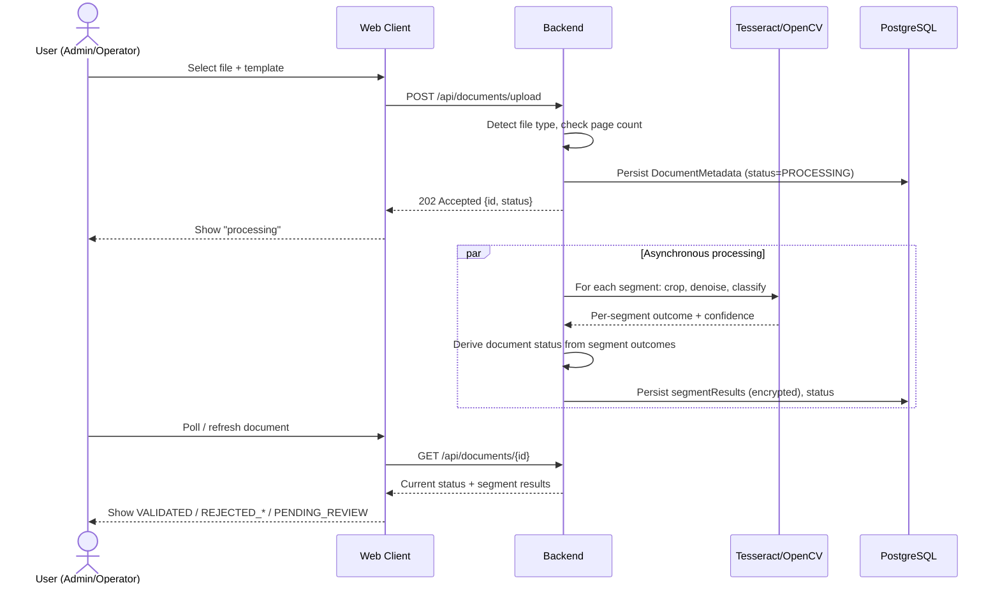
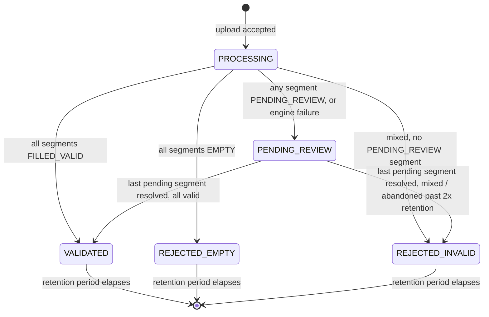
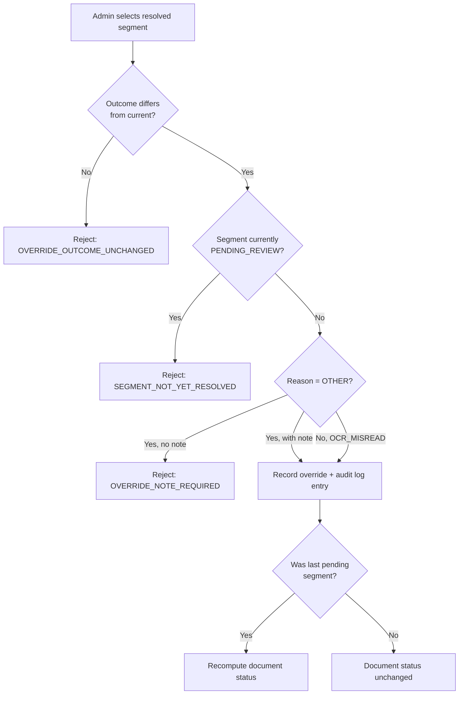
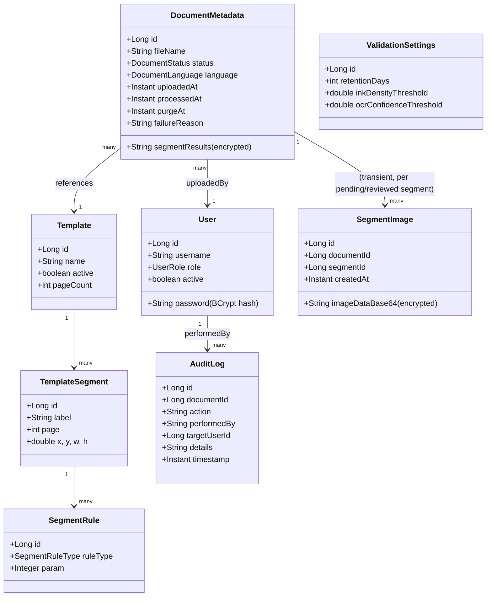

Department of Software Engineering (Internship Project)
validdoc
Software Requirements Specification for
validdoc — Document Validation System
By
Pelin Evleksiz
Friday 7th August, 2026

# Contents

1 Introduction .......................................................................................... 1
1.1 Purpose of the System .......................................................................... 1
1.2 Scope .................................................................................................. 2
1.3 Stakeholders and Their Characteristics ................................................. 3
1.3.1 Administrators .............................................................................. 3
1.3.2 Operators ..................................................................................... 4
1.3.3 Project Stakeholder (Academic Advisor) ......................................... 4
1.4 System Overview .................................................................................. 5
1.4.1 System Perspective ....................................................................... 5
1.4.1.1 System Interfaces ................................................................... 6
1.4.1.2 User Interfaces ....................................................................... 6
1.4.1.3 Software Interfaces ................................................................. 6
1.4.1.4 Communication Interfaces ....................................................... 7
1.4.1.5 Memory Constraints ................................................................ 7
1.4.1.6 Operations .............................................................................. 7
1.4.2 System Functions .......................................................................... 8
1.4.3 Limitations .................................................................................... 9
1.5 Definitions ............................................................................................ 11

2 References ............................................................................................... 12

3 Specific Requirements .............................................................................. 13
3.1 External Interfaces
3.2 Functions
3.3 Performance Requirements
3.4 Logical Database Requirements
3.5 Design Constraints
3.6 System Quality Attributes

4 Supporting Information .............................................................................. —
4.1 Sample Data
4.2 Background Information
4.3 Appendixes

# List of Figures

1.1 System Context Diagram ....................................................................... 5
1.2 Use Case Diagram ................................................................................ 8
3.1 Sequence Diagram of Document Upload and Automatic Classification ...... —
3.2 State Diagram of Document Status ........................................................ —
3.3 Activity Diagram of Segment Override .................................................... —

# List of Tables

1 Revision History ....................................................................................... vi
3.x Tabular Use Case Descriptions (one per user story, Section 3.2) ............. —

---

# Revision History

| Version | Description | Date | Author |
|---|---|---|---|
| 1.0 | Initial draft, informal requirements notes | 2026-08-06 | Pelin Evleksiz |
| 2.0 | Restructured to full IEEE 830 outline | 2026-08-07 | Pelin Evleksiz |
| 3.0 | Rewritten from source code analysis; every requirement re-derived from the actual implementation rather than the prior draft | 2026-08-07 | Pelin Evleksiz |
| 4.0 | Added stakeholder analysis, user-story format with Given/When/Then acceptance criteria, tabular use case descriptions, Essential/Conditional/Optional ranking, and supporting diagrams | 2026-08-07 | Pelin Evleksiz |

---

# 1. Introduction

This document is the Software Requirements Specification (SRS) for **validdoc**, a document validation system developed as an internship project. This SRS follows IEEE Std 830-1998, IEEE Recommended Practice for Software Requirements Specifications [1], organizing Section 3 by user class (Annex A.3 of the standard), since validdoc has two user classes with materially different capabilities rather than distinct operational modes or a natural feature-driven decomposition.

## 1.1 Purpose of the System

This subsection should delineate the purpose of this SRS and specify its intended audience.

The purpose of validdoc is to automate the routine checking of paper forms — identity documents, invoices, applications — against a fixed, admin-defined layout, without requiring a human to read every field of every document first. Given an uploaded document and a reference to a template, the system determines whether each expected field is filled, empty, or filled with content that fails a defined rule, and produces an overall document status. Fields the system cannot classify with sufficient confidence are queued for human review rather than guessed, so that automation reduces manual checking without silently introducing incorrect approvals or rejections.

This SRS specifies what the system does and how its behavior is to be verified. Its intended audience is:

- **The system's developer**, who uses it as the basis for implementation and regression testing, and as the single source of truth when source code and prior informal notes disagree.
- **The academic advisor evaluating the project**, who uses it to assess whether the delivered system meets its stated requirements, and whether architectural decisions (in particular, the decision not to send document data to any third-party OCR or document-understanding service) were made deliberately and for a stated reason rather than incidentally.
- **Any future maintainer of the codebase**, who uses it to understand intended system behavior without having to re-derive it from source code alone.

## 1.2 Scope

This subsection should identify the software product by name, explain what it will and will not do, and describe its application, objectives, and goals.

**Product name:** validdoc.

validdoc is a self-hosted, small-team document validation system. Given an uploaded document (PDF, PNG, or JPEG) and a reference to an admin-defined template, the system shall automatically determine, per field, whether it is filled with valid content, filled with invalid content, empty, or too uncertain to classify automatically — and shall derive an overall document status from those per-field results.

The system shall:

- Authenticate users under two distinct access levels: admin and operator.
- Allow an admin to define reusable templates — named, versioned-by-recreation sets of page-and-coordinate fields ("segments"), each with one or more validation rules drawn from a fixed catalog (structural rules: letters-only, digits-only, alphanumeric, date, length bounds; validated-format rules: Turkish national ID number and tax number by checksum, phone, email; presence-based rules: signature ink, stamp ink).
- Accept document uploads against a template and classify them asynchronously, using OCR for text fields and pixel-variance analysis for ink fields and for emptiness detection generally.
- Route fields the engine cannot confidently classify to a review queue, and record every subsequent human decision against them, including administrative overrides of already-resolved fields.
- Automatically expire and anonymize stored classification results and any retained field images after a configurable retention period.
- Present its entire interface, including every system-generated error message, in Turkish and English.

The system shall not:

- Validate a document without a template ("freeform" document understanding).
- Transmit document content, in whole or in part, to any third-party network service for processing (see 1.4.3, item 1, for the rationale).
- Allow a saved template's fields or rules to be edited in place; a correction requires creating a new template.
- Support user self-registration; every account is admin-provisioned, except for a single automatically created bootstrap admin account on first startup.
- Share login/upload rate-limiting state across more than one concurrently running backend instance, without additional infrastructure not present in this version.

No higher-level system specification exists that validdoc is a component of; validdoc is independent and self-contained (see 1.4.1). This SRS is consistent with, and derived directly from, the system's implemented behavior as of the version described in the Revision History above, cross-checked against the automated integration test suite referenced in Section 2.

## 1.3 Stakeholders and Their Characteristics

The stakeholders of validdoc range from the people who configure and operate it day-to-day to the party evaluating the engineering rigor of the project as a whole. Characteristics of each stakeholder class are described below.

### 1.3.1 Administrators

**Description:** The user(s) who set up validdoc for a given document workflow and operate it on an ongoing basis — building templates, managing accounts, tuning system parameters, and having final authority over classification disputes.

**Characteristics:** Assumed to understand the document domain well enough to recognize a correctly formatted Turkish national ID number, tax number, phone number, or email address at a glance. Not assumed to have a software engineering background, and not assumed to have any prior experience administering a similar system.

**Concerns:**
- Whether a template, once built, reliably captures the fields it was designed to capture across real-world variation in how a form is filled out.
- Whether the system's automatic classifications are trustworthy enough to actually reduce manual checking, rather than merely relocating the same manual effort into a review queue.
- The overhead of account and password management, particularly password resets, which by design require the admin to re-authenticate with their own credentials before acting on another account.

**Needs:**
- A template preview mechanism that lets them visually and numerically confirm segment placement against a real sample document before committing to a template, since templates cannot be edited afterward.
- Visibility into *why* a segment was flagged for review — the specific reason (low OCR confidence with the numeric score, or OCR returning no text despite visible ink) — not merely that it was flagged.
- A straightforward, auditable way to correct a wrong classification (override) that makes it unambiguous who made the correction, when, and why.

**Influence:** High — admins are the only user class that shapes the system's ongoing configuration: templates, validation thresholds, and account provisioning. Every requirement in Section 3.2 concerning template management, user management, settings, and the audit log exists specifically to serve this stakeholder class.

### 1.3.2 Operators

**Description:** The user(s) who use validdoc day-to-day to upload documents against templates an admin has already built, and to clear the review queue for documents they themselves submitted.

**Characteristics:** No assumed template-design or system-administration background. Expected to interact with the system primarily through the upload screen and the review queue, in that order, for the majority of their sessions.

**Concerns:**
- Speed of getting a routine, correctly filled document through to a validated state without unnecessary friction.
- Clarity, when a document is rejected or queued for review, about what specifically is wrong, so they are not left guessing which field caused the outcome.
- Not being shown, or held responsible for, documents uploaded by other operators.

**Needs:**
- Fast, unambiguous feedback on upload (an immediate "processing" acknowledgment, followed by a definite terminal or pending status).
- A review-queue experience that shows the actual cropped segment image next to the decision being made, not an abstract textual description of the field's location.
- A guarantee that a document they did not upload is simply not visible to them, rather than visible-but-forbidden, which would confirm its existence.

**Influence:** Moderate — operators consume the system as configured by admins and do not shape template design, validation thresholds, or account policy, but their day-to-day workflow (Section 3.2, User Stories 3, 4, and 5) is the system's primary transactional purpose.

### 1.3.3 Project Stakeholder (Academic Advisor)

**Description:** Evaluates the project's engineering rigor, including this SRS itself, against academic and professional software engineering standards, as part of assessing the internship deliverable.

**Characteristics:** Software engineering background; evaluates documentation quality as a deliverable in its own right, not only the running system's behavior.

**Concerns:**
- Whether the requirements documented in this SRS are traceable to verified, tested behavior rather than aspirational or unverified claims.
- Whether architectural decisions — most notably, the decision to perform all OCR processing locally rather than via a third-party cloud service — were made deliberately, for a stated and defensible reason, rather than incidentally or by default.
- Whether the system's handling of uncertainty (OCR confidence, ambiguous field content) reflects a considered design position rather than an accident of implementation.

**Needs:**
- A specification whose individual claims can be cross-checked against the Test Case Specification and Test Summary Report referenced in Section 2, rather than taken on faith.
- Explicit statement, where a design decision trades off one property against another (for example, local-only OCR processing against raw classification accuracy), of what was traded and why.

**Influence:** High — this stakeholder's standard for what constitutes an adequate requirements specification directly shapes the form and depth of this document, including the decision to restructure it from an earlier, less detailed draft.

## 1.4 System Overview

### 1.4.1 System Perspective

This subsection should place the product in perspective — independent and self-contained, or a component of a larger system — and describe the constraints under which it operates.

validdoc is independent and totally self-contained. It is not a component of, and does not integrate with, any larger system, and no parent system specification exists that this SRS must remain consistent with. The system consists of three cooperating containers — a PostgreSQL database, a Spring Boot backend, and an nginx-served frontend — deployed together via a single Docker Compose configuration, with no external network dependency at runtime beyond what those three containers provide to each other.

The operational environment of validdoc is characterized by its deliberate closure: unlike systems that orchestrate multiple external AI/ML services and third-party data sources, validdoc's core reasoning — OCR text extraction and pixel-based ink/emptiness analysis — runs entirely in-process within the backend container. As illustrated in the System Context Diagram (Figure 1.1), the system boundary encloses the OCR and image-processing engines themselves, not merely the orchestration logic around them; this is the direct architectural consequence of Constraint C1 (see 1.4.3, item 1): no document content leaves the system boundary for processing, by any component, under any configuration.

**Figure 1.1: System Context Diagram.** Tesseract and OpenCV are shown *inside* the system boundary rather than as external service dependencies, because both execute in-process within the backend container — no network call, to any host, carries document content outside this boundary at any point in the processing pipeline.

#### 1.4.1.1 System Interfaces

Not applicable — no parent system exists that imposes external system-level interface requirements on validdoc; the system does not participate in a larger data pipeline or workflow it must conform to.

#### 1.4.1.2 User Interfaces

The primary and only user interface for validdoc is a browser-based single-page web client, covering the full workflow for both user classes described in 1.3. Detailed interface requirements are given in Section 3.6.3. In summary, the interface operates under the following characteristics:

1. **Authentication:** the client presents a login screen accepting a username and password, persisting the resulting session token for the duration of its 10-minute validity.
2. **Role-Scoped Navigation:** the client shows only the screens a given role is authorized to use (see the Access Control Summary, Section 3.2), rather than showing an admin-only screen in a disabled state to an operator.
3. **Document Upload:** the client accepts one or more files per batch, displays each file's detected page count before submission, and blocks submission of any file whose page count does not match the selected template.
4. **Review and Resolution:** the client presents pending segments with their cropped source image directly visible, alongside the decision controls, rather than requiring the user to separately request the image.
5. **Bilingual Presentation:** every piece of client-rendered text, and every server-supplied error code, is rendered in the user's selected language (Turkish or English) via client-side localization.

#### 1.4.1.3 Software Interfaces

validdoc relies on the following required software products to implement its validation pipeline. Unlike systems that orchestrate several external, network-accessed AI services, all of validdoc's software interfaces below execute either in-process within the backend container or as a directly-managed sibling container (PostgreSQL) — none is a third-party network API.

| # | Name | Version | Source | Purpose |
|---|---|---|---|---|
| 1 | PostgreSQL | 16 | postgresql.org | System of record for all persisted data; accessed via Spring Data JPA over JDBC. |
| 2 | Tesseract OCR (via Tess4J) | Tess4J 5.12.0 | tess4j project | In-process optical character recognition for non-ink segments. |
| 3 | OpenCV (via `org.openpnp:opencv`) | — | org.openpnp | In-process image preprocessing (median-blur denoising, Otsu binarization) and pixel-standard-deviation analysis used for both ink-segment classification and pre-OCR emptiness detection. |
| 4 | Apache PDFBox | — | pdfbox.apache.org | PDF page rasterization at a fixed DPI, and PDF page-count detection at upload time. |
| 5 | Flyway | — | flywaydb.org | Ordered, versioned application of database schema migrations at application startup. |

The purpose of each interface, in relation to this software product, is stated in the table above; none of these products is documented elsewhere and none requires a separate interface specification beyond its own public documentation, referenced by name and version for reproducibility.

#### 1.4.1.4 Communication Interfaces

The frontend and backend communicate exclusively over HTTP, using a build-time-configured API base URL baked into the frontend's static bundle at image-build time — deliberately not a Docker-internal hostname resolvable only inside the container network, so that the frontend bundle remains correct regardless of the container orchestration layer it is eventually served from. Cross-origin requests are restricted to an explicit, configured allow-list of origins (Constraint C5, Section 3.5); no wildcard origin is accepted under any configuration.

#### 1.4.1.5 Memory Constraints

No specific minimum-RAM or heap-size requirement is imposed by this SRS. This is a deliberate contrast with systems that hold a large in-memory index, embedding store, or language model resident for the duration of operation: validdoc processes one document at a time, and its OCR/image-processing footprint per document is small and short-lived. No requirement in this SRS depends on a specific memory ceiling beyond what the three containers described in Section 3.5 (Constraint C4) require to run under normal operation.

#### 1.4.1.6 Operations

validdoc is designed as an on-demand validation assistant, not a continuously polling or streaming system. Its operations are characterized by a combination of interactive user sessions, short-lived asynchronous background processing per upload, and fixed-schedule unattended maintenance:

a) **Modes of Operation:**
- **Normal Operational Mode:** the system waits for authenticated HTTP requests; idle resource consumption is minimal, and no background polling of any external resource occurs, since validdoc has no external resource to poll (see 1.4.1.3).
- **Document Processing Mode:** entered immediately upon accepting an upload (Section 3.2, User Story 3); involves per-segment cropping, denoising, ink/emptiness classification, and — for non-empty text segments — OCR and rule evaluation. This mode is bounded to complete within 3 seconds for a standard single-page document (Section 3.3).
- **Degraded Mode (Engine Failure):** if OCR or image processing fails at the engine level — a corrupt or encrypted PDF, an internal OCR engine error, an internal image-processing error, or an invalid template definition discovered mid-processing — the system routes the affected document to `PENDING_REVIEW` with a recorded, human-readable failure reason, rather than leaving the document permanently in a `PROCESSING` state or surfacing a raw internal error to the user.

b) **Periods of Interactive and Unattended Operation:** the system's Normal Operational Mode and the synchronous portions of every admin/operator action (login, template creation, user management, resolve, override) constitute its interactive period. Document Processing Mode, entered immediately after an upload's synchronous `202 Accepted` response, constitutes its unattended period per document — the uploading user is not blocked waiting for it.

c) **Data Processing Support Functions:** background support functions include: per-segment image cropping and encoding for storage; AES-256-GCM encryption of the segment-results payload and any retained segment images; and the two nightly scheduled retention jobs described in Section 3.4 (REQ-DB-6, REQ-DB-7).

d) **Backup, Recovery, and Restart Operations:** validdoc does not implement application-level backup/recovery beyond standard PostgreSQL backup practices for its single system-of-record database. Because all persisted state lives in that database and the backend itself is stateless (Section 3.6.4, REQ-MAIN-3), a backend container restart during Document Processing Mode leaves the affected document's status unresolved (`PROCESSING`) with no automatic recovery step; this is a known limitation, not a specified recovery behavior, since no requirement in this SRS currently addresses mid-processing failure recovery for a killed (as opposed to erroring) backend process.

### 1.4.2 System Functions

This subsection provides a high-level summary of the major capabilities and functions validdoc performs. Detailed specifications of these functions, including their exact acceptance criteria and flows, are given in Section 3.2. The logical relationships between these functions and the system's two user classes are summarized in the Use Case Diagram (Figure 1.2).

**Figure 1.2: Use Case Diagram.** Upload and Resolve are available to both user classes, scoped to the operator's own documents where noted (see the Access Control Summary, Section 3.2); the remaining functions are admin-only, per the requirements in 3.2.

The major system functions are organized into the following core capabilities:

1. **Authentication:** the system shall authenticate users via a stateless, JWT-based login mechanism under two roles, with per-username rate limiting on repeated failed attempts.

2. **Template Management:** an admin shall be able to define a named, reusable template — a fixed set of coordinate-based segments, each with one or more validation rules — and preview it against a sample document before committing to it. Once saved, a template is immutable; a correction requires creating a new template.

3. **Document Upload and Automatic Classification:** an authenticated user shall be able to upload a document against an existing template. The system automatically crops each defined segment, determines whether it is empty or filled using pixel-variance analysis, runs OCR and rule evaluation on non-empty text segments, and derives an overall document status from the resulting per-segment outcomes — without any human involvement, unless the engine cannot classify a segment with sufficient confidence.

4. **Review Queue and Manual Resolution:** for a segment the engine could not confidently classify, an authorized user (the document's uploader, or any admin) shall resolve it with a final, one-time decision, after which the whole-document status is recomputed.

5. **Administrative Override:** an admin shall be able to correct the outcome of any already-resolved segment, on any document, with a recorded reason — the system's mechanism for correcting a mistaken automatic or manual classification after the fact.

6. **Audit Logging:** every automatic classification and every manual resolve or override action shall be recorded as an immutable entry in an audit log, viewable by admins.

7. **Retention and Anonymization:** the system shall automatically clear a document's stored classification results and delete any retained segment images once a configurable retention period elapses, and shall automatically resolve documents abandoned in the review queue for an extended period.

8. **Administration:** an admin shall be able to manage operator and admin accounts (creation, deactivation, password reset) and tune system-wide validation parameters (retention period, ink density threshold, OCR confidence threshold) at runtime.

9. **Localization:** the system's entire interface, including every server-generated error message, shall be available in Turkish and English.

### 1.4.3 Limitations

validdoc operates under several functional and operational limitations, imposed by deliberate design decisions, external engine dependencies, and the time constraints of an internship-scoped release. These limitations bound the system's current scope and are distinguished below from the binding constraints in Section 3.5, since a limitation here describes an accepted gap or trade-off rather than a rule the design must obey.

1. **No external processing dependency, by design.** validdoc relies entirely on an in-process OCR engine (Tesseract) and in-process image processing (OpenCV); no cloud OCR or document-understanding API is used anywhere in the pipeline. This was a deliberate decision, made in explicit consultation with the project's academic advisor, who indicated a preference against sending document data outside infrastructure the system operator directly controls. The trade-off is accepted knowingly rather than incidentally: cloud alternatives such as Google Document AI, AWS Textract, and Azure Document Intelligence were evaluated during development and generally offer higher raw OCR accuracy on difficult input, but were rejected specifically on data-locality grounds, not on technical merit.

2. **Turkish-language OCR model quality.** The bundled Turkish Tesseract language model has known, upstream, engine-level recognition weaknesses that are independent of validdoc's own code — most notably, a frequent misreading of the "@" character as "©" when it appears in short, non-dictionary text such as an email address. Targeted, narrowly scoped corrections for this and one other specific, observed misread pattern are applied during OCR post-processing (Section 3.2, User Story 3, `REQ-PROC-7`); this mitigates, but does not resolve, the underlying limitation of the third-party language model itself.

3. **No correction for skewed or rotated scans.** Documents photographed or scanned at an angle are not corrected before segment cropping in this version of the system. A content-based deskewing approach — analyzing the orientation of ink or text within the page itself, rather than the page's outer border, since real-world scans are frequently cropped tight to the paper and expose no detectable border for a border-based approach to rely on — was investigated during development and found technically viable in principle. It was not implemented in this release: it carries a measurable risk of degrading documents that are already correctly aligned, and there was not enough remaining development time before this release to validate that risk down to an acceptable level. This limitation is tracked as GitHub issue #328 for future work.

4. **Single-instance rate limiting.** The login and upload rate limiters hold their state in an in-process map local to a single running backend instance, not in a shared external store. Correctness of rate limiting — specifically, that a given username cannot exceed the configured attempt limit — is guaranteed only when exactly one backend instance is running; horizontal scaling to multiple concurrent instances would require introducing a shared store (e.g. Redis), which is not present in this version.

5. **Templates are immutable by design, not by oversight.** A template's segments and rules cannot be edited after creation; a correction requires creating an entirely new template. This is a deliberate architectural choice, not a missing feature: it preserves the meaning of historical `segmentResults` data, which is only correctly interpretable in the context of the exact template version that originally produced it. The accepted cost of this decision is that even a trivial correction — for example, a mistyped segment label — requires recreating the whole template rather than patching the one field.

6. **Manual accuracy campaign incomplete as of this document version.** The accuracy campaign described in the Test Plan (Section 2, reference [2]) has, as of this SRS version, been executed only against synthetically generated documents; the portion of the campaign involving genuinely scanned or handwritten documents has not yet been completed (see the Test Summary Report, reference [4], Section 5.4).

## 1.5 Definitions

This section provides definitions for terms, acronyms, and abbreviations used throughout this SRS, to ensure unambiguous interpretation regardless of the reader's prior familiarity with the project.

- **API:** Application Programming Interface.
- **Document status:** the whole-document classification derived from all of a document's segment outcomes: `PROCESSING`, `VALIDATED`, `REJECTED_EMPTY`, `REJECTED_INVALID`, or `PENDING_REVIEW`.
- **Ink segment:** a segment whose only assigned rule is `SIGNATURE_INK` or `STAMP_INK`; classified by pixel-standard-deviation analysis, not by OCR text extraction.
- **JWT:** JSON Web Token, the stateless authentication token format used by the system.
- **Override:** an admin action that changes the outcome of a segment that has already been resolved, whether automatically or manually, recorded with a reason code and, in some cases, a mandatory free-text note.
- **OCR:** Optical Character Recognition.
- **PSM:** Page Segmentation Mode, a Tesseract engine parameter controlling how the engine interprets the layout of an image passed to it.
- **Resolve:** an operator or admin action that assigns a final, non-pending outcome to a segment currently in the `PENDING_REVIEW` state.
- **Retention period:** the configurable number of days after which a terminal document's segment results and any associated segment images are automatically erased.
- **Segment:** a named, coordinate-defined rectangular region on a specific page of a template, to which one or more validation rules are attached.
- **Segment outcome:** the per-segment classification result: `FILLED_VALID`, `FILLED_INVALID`, `EMPTY`, or `PENDING_REVIEW`.
- **TC Kimlik No:** Turkish national identification number; an 11-digit value validated by the two-checksum-digit MERNİS algorithm.
- **VKN:** Vergi Kimlik Numarası, a 10-digit Turkish tax identification number, validated by its own distinct checksum algorithm.

# 2. References

This recommended practice shall be used in conjunction with the following publications and project documents.

[1] IEEE Std 830-1998, IEEE Recommended Practice for Software Requirements Specifications. IEEE Computer Society, 20 October 1998.

[2] Test Plan (TP-VALIDDOC-001). `docs/test-plan.md`. Defines the test scope, approach, and exit criteria this SRS's requirements are verified against.

[3] Test Case Specification (TCS-VALIDDOC-001). `docs/test-case-specification.md`. Provides per-requirement test case traceability for the automated suite and the manual accuracy campaign.

[4] Test Summary Report (TSR-VALIDDOC-001). `docs/test-summary-report.md`. Records actual measured results against the Test Plan's exit criteria, including the empirical figures referenced informally in Section 4.2 of this SRS.

[5] GitHub issue tracker, `pelinevleksiz/validdoc` project board. Referenced for the deferred-work item discussed in 1.4.3, item 3 (issue #328).

---

# 3. Specific Requirements

This section contains all software requirements to a level of detail sufficient to enable design and testing, organized by user class (Annex A.3 of [1]) for functional requirements, and by category (external interfaces, performance, logical database, design constraints, quality attributes) for the remainder. Every requirement is uniquely identified (`REQ-<area>-<n>`) for traceability into the Test Case Specification [3]. Every functional requirement in 3.2 is additionally expressed as a user story with Given/When/Then acceptance criteria, so that each requirement's satisfaction condition is stated without ambiguity (4.3.2, 4.3.6 of [1]). Every requirement across this section carries a rank — **Essential (E)**, **Conditional (C)**, or **Optional (O)** — per 4.3.5.2 of [1]: Essential means the system is not acceptable without it; Conditional means it enhances the system but its absence would not make the system unacceptable; Optional means it may or may not be worth implementing.

## 3.1 External Interfaces

This section defines the requirements for all inputs into and outputs from the validdoc software system, complementing the interface descriptions in 1.4.1 without repeating them.

**Figure 3.1: External Interface Class Diagram.** All endpoints are consumed exclusively by validdoc's own frontend (1.4.1.4); no endpoint is designed for, documented for, or intended to be called by a third-party client. `HealthEndpoint` is shown as a dashed dependency because it is polled by the container orchestration layer, not the browser client.

The external interfaces of validdoc are deliberately narrow: a single HTTP API surface with no interface exposed to, or consumed from, any third party. This is a direct contrast to systems that integrate multiple external data sources and AI services — validdoc's only "external" software interfaces are the in-process engines described in 1.4.1.3, which are not reached over a network at all. The specific requirements for the HTTP interface are defined below, grouped by the resource area they govern.

### 3.1.1 Authentication Interface

**REQ-EXT-1 [E].** The system shall provide `POST /api/auth/login`, accepting a JSON body of `{username, password}` and returning a JWT and role on success.

- **Protocol and Security:** the endpoint shall be reachable without a prior valid token (it is the sole unauthenticated write endpoint besides the health check), shall be served only over the same HTTPS/TLS termination as the rest of the API in production, and shall never echo the submitted password back in any response, log line, or error message.
- **Data Format:** request and response bodies shall be `application/json`; the response shall contain exactly `{token, role}` on success and a structured `{code, message}` error body on failure, localized per REQ-LANG-1.
- **Rate and Availability Constraints:** the endpoint shall enforce the login rate limit described in REQ-AUTH-3 (3.2) before delegating to the authentication check itself, so that a blocked username never reaches password verification.

### 3.1.2 Document Interface

**REQ-EXT-2 [E].** The system shall provide `POST /api/documents/upload`, accepting a `multipart/form-data` request containing the file, a required `templateId`, and an optional `lang` parameter.

- **Protocol and Security:** this endpoint shall require a valid, non-expired JWT with role `OPERATOR` or `ADMIN`; a request without one shall receive `401 Unauthorized` before any part of the multipart body is parsed.
- **Data Items Accepted:** the file itself (PDF, PNG, or JPEG — see REQ-EXT-3 through REQ-EXT-5 below), the numeric `templateId`, and the optional two-letter `lang` code.
- **Data Items Returned:** on success, a JSON body containing the new document's `id`, `status`, and resolved `language`.

**REQ-EXT-3 [E].** The system shall determine the uploaded file's actual format from its binary signature bytes rather than trusting the client-supplied `Content-Type` header.

- *Given* a file whose bytes begin with the PDF (`%PDF-`), PNG, or JPEG magic number, *when* it is uploaded regardless of its declared `Content-Type`, *then* the system shall process it as that detected type.
- *Given* a file whose bytes match none of the three signatures, *when* it is uploaded, *then* the system shall reject it with `UNSUPPORTED_FILE_TYPE` before any further processing, including before any attempt to read it as an image or PDF.

**REQ-EXT-4 [E].** The system shall require every upload to specify a valid `templateId`.

- *Given* an upload request with no `templateId` parameter, *when* it is submitted, *then* the system shall reject it with `TEMPLATE_ID_REQUIRED` without reading the uploaded file's content at all.
- *Given* a `templateId` that does not correspond to any existing template, *when* the upload is submitted, *then* the system shall reject it with `TEMPLATE_NOT_FOUND`.

**REQ-EXT-5 [E].** The system shall reject an upload whose detected page count does not exactly equal its referenced template's page count.

- *Given* a template with `pageCount = 1` and an uploaded 3-page PDF, *when* the upload is submitted, *then* the system shall reject it with `PAGE_COUNT_MISMATCH`, including both the actual and expected page counts in the error, before any OCR or image-processing step begins.
- *Given* a PNG or JPEG upload (inherently single-page) against a template with `pageCount = 1`, *when* the upload is submitted, *then* this check shall pass without a PDF-specific page-count detection step being invoked.

**REQ-EXT-6 [C].** The system shall accept an optional `lang` upload parameter selecting the OCR recognition language independently of the request's `Accept-Language` header.

- *Given* an upload with `lang=eng`, *when* it is processed, *then* the system shall run OCR using the English Tesseract model regardless of the requesting user's interface language.
- *Given* an upload with no `lang` parameter, or a value other than a recognized language code, *when* it is processed, *then* the system shall default to the Turkish model.

**REQ-EXT-7 [E].** The system shall return `202 Accepted` immediately upon accepting an upload, before document processing begins.

- *Given* a valid upload request that passes all pre-processing checks (REQ-EXT-3 through REQ-EXT-5), *when* it is accepted, *then* the system shall respond `202 Accepted` with the newly created document's id, its initial status (`PROCESSING`), and its resolved language, without waiting for classification of any segment to complete.
- *Given* a template with many segments versus a template with few, *when* an upload against either is accepted, *then* the response time for this endpoint shall not measurably differ, since classification happens entirely after the response is returned (see REQ-PERF-2).

**REQ-EXT-8 [E].** The system shall provide `GET /api/documents`, `GET /api/documents/{id}`, `GET /api/documents/queue`, and `GET /api/documents/stats`, each scoped per the Access Control Summary (3.2) — an operator sees only documents they uploaded; an admin sees all documents.

**REQ-EXT-9 [E].** The system shall expose a segment's stored cropped image over HTTP, scoped to authorized users only.

- *Given* a document and segment id the requesting user is authorized to view, *when* `GET /api/documents/{id}/segments/{segmentId}/image` is called, *then* the system shall return `image/jpeg` content with a `Cache-Control: no-store` response header, so that a stale or previously revoked image is never served from a cache.
- *Given* a segment id with no stored image, *when* the endpoint is called, *then* the system shall return `SEGMENT_IMAGE_NOT_FOUND`.

**REQ-EXT-10 [E].** The system shall provide `POST /api/documents/{id}/segments/{segmentId}/resolve` and `POST /api/documents/{id}/segments/{segmentId}/override`, each accepting a JSON body per the acceptance criteria detailed in 3.2 (User Stories 5 and 6).

### 3.1.3 Template Interface

**REQ-EXT-11 [E].** The system shall provide `GET /api/templates`, `GET /api/templates/{id}`, `POST /api/templates`, and `DELETE /api/templates/{id}`, each requiring role `ADMIN` except the two `GET` endpoints, which additionally accept role `OPERATOR` for read access.

**REQ-EXT-12 [E].** The system shall provide `GET /api/templates/rule-types`, returning the fixed catalog of validation rule types and, for each, whether it requires a numeric parameter and whether it is an ink-based rule — used by the frontend to render the correct rule-configuration control per type.

**REQ-EXT-13 [C].** The system shall provide `POST /api/templates/preview`, accepting a `multipart/form-data` request with a sample file and a JSON-encoded array of draft segments, per the acceptance criteria in 3.2 (User Story 2).

### 3.1.4 Administrative Interface

**REQ-EXT-14 [E].** The system shall provide `GET /api/users`, `POST /api/users`, `DELETE /api/users/{id}`, `PUT /api/users/me/password`, and `PUT /api/users/{id}/password`, all requiring role `ADMIN`.

**REQ-EXT-15 [E].** The system shall provide `GET /api/admin/audit-logs`, requiring role `ADMIN`, optionally filtered by `documentId`, returning entries in reverse chronological order.

**REQ-EXT-16 [C].** The system shall provide `GET /api/admin/validation-settings` and `PUT /api/admin/validation-settings`, both requiring role `ADMIN`.

### 3.1.5 Health Interface

**REQ-EXT-17 [E].** The system shall expose an authentication-free health-check endpoint.

- *Given* the backend process is running and able to serve requests, *when* `GET /actuator/health` is called without any credentials, *then* the system shall return a status indicating health, usable directly by the container runtime to decide whether to route traffic to this instance.
- *Given* the backend process has not yet finished starting (for example, mid-migration), *when* the same endpoint is polled, *then* it shall not report healthy until the application context is fully initialized, so that the container runtime never routes a request to a not-yet-ready instance.

## 3.2 Functions

Figure 1.2 (Section 1.4.2) summarized the major functions at a high level; the following user stories give per-function detail, each with Given/When/Then acceptance criteria and, for the functions most central to the system's purpose, a full tabular use case description in the format of Table 3.x, showing actors, preconditions, data flow, and the normal/alternative/exception paths through the function. The primary flow through the system — from upload to a terminal or pending status — is shown in Figure 3.2.

**Figure 3.2: Sequence Diagram of Document Upload and Automatic Classification.**

### User Story 1: Define a Template

*As an admin, I want to define a named template with coordinate-based fields and validation rules, so that every future document uploaded against it is checked consistently against the same layout.*

**Acceptance Criteria (REQ-ADM-1 to REQ-ADM-4) [E]:**

- *Given* a template name not already used by another active template, a page count, and one or more segments each with valid coordinates and at least one rule, *when* the admin submits template creation, *then* the system shall persist the template and return its id with `201 Created`.
- *Given* a segment whose coordinates fall outside the bounds of an A4-sized page at the system's render resolution, *when* creation is attempted, *then* the system shall reject it with `INVALID_SEGMENT_COORDINATES`.
- *Given* a segment referencing a page number outside `[1, pageCount]` for that template, *when* creation is attempted, *then* the system shall reject it with `SEGMENT_PAGE_OUT_OF_BOUNDS`.
- *Given* a segment combining a `SIGNATURE_INK` or `STAMP_INK` rule with any other rule, *when* creation is attempted, *then* the system shall reject it with `INVALID_SEGMENT_RULE_COMBINATION`.
- *Given* a `MIN_LENGTH` or `MAX_LENGTH` rule with a missing or non-positive parameter, or any other rule type given a parameter at all, *when* creation is attempted, *then* the system shall reject it with `INVALID_RULE_PARAM`.
- *Given* a name already used by an active template, *when* creation is attempted, *then* the system shall reject it with `TEMPLATE_NAME_TAKEN`.

**Table 3.1: Tabular Description of Define a Template**

| Field | Description |
|---|---|
| **Use Case Name** | Define a Template |
| **Actors** | Admin (Primary) |
| **Description** | Admin defines a named, reusable template consisting of page-and-coordinate segments, each assigned one or more validation rules, for later use in document classification. |
| **Pre-Conditions** | 1. Admin is authenticated. 2. No active template exists with the same name. |
| **Data** | *Input:* template name, page count, list of segments (label, page, x/y/w/h, rules with optional param). *Internal:* A4 canvas bounds, rule catalog. *Output:* persisted template id. |
| **Response** | *Success:* `201 Created` with template id. *Failure:* `400` with a specific error code, or `409 TEMPLATE_NAME_TAKEN`. |
| **Stimulus** | Admin submits a completed template definition via the template creation screen. |
| **Normal Flow** | 1. Receive template request. 2. For each segment, validate coordinates lie within A4 bounds. 3. For each segment, validate rule combination. 4. For each segment, validate rule parameters. 5. For each segment, validate its page number is within `[1, pageCount]`. 6. Check template name is not already taken by an active template. 7. Persist template, segments, and rules in a single transaction. 8. Return `201 Created` with the new id. |
| **Alternative Flow** | None — template creation is a single-step, all-or-nothing operation. |
| **Exception Flow** | 1. Any single validation failure (steps 2–6) aborts the entire request. 2. No partial template, segment, or rule is persisted. 3. Return the specific error code for the failure encountered. |
| **Post-Conditions** | 1. Template, its segments, and their rules are persisted and immutable (Constraint C3). 2. Template is available for selection on future uploads. |

### User Story 2: Preview a Template Before Saving

*As an admin, I want to see how my draft segments align with a real document before committing to a template, so that I catch misplaced coordinates before any real upload relies on them.*

**Acceptance Criteria (REQ-ADM-5) [C]:**

- *Given* a sample document and a set of draft segments (not yet a saved template), *when* the admin requests a preview, *then* the system shall return, per segment, its computed pixel ink density (for ink-rule segments) without persisting anything.
- *Given* a preview segment missing a required field (label, page, or any coordinate), *when* preview is requested, *then* the system shall reject it with `PREVIEW_FAILED` rather than raising an unhandled error.

**Table 3.2: Tabular Description of Preview a Template Before Saving**

| Field | Description |
|---|---|
| **Use Case Name** | Preview a Template Before Saving |
| **Actors** | Admin (Primary) |
| **Description** | Admin submits a sample document and a set of draft segments to visually and numerically confirm placement before committing to template creation. |
| **Pre-Conditions** | 1. Admin is authenticated. 2. A sample document is available to upload alongside the draft segments. |
| **Data** | *Input:* sample document file, JSON array of draft segments. *Internal:* file-signature detection, per-segment pixel ink density calculation. *Output:* per-segment preview result. |
| **Response** | *Success:* `200 OK` with an array of per-segment preview results. *Failure:* `400 PREVIEW_FAILED`, or `400 UNSUPPORTED_FILE_TYPE`. |
| **Stimulus** | Admin, while drawing segments on the template creation screen, requests a preview. |
| **Normal Flow** | 1. Receive sample file and draft segments JSON. 2. Detect file type from signature bytes. 3. Parse segments JSON; reject if malformed or empty. 4. For each segment, validate required fields are present and coordinates are within bounds. 5. Compute ink density for each segment. 6. Return results without persisting anything. |
| **Alternative Flow** | None. |
| **Exception Flow** | 1. Malformed/empty segments JSON → `PREVIEW_FAILED`. 2. Missing required field → `PREVIEW_FAILED` with the field named. 3. Unrecognized file signature → `UNSUPPORTED_FILE_TYPE`. |
| **Post-Conditions** | 1. No template, segment, or rule is persisted. |

### User Story 3: Upload and Automatically Classify a Document

*As an operator, I want to upload a document against a template and have the system tell me automatically whether it's acceptable, so that I don't have to manually check every field myself.*

**Acceptance Criteria (REQ-PROC-1 to REQ-PROC-13) [E]:**

- *Given* a valid upload, *when* it is accepted, *then* the system shall evaluate every segment of the referenced template against the corresponding cropped region of the corresponding page, asynchronously.
- *Given* a segment whose only rule is `SIGNATURE_INK` or `STAMP_INK`, *when* it is evaluated, *then* the system shall classify it `FILLED_VALID` if its denoised pixel standard deviation meets or exceeds the configured ink density threshold, and `EMPTY` otherwise — without attempting OCR.
- *Given* a non-ink segment whose denoised pixel standard deviation falls below the configured threshold, *when* it is evaluated, *then* the system shall classify it `EMPTY` without attempting OCR. *Rationale:* development measurement showed genuinely blank, noisy regions could otherwise produce spurious non-empty OCR text (see User Story 4).
- *Given* a non-ink segment above that threshold, *when* it is evaluated, *then* the system shall binarize the region (Otsu thresholding after median-blur denoising, with a fixed white border) and pass it to OCR.
- *Given* a segment governed by a `PHONE` or `EMAIL` rule specifically, *when* OCR is run on it, *then* the system shall additionally apply a character whitelist restricted to that field type's plausible character set and single-line page segmentation mode. *Rationale:* the default segmentation mode was measured to introduce spurious word breaks in these short, single-token fields; a whitelist applied broadly to all rule types caused a net accuracy regression and was rejected, while a whitelist scoped to only these two rule types produced a net improvement.
- *Given* extracted, rule-passing text whose OCR confidence is below the configured threshold, *when* the confidence check runs, *then* the system shall first add a fixed bonus to the confidence score, and only then compare it to the threshold. *Rationale:* text that both derives from OCR and independently satisfies a strict rule is unlikely to be a coincidental misread; the bonus is one-directional and never applied to text already failing a rule.
- *Given* a segment's (possibly adjusted) OCR confidence is below the configured threshold, *when* classification completes, *then* the system shall classify it `PENDING_REVIEW` regardless of whether the text otherwise passes its rules; *otherwise* `FILLED_VALID` if all rules pass, or `FILLED_INVALID` if any fail.
- *Given* every segment on a document is `EMPTY`, *when* the document status is derived, *then* it shall be `REJECTED_EMPTY`; *given* any segment is `PENDING_REVIEW`, *then* `PENDING_REVIEW`; *given* every segment is `FILLED_VALID`, *then* `VALIDATED`; *otherwise* `REJECTED_INVALID`.

**Exception Flow (REQ-PROC-14) [E]:** *given* a corrupt or encrypted PDF, an internal OCR or image-processing error, or an invalid template definition occurs during processing, *when* the failure is caught, *then* the system shall classify the document `PENDING_REVIEW` with a recorded, human-readable failure reason distinct from a segment-level pending-review cause, rather than leaving the document permanently `PROCESSING` or surfacing a raw error to the user.

**Table 3.3: Tabular Description of Upload and Automatically Classify a Document**

| Field | Description |
|---|---|
| **Use Case Name** | Upload and Automatically Classify a Document |
| **Actors** | Operator or Admin (Primary); Tesseract/OpenCV engine (Secondary) |
| **Description** | User uploads a document against a template; system asynchronously classifies each segment and derives an overall document status. |
| **Pre-Conditions** | 1. User is authenticated with role OPERATOR or ADMIN. 2. Referenced template exists. 3. Upload rate limit not exceeded. |
| **Data** | *Input:* file bytes, templateId, optional lang. *Internal:* per-segment pixel standard deviation, OCR text and confidence, rule evaluation results. *Output:* document id, status, per-segment results (encrypted). |
| **Response** | *Success:* `202 Accepted` immediately; final status available via polling. *Failure:* `400` with a specific error code for pre-processing failures; `PENDING_REVIEW` with a failure reason for engine-level failures during processing. |
| **Stimulus** | User submits a file and template selection via the upload screen. |
| **Normal Flow** | 1. Detect file type from signature. 2. Validate templateId present and page count matches. 3. Persist DocumentMetadata (status=PROCESSING). 4. Return 202 Accepted. 5. Asynchronously, for each segment: crop region. 6. Compute pixel standard deviation. 7. If below threshold, classify EMPTY. 8. Else, binarize and run OCR (with field-specific whitelist/PSM for phone/email). 9. Apply known-misread corrections. 10. Evaluate rules against extracted text. 11. Adjust confidence if rules pass. 12. Classify segment outcome. 13. After all segments, derive document status. 14. Persist encrypted segment results and final status. |
| **Alternative Flow** | 1. OCR returns >10 words for a segment (implausible for this system's fields). 2. Treat as noise: discard and classify as empty text, zero confidence. 3. Resume at step 10. |
| **Exception Flow** | 1. Corrupt/encrypted PDF, OCR engine error, image-processing error, or invalid template definition occurs during processing. 2. Catch the failure. 3. Classify document PENDING_REVIEW with a recorded failure reason. 4. Log the error for diagnosis. |
| **Post-Conditions** | 1. Document has a definite status (terminal or PENDING_REVIEW). 2. Segment results persisted, encrypted. 3. Segment images persisted for later review if applicable. |

### User Story 4: Guard Against OCR Hallucination on Noisy Blank Regions

*As an admin relying on the system's automatic classification, I want the system to recognize when OCR has produced implausible output rather than trust it blindly, so that a genuinely blank, noisy field is never misreported as containing specific text.*

**Acceptance Criteria (REQ-PROC-9, REQ-PROC-12) [E]:**

- *Given* the OCR engine returns more than 10 recognized words for a single segment, *when* the result is processed, *then* the system shall discard it and treat the segment as empty text with zero confidence, rather than passing an implausibly long result to rule evaluation. *Rationale:* this length was observed, during development, to occur specifically when the engine misinterpreted image noise in a blank region as text; no legitimate value in this system's rule catalog approaches this length.
- *Given* OCR returns no text for a segment but its pixel standard deviation indicates visible content, *when* classification completes, *then* the system shall classify the segment `PENDING_REVIEW` — not `EMPTY` — since this disagreement indicates content the engine could not read rather than a genuinely blank field.

This function has no independent tabular use case description; it is a safeguard embedded within User Story 3's Normal and Alternative Flows (Table 3.3, steps 6–7 and Alternative Flow) rather than a separately invocable function.

### User Story 5: Resolve a Segment in the Review Queue

*As an operator, I want to manually decide the outcome of a segment the system couldn't confidently classify, so that documents aren't permanently stuck waiting on an automatic decision the system has already said it can't make.*

**Acceptance Criteria (REQ-PROC-15, REQ-PROC-16, REQ-OPR-4) [E]:**

- *Given* a document in `PENDING_REVIEW` with at least one segment also in `PENDING_REVIEW`, and the requesting user is the document's uploader or an admin, *when* they submit a final outcome for that segment, *then* the system shall record it as resolved.
- *Given* the segment being resolved was the last one still pending on that document, *when* resolution completes, *then* the system shall recompute the whole-document status and set a new purge date.
- *Given* an operator who did not upload the document, *when* they attempt to resolve a segment on it, *then* the system shall return `404 Not Found` (`DOCUMENT_NOT_FOUND`) — not `403 Forbidden` — so as not to confirm the document's existence to a non-owner.

**Exception Flow:**

- *Given* a segment that has already been resolved, *when* a second resolve attempt is made, *then* the system shall reject it with `SEGMENT_ALREADY_RESOLVED`.
- *Given* a resolve request specifying `PENDING_REVIEW` as the target outcome, *when* submitted, *then* the system shall reject it with `INVALID_SEGMENT_RESOLUTION_OUTCOME`.
- *Given* a document not currently in `PENDING_REVIEW`, *when* any resolve or override is attempted on it, *then* the system shall reject it with `DOCUMENT_NOT_PENDING_REVIEW`.

**Figure 3.3: State Diagram of Document Status.**

**Table 3.4: Tabular Description of Resolve a Segment in the Review Queue**

| Field | Description |
|---|---|
| **Use Case Name** | Resolve a Segment in the Review Queue |
| **Actors** | Operator (own uploads) or Admin (any document) |
| **Description** | User assigns a final outcome to a segment currently PENDING_REVIEW; system recomputes document status if this was the last pending segment. |
| **Pre-Conditions** | 1. Document exists and is in PENDING_REVIEW. 2. Segment exists and is itself PENDING_REVIEW. 3. Requesting user is the document's uploader or an admin. |
| **Data** | *Input:* documentId, segmentId, final outcome (FILLED_VALID / FILLED_INVALID / EMPTY). *Internal:* remaining pending segment count. *Output:* updated document summary. |
| **Response** | *Success:* `200 OK` with updated document. *Failure:* `404 DOCUMENT_NOT_FOUND` (non-owner), `409 SEGMENT_ALREADY_RESOLVED`, `400 INVALID_SEGMENT_RESOLUTION_OUTCOME`, `409 DOCUMENT_NOT_PENDING_REVIEW`. |
| **Stimulus** | User selects a pending segment in the review queue or document detail screen and submits a decision. |
| **Normal Flow** | 1. Load document, verify access (owner or admin). 2. Verify document status is PENDING_REVIEW. 3. Locate segment; verify its outcome is PENDING_REVIEW. 4. Set segment outcome, mark manually resolved, record resolver and timestamp. 5. Check if any segment remains PENDING_REVIEW. 6. If none remain, recompute document status and set new purge date. 7. Persist updated segment results. 8. Write audit log entry. |
| **Alternative Flow** | None — resolution is a single-step, irreversible-per-segment action once submitted. |
| **Exception Flow** | 1. Segment already resolved → `SEGMENT_ALREADY_RESOLVED`. 2. Outcome = PENDING_REVIEW submitted → `INVALID_SEGMENT_RESOLUTION_OUTCOME`. 3. Document not in PENDING_REVIEW → `DOCUMENT_NOT_PENDING_REVIEW`. 4. Non-owner operator → `DOCUMENT_NOT_FOUND` (not 403). |
| **Post-Conditions** | 1. Segment outcome is final and irreversible except via admin override (User Story 6). 2. If last pending segment, document status is terminal or re-derived. 3. Audit log entry recorded. |

### User Story 6: Override an Already-Resolved Segment

*As an admin, I want to correct a segment's outcome even after it has been resolved, so that a mistaken classification isn't permanent.*

**Acceptance Criteria (REQ-ADM-15, REQ-ADM-16, REQ-OPR-6) [E]:**

- *Given* an already-resolved segment on any document, *when* an admin submits an override with a new outcome, a reason code (`OCR_MISREAD` or `OTHER`), and — if `OTHER` — a mandatory note, *then* the system shall record the change and recompute the document status if this was the last pending segment.
- *Given* an operator (not admin) attempts an override, *when* the request is made, *then* the system shall reject it with `403 Forbidden`.

**Exception Flow:**

- *Given* a segment still in `PENDING_REVIEW` (never resolved), *when* an override is attempted, *then* the system shall reject it with `SEGMENT_NOT_YET_RESOLVED`.
- *Given* an override whose requested outcome equals the segment's current outcome, *when* submitted, *then* the system shall reject it with `OVERRIDE_OUTCOME_UNCHANGED`.
- *Given* reason code `OTHER` with no note supplied, *when* submitted, *then* the system shall reject it with `OVERRIDE_NOTE_REQUIRED`.

**Figure 3.4: Activity Diagram of Segment Override.**

**Table 3.5: Tabular Description of Override an Already-Resolved Segment**

| Field | Description |
|---|---|
| **Use Case Name** | Override an Already-Resolved Segment |
| **Actors** | Admin (Primary) |
| **Description** | Admin changes the outcome of a previously resolved segment on any document, with a mandatory reason code. |
| **Pre-Conditions** | 1. Requesting user has role ADMIN. 2. Segment exists and is not PENDING_REVIEW. |
| **Data** | *Input:* documentId, segmentId, new outcome, reasonCode, optional note. *Internal:* previous outcome for audit detail. *Output:* updated document summary. |
| **Response** | *Success:* `200 OK` with updated document. *Failure:* `403 Forbidden` (non-admin), `409 SEGMENT_NOT_YET_RESOLVED`, `400 OVERRIDE_OUTCOME_UNCHANGED`, `400 OVERRIDE_NOTE_REQUIRED`. |
| **Stimulus** | Admin selects a resolved segment in the document detail screen and submits a correction. |
| **Normal Flow** | 1. Verify requester is ADMIN. 2. Load document and locate segment. 3. Verify segment outcome is not PENDING_REVIEW. 4. Verify new outcome differs from current. 5. If reasonCode=OTHER, verify note is present. 6. Record previous and new outcome, resolver, timestamp. 7. Check remaining pending segments; recompute document status if none remain. 8. Persist. 9. Write audit log entry including the previous→new outcome transition and reason. |
| **Alternative Flow** | None. |
| **Exception Flow** | 1. Non-admin → 403 Forbidden. 2. Segment still PENDING_REVIEW → SEGMENT_NOT_YET_RESOLVED. 3. Outcome unchanged → OVERRIDE_OUTCOME_UNCHANGED. 4. OTHER reason, no note → OVERRIDE_NOTE_REQUIRED. |
| **Post-Conditions** | 1. Segment outcome updated. 2. Audit log entry records the full transition for traceability. 3. Document status re-derived if applicable. |

### User Story 7: Manage User Accounts

*As an admin, I want to create, deactivate, and reset the passwords of operator and admin accounts, so that I can manage who has access without relying on database access.*

**Acceptance Criteria (REQ-ADM-10 to REQ-ADM-12) [E]:**

- *Given* a unique username, *when* an admin creates a user, *then* the system shall persist it with a BCrypt-hashed password and return `201 Created`.
- *Given* the last remaining active admin account, *when* deactivation is attempted, *then* the system shall reject it with `CANNOT_DELETE_LAST_ADMIN`.
- *Given* an admin re-authenticates with their own current password, *when* they request a password reset for another user, *then* the system shall reset the target's password; *given* the admin's supplied password does not match, *then* the system shall reject the request with `BAD_CREDENTIALS` without changing the target account.

This function's normal/exception flow is straightforward CRUD with the one guard condition (last-admin protection) already stated in the acceptance criteria above; a separate tabular description is omitted as it would not add information beyond User Story 7's Given/When/Then statements.

### User Story 8: Tune Validation Parameters at Runtime

*As an admin, I want to adjust the retention period and the OCR/ink thresholds without a deployment, so that the system's sensitivity can be calibrated to real-world usage after launch.*

**Acceptance Criteria (REQ-ADM-14) [C]:**

- *Given* new values for retention days, ink density threshold, and OCR confidence threshold, *when* an admin submits them, *then* the system shall apply them to all subsequent document processing immediately, without a restart, and record who changed them and when.

### User Story 9: Review the Audit Trail

*As an admin, I want to see a complete, tamper-evident history of every automatic and manual decision, so that I can answer "why was this document rejected" or "who changed this" after the fact.*

**Acceptance Criteria (REQ-ADM-13, REQ-PROC-18) [E]:**

- *Given* any automatic classification or manual resolve/override action occurs, *when* it completes, *then* the system shall write a corresponding audit log entry that cannot subsequently be updated or deleted through any API.
- *Given* an admin requests the audit log, optionally filtered by document id, *when* the request is made, *then* the system shall return entries in reverse chronological order.

### Access Control Summary

This subsection is not a separate requirement but a consolidated view of the access-control requirements distributed through this section, provided for clarity.

| Function | Admin | Operator |
|---|---|---|
| Create/deactivate template | ✅ | ❌ |
| Preview template | ✅ | ❌ |
| Upload document | ✅ | ✅ (own uploads only in list/queue/stats) |
| View document | ✅ (all) | ✅ (own uploads only; else `404`) |
| Resolve pending segment | ✅ (any document) | ✅ (own uploads only) |
| Override resolved segment | ✅ | ❌ |
| Manage users | ✅ | ❌ |
| View audit log | ✅ | ❌ |
| View/update validation settings | ✅ | ❌ |

## 3.3 Performance Requirements

This subsection should specify both the static and the dynamic numerical requirements placed on the software, stated in measurable terms rather than qualitative ones.

**REQ-PERF-1 [E].** End-to-end processing of a single-page document, from acceptance of the upload to persistence of a terminal or pending-review status, shall complete in under 3 seconds under normal load (no concurrent rate-limit contention).

**REQ-PERF-2 [E].** The upload endpoint's response time shall not scale with the referenced template's segment count, since the response (REQ-EXT-7) is returned before processing begins and classification runs entirely asynchronously afterward.

**REQ-PERF-3 [C].** The backend shall be deployable as more than one concurrently running container instance behind a load balancer, with the documented exception that per-instance rate-limiting state — login: 5 attempts per rolling 60-second window per username; upload: 20 attempts per rolling 60-second window per username — is not synchronized across instances under that topology (see Constraint C2, 3.5).

**REQ-PERF-4 [C].** The two scheduled retention jobs (REQ-DB-6, REQ-DB-7) shall run at fixed, non-overlapping times (03:00 and 03:30 server time respectively) so that neither contends with the other for the same document rows, and both shall run outside of any explicitly measured peak-usage window, since no interactive request in this system is expected during that period.

## 3.4 Logical Database Requirements

This subsection should specify the logical requirements for information placed into a database, including data entities, retention, and integrity constraints.

**Figure 3.5: Logical Database Requirements Class Diagram.**

The logical data requirements and the relationships between entities are summarized above and specified below.

**REQ-DB-1 [E].** The system shall persist, per document: file name, status, referenced template, uploader, uploader-selected language, segment results (as an encrypted structured payload), upload timestamp, processing completion timestamp, and purge timestamp. The original uploaded file bytes shall never be persisted at any point.

**REQ-DB-2 [E].** The system shall persist, per template: name, active flag, page count, and its ordered list of segments, each with label, page, coordinates, and its ordered list of rules (type and optional integer parameter).

**REQ-DB-3 [E].** The system shall persist, per user: username, BCrypt password hash, role, and active flag; no plaintext password shall ever be persisted.

**REQ-DB-4 [E].** The system shall persist, per audit log entry: an optional related document id, an action code, the username who performed it (or `SYSTEM` for automated actions), an optional related target user id, an optional free-text detail string, and a timestamp. Audit log entries shall be immutable once written — no update or delete operation shall exist for this entity at the API or repository level.

**REQ-DB-5 [E].** For a segment awaiting or having undergone manual review, the system shall additionally persist its cropped source image, encrypted at rest with AES-256-GCM, and shall delete it once the document's retention period elapses (REQ-DB-6), independent of whether the segment result JSON itself has already been cleared.

**REQ-DB-6 [E].** A nightly scheduled job (03:00 server time) shall clear the `segmentResults` field and delete any associated segment images for every document whose purge timestamp has passed, recording one `RETENTION_PURGE` audit log entry per document processed.

**REQ-DB-7 [E].** A nightly scheduled job (03:30 server time) shall automatically transition to `REJECTED_INVALID` any document that has remained in `PENDING_REVIEW` for longer than twice the configured retention period without being resolved, setting a new purge timestamp from that point and recording one `RETENTION_ABANDONED_REVIEW_EXPIRED` audit log entry per document transitioned.

**REQ-DB-8 [E].** The system shall prevent an admin account from being deactivated if doing so would leave zero active admin accounts in the system.

**REQ-DB-9 [E].** The database schema shall be defined by an ordered set of versioned migration scripts applied at startup, not generated from the entity model at runtime, so that the schema is identical and reproducible across every environment the application is deployed to.

**Data Access, Retention, and Integrity Requirements Summary:**

- **Types of Information and Frequency of Use:** database operations favor short, low-latency writes during Document Processing Mode (one row insert/update per document, one row per segment image) and read-heavy access during interactive browsing (document list, review queue, audit log), all served from a single PostgreSQL instance with no read-replica requirement in this version.
- **Accessing Capabilities:** the system shall not allow any user, including an admin, to execute raw database queries through any API; all logical data access shall be mediated by the backend's repository layer.
- **Integrity Constraints:** the system shall enforce referential integrity between documents and their template (a document cannot reference a nonexistent or deleted template row) and between segment images and their owning document, via foreign key constraints defined in the versioned migrations (REQ-DB-9).
- **Data Retention:** see REQ-DB-6 and REQ-DB-7 above; retention is time-based and automatic, not subject to manual per-document deletion through any exposed API.

## 3.5 Design Constraints

This subsection should specify design constraints imposed by standards, hardware limitations, or regulatory requirements.

**Constraint C1 — No external OCR or document-understanding service [E].** All OCR processing shall occur within the backend container using a locally embedded engine; no document content shall be transmitted to a third-party API for recognition or extraction. See 1.4.3, item 1, for the rationale and the trade-off this accepts.

**Constraint C2 — Rate limiters are single-instance [C].** See REQ-PERF-3.

**Constraint C3 — Templates are immutable once created [E].** See 1.4.3, item 5.

**Constraint C4 — Fixed deployment topology [E].** The system shall be deployed as exactly three Docker Compose services (database, backend, frontend) via a single `docker-compose.yml`; no Kubernetes manifest, serverless packaging, or alternative topology is in scope for this version.

**Constraint C5 — Security and secrets [E].**
- All secrets (`JWT_SECRET`, `ENCRYPTION_SECRET_KEY`, database password, bootstrap admin password) shall be supplied only via environment variables and shall never be committed to version control.
- The application shall refuse to start if any required secret is missing, blank, or equal to a placeholder value published in the tracked `.env.example` file.
- `JWT_SECRET` shall be rejected at startup if shorter than 32 bytes UTF-8-encoded, since it signs tokens with HMAC-SHA256.
- Cross-origin requests shall be restricted to an explicit, configured allow-list of origins; no wildcard origin shall be accepted under any configuration.

## 3.6 System Quality Attributes

This section specifies the quality attributes deemed most critical for validdoc, ordered by priority. These requirements state what the system shall do to achieve each quality without dictating a specific design solution, per 5.3.6 of [1].

### 3.6.1 Reliability and Accuracy

**REQ-REL-1 [E].** The system's response to OCR uncertainty shall always be to route the affected segment to human review (User Stories 3–4) rather than to silently accept a low-confidence result or silently reject a segment the engine failed to read.

**REQ-REL-2 [E].** The automated integration test suite shall run against a disposable, per-test-run database instance, so that test execution neither depends on nor alters shared or persistent environment state.

### 3.6.2 Performance
See 3.3.

### 3.6.3 Usability

**REQ-UI-1 [E].** The web client shall provide, for both user classes as scoped by the Access Control Summary (3.2), screens covering: login, document upload, the review queue, document listing and detail, template creation (admin only), user management (admin only), validation settings (admin only), and the audit log (admin only).

**REQ-UI-2 [E].** The template creation screen shall render a sample document (PNG, JPEG, or PDF) as a canvas background, allow the admin to draw segment rectangles directly on it, and assign one or more rules to each; for a multi-page PDF sample, the screen shall provide a page navigator so segments can be drawn independently per page.

**REQ-UI-3 [E].** The document upload screen shall accept PDF, PNG, or JPEG, support selecting multiple files for a single batch upload against one template, display each selected file's detected page count, and disable submission for any file whose detected page count does not match the selected template's (a client-side pre-check of REQ-EXT-5).

**REQ-UI-4 [C].** The document detail screen shall allow a document in `PENDING_REVIEW` to be resolved inline, immediately after upload, without navigating to a separate review screen; the dedicated review queue screen shall remain independently available for documents uploaded at an earlier time.

**REQ-UI-5 [C].** The document detail screen shall display, for each segment, its outcome, its masked value where applicable, and — to admin users only — its OCR confidence score, to support an informed override decision.

**REQ-UI-6 [C].** The web client shall render correctly, with the sidebar collapsed into a hamburger menu, at viewport widths below 768px.

**REQ-LANG-1 [E].** The system shall serve all API error and feedback message content in Turkish or English, selected by the request's `Accept-Language` header, falling back to Turkish when the header is absent or unrecognized.

**REQ-LANG-2 [C].** The OCR recognition language (REQ-EXT-6) and the UI/error display language (REQ-LANG-1) shall be independently selectable, so that, for example, a Turkish-language document can be processed while the requesting user's interface is displayed in English.

**REQ-LANG-3 [E].** The web client shall present its entire interface in Turkish and English via client-side localization, including a client-side mapping from every backend error code to a localized display string.

### 3.6.4 Maintainability

**REQ-MAIN-1 [E].** See REQ-DB-9 (versioned schema migrations).

**REQ-MAIN-2 [C].** The frontend shall be built as a static production bundle served by a dedicated nginx container, decoupled from the backend container; the two shall communicate only over HTTP using the configured API base URL, so that either can be rebuilt, redeployed, or replaced independently of the other.

**REQ-MAIN-3 [E].** The backend shall be built with Spring Boot 4.x on Java 21, packaged as a stateless container image with no reliance on local filesystem state surviving a container restart, other than the database, which is a separate container with its own persistent volume.

### 3.6.5 Portability

**REQ-PORT-1 [C].** The system shall run on any host capable of running Docker Compose with the three containers described in Constraint C4; no requirement in this SRS depends on a specific host operating system.

**REQ-PORT-2 [E].** The backend container shall be self-contained with respect to its OCR dependency: the `tesseract-ocr` and `tesseract-ocr-tur` packages shall be installed inside the backend's own container image at build time, not assumed present on the host.

### 3.6.6 Availability

**REQ-AVAIL-1 [E].** The system shall expose an authentication-free health-check endpoint (REQ-EXT-17) that the container runtime polls to determine whether an instance is ready to receive traffic.

**REQ-AVAIL-2 [E].** The full stack (database, backend, frontend) shall run as three containers defined in a single `docker-compose.yml`; the database's port shall be published only on the loopback interface of the host, not externally reachable.

**REQ-AVAIL-3 [C].** All three containers shall be configured to restart automatically on failure unless deliberately stopped by an operator.

---

# 4. Supporting Information

This section provides additional background and supporting information to assist readers, developers, and testers in understanding the operational context of validdoc. In accordance with the informational role of an SRS appendix, the information provided in this section is strictly informative and falls entirely outside the scope of the binding software requirements stated in Section 3.

## 4.1 Sample Data: OCR Confidence Adjustment

To assist a reader in understanding the confidence-adjustment mechanism referenced in User Story 3 (3.2), a concrete example is provided below.

- **Sample Input:** a `TC_KIMLIK_NO` segment is read by OCR as `10562272296` with raw confidence 21.0, against a configured threshold of 35.0.
- **Sample Processing:** `10562272296` independently passes the MERNİS checksum algorithm (isValidTcKimlikNo). Per REQ-PROC-10, the confidence-adjustment mechanism raises the effective confidence by a fixed +15 bonus, to 36.0.
- **Sample Output:** since 36.0 now clears the 35.0 threshold, the segment is classified `FILLED_VALID` rather than `PENDING_REVIEW`, despite the raw OCR confidence alone being insufficient.

## 4.2 Background Information: Measured Operating Thresholds

To help readers of this SRS understand the empirical basis for the numeric thresholds referenced throughout Section 3, without cluttering the functional requirements themselves, the following values are documented here. Each was established by measurement during development (see the Test Summary Report [4], Appendix A) rather than derived analytically.

- **Pixel standard deviation, blank vs. filled ink segments:** blank/noisy regions measured below approximately 8; genuine ink measured above approximately 52 — a wide, empirically clean separation with no observed overlap in the system's synthetic test corpus.
- **OCR confidence threshold:** set to 35 (from an original default of 60) after campaign data showed zero high-confidence misreads below that level across the full synthetic test corpus at all three tested quality levels.
- **OCR confidence bonus for rule-compliant text (REQ-PROC-10):** a fixed +15, chosen conservatively — large enough to recover borderline cases (raw confidence in the high 20s to low 30s), not large enough to single-handedly clear the full threshold range from a very low raw score (below roughly 20).
- **Maximum plausible word count per segment (REQ-PROC-9):** 10 words, chosen because no segment value in the system's rule catalog — including the longest structural field, `Açıklama` under a `MIN_LENGTH`/`MAX_LENGTH` rule — is expected to approach this length under normal use; results exceeding it were observed exclusively on noise-induced OCR hallucination during development measurement.

## 4.3 Appendixes

The following documents are referenced but not reproduced here; they are considered supporting information, not part of the requirements stated in Section 3 of this SRS.

- `docs/test-plan.md` — Test Plan (TP-VALIDDOC-001), describing how the requirements in this SRS are verified.
- `docs/test-case-specification.md` — Test Case Specification (TCS-VALIDDOC-001), providing per-requirement test case traceability.
- `docs/test-summary-report.md` — Test Summary Report (TSR-VALIDDOC-001), recording actual measured results against the Test Plan's exit criteria, including the empirical figures referenced informally in 4.2 above.
- GitHub issue #328 — full technical detail behind the deferral noted in 1.4.3, item 3 (skewed/rotated scan correction).